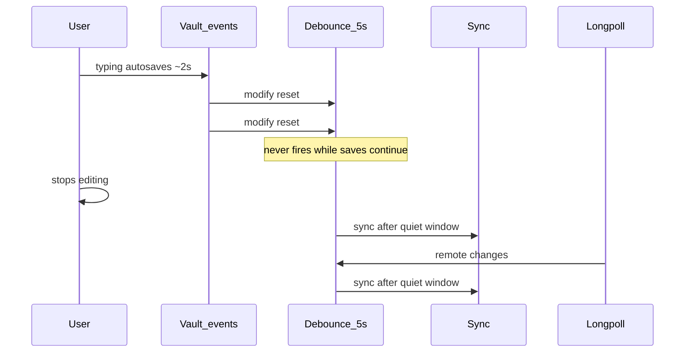
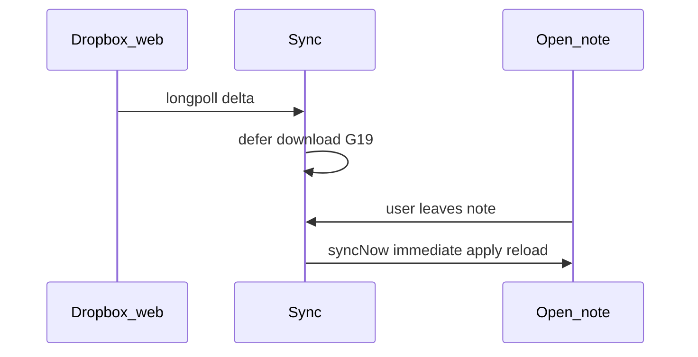

# Background sync triggers

## Why it exists

Background sync must react to local vault changes and remote Dropbox changes without uploading on every Obsidian autosave, and without leaving deferred remote edits stuck behind the same quiet window when the user leaves a note. This page documents how those triggers are scheduled after the debounce / open-file deferral fixes on release 0.2.

## Conceptual understanding

Three wake-ups share background sync, but they are not the same:

| Trigger | Purpose | Timing |
|---|---|---|
| Vault create / modify / delete / rename | Upload or reconcile after **saved** local changes | Configurable quiet window (`vaultEventDebounceSec`, default **5s**) after the last vault event |
| Dropbox longpoll | Pull remote changes | Same debounce as vault events so a burst of remote notifications settles with local typing |
| Open-file deferral flush | Apply a download that was held while a note was open/dirty | **Immediate** `syncNow` when the user leaves that note (leaf / file-open change) |

Debounce is keyed off **file system events**, not editor keystrokes. Obsidian typically autosaves about every two seconds while typing. The quiet window must stay **longer than that cadence** (hence the 5s default) so continuous typing keeps resetting the timer and never reaches sync until editing stops.

Open-file deferral is separate:

## Flows

### Local edit settle (R13)

1. A vault event that should sync stamps `lastVaultEventAt` and arms (or resets) the debounce timer.
2. If a cycle is already running, the plugin only sets `pendingDebouncedSync` — it does not arm a mid-cycle timer that would fire shortly after upload finishes.
3. When the cycle ends with pending vault activity, it rearms a **full** quiet window from that moment.
4. `fireDebouncedSync` starts sync only when `Date.now() - lastVaultEventAt` is at least `vaultEventDebounceSec`.

### Remote change while a note is open

1. Longpoll (after its own debounce) runs a cycle.
2. The executor defers downloads for open/dirty editors and records them in the durable retry set.
3. The cycle may still advance the cursor so live polling continues.
4. Leaving the note calls `flushDeferredAppliesAfterLeafChange`, which runs `syncNow` **immediately** (no vault-event debounce). The remote content is already known; the leaf change only clears the open-file bind.
5. If the bound can expire without a leaf change, `scheduleDeferredApplyRetry` wakes later (floored at the vault debounce so it does not spin tighter than local settle).

### Post-upload cursor catch-up

After a cycle mutates Dropbox (uploads, remote deletes, moves), the engine catches the remote cursor up past the device’s own writes before committing it. That stops longpoll from immediately echoing the device’s uploads as “changes,” which used to re-enter sync mid-keystroke.

## Technical details

| Piece | Role |
|---|---|
| `vaultEventDebounceSec` / settings slider | Quiet window after last saved vault event; options 2 / 5 / 10 / 30 / 60; default **5** |
| `src/sync/background-sync-schedule.ts` | Pure decide helpers (`decideVaultActivityScheduling`, `decideDebounceFire`, `shouldFlushDeferredApplies`, `shouldRearmDebounceAfterPendingVaultActivity`) — no Obsidian imports so CI can lock quiet-window and leaf-flush rules |
| `noteVaultActivityAndScheduleDebounce` | Stamp + arm or mark pending while syncing (wraps the decide helper) |
| `scheduleDebouncedSync` / `fireDebouncedSync` | Timer + quiet-window gate; used for vault events and longpoll |
| `flushDeferredAppliesAfterLeafChange` | Immediate apply when unlocked retry-set paths exist (`LEAF_FLUSH_DEFERRED_TRIGGER`) |
| `scheduleDeferredApplyRetry` | Bound expiry wake for G10 |
| `catchUpRemoteCursor` | Avoid longpoll echo of own writes |
| `mergeRetryItemsIntoPlan` | Reinstates deferred downloads over weak `noop` / `recordBase` plan rows |
| `ensureVaultSyncHooks` | Registers vault listeners once a vault ID exists (including after wipe/relink) |

`main.ts` owns timers and `syncNow`. The schedule module only answers *what* to do so regression tests do not need a mounted plugin.

### Automated regression coverage

These bun:test suites lock the release-0.2 debounce / deferral fixes:

| Suite | Guards |
|---|---|
| `test/background-sync-schedule.test.ts` | Quiet window, mid-sync pending, re-arm remaining, post-cycle full re-arm, leaf flush vs debounce |
| `test/deferral-tracker.test.ts` + executor cases | G10 bound clock; apply after expiry |
| `test/retry-set-cycle.test.ts` | Weak `recordBase`/`noop` must not drop durable downloads; deferred → retrySet + cursor advance |
| `test/catchup-remote-cursor.test.ts` | Committed cursor past own uploads |
| `test/vault-adapter.test.ts` / `test/built-in-excludes.test.ts` | Indexed overwrite via `modifyBinary`, leftover `.tmp-dropbox-sync` cleanup, built-in exclude |
| `test/executor.test.ts` | `reloadOpenFile` after download; not called when deferred |
| `test/simulation/active-file.test.ts` + matrix rows **9 / 18 / 21 / 22 / 29** | Open-file deferral, G27 cursor, continuous-typing schedule helper, delete-while-open |

Still manual: real Obsidian autosave feel, workspace leaf wiring end-to-end, CodeMirror reload/scroll restore. Matrix row **23** (device sleep) remains a stub.

## Technical Gotchas

- **Do not put leaf-flush behind vault debounce.** Click-away would wait a full quiet window even though the download was already deferred. Leaf flush must call `syncNow` directly with `leaf:flush-deferred`.
- **Keep schedule decisions in `background-sync-schedule.ts`.** Putting quiet-window rules back into private `main.ts` methods makes them untestable without Obsidian and is how the typing stampede regressed unnoticed.
- **Default must exceed autosave.** A 2s quiet window matches Obsidian’s typical save cadence and looks like “debounce is broken” while typing. Prefer ≥5s unless the user knowingly wants snappier uploads.
- **Mid-sync autosaves must not schedule from “now” while syncing.** Mark pending and re-arm a full window after the cycle; otherwise the next sync starts sub-second after upload ends.
- **Longpoll still shares the vault debounce.** That is intentional so remote echoes settle with typing. It is not a substitute for cursor catch-up after own uploads.
- **Create → rename within the quiet window** delays the first upload until settle completes; that avoids uploading `Untitled` then renaming a moment later.
- **Weak planner successes must not clear retrySet downloads.** After a cursor checkpoint, `same_content` becomes `recordBase`; merging must replace that weak action with the durable deferred download or click-away loses the remote edit.
