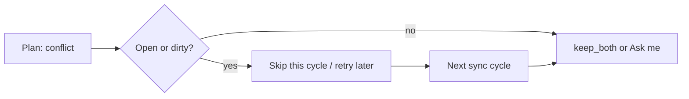

# Conflict Resolution

A conflict happens when you edit the same file on two devices before they've had a chance to sync. For example, you edit a note on your laptop, then edit the same note on your phone before the laptop syncs.

## Choosing a strategy

Go to **Settings > Dropbox Sync > Conflict strategy** to pick how conflicts are handled.

### Keep both (default)

Both versions are kept. The copy **already on Dropbox** stays at the canonical path. The version that arrived from this device is saved next to it using Dropbox’s conflict naming (so copies look the same whether they came from this plugin or the Dropbox desktop app):

```
notes/idea.md                                              ← Dropbox’s version (canonical)
notes/idea (Device ab12's conflicted copy 2026-07-26).md   ← this device’s displaced bytes
```

If the same device conflicts on the same path again the same day, a counter is appended (`… 2026-07-26 2).md`). Legacy `.conflict-<timestamp>` siblings from older plugin builds are still recognised and associated with their canonical path.

You can compare them at your own pace, merge what you need, and delete the conflict copy when done. Conflict copies are ordinary vault files: they sync to Dropbox and to every other device.

When the conflicted note is open, the status bar shows a conflict icon. Click it for a short explanation and **Compare**, which opens your version and the Dropbox copy in a split (side-by-side on wide viewports, stacked on tall ones). See [Per-file status bar](per-file-status-bar.md).

### Open notes defer conflict apply (R12)

If the conflicting path is **open or dirty in an editor**, the planner may still classify it as `conflict`, but the executor **skips applying** that conflict for the current cycle. The path is deferred and retried on a later sync (manual Sync Now, background sync, or a leaf-change flush when you leave the note). Closing the tab or switching away usually lets the next cycle mint the conflicted copy and rewrite the canonical path.

This protects mid-edit buffers from being rewritten under your feet. Deferral is also **bounded** (~60 seconds): after the bound expires, the conflict applies even if the note is still open — see [Sync safety](sync-safety.md) Layer 4 and [Sync scenarios](sync-scenarios.md) R12.



### Ask me

A comparison window opens so you can decide section by section. Automatic resolution never discards a side without a conflict copy — even when you pick local, remote, or merged text, the other bytes survive as a sibling until you delete them.

<!-- TODO: 스크린샷 — 텍스트 파일 머지 모달 (conflict 블록 + 선택 상태) -->
<!-- 파일: docs/images/merge-modal.png, 권장 크기: 800px 너비 -->

**For text files**, you see a side-by-side view:

- Sections that are the same on both devices are shown in gray
- Sections that differ are highlighted — click one to choose **your version**, **the other version**, or **both**
- A counter at the bottom shows how many sections still need your decision
- When you're ready, click **Save**

You can also click **Keep all local** or **Keep all remote** to quickly resolve everything at once.

<!-- TODO: 스크린샷 — 이미지 파일 비교 모달 (두 이미지 나란히) -->
<!-- 파일: docs/images/image-compare.png -->

**For images**, you see both versions side by side with their file sizes, so you can pick the right one visually.

**For other files** (PDFs, etc.), you see file sizes and modification dates to help you decide.

**Not sure yet?** Click the clock icon to skip this conflict for now. Skip is bounded — after about a minute the sync cycle applies the change so a postponed conflict cannot stall the shared Dropbox cursor forever.

## What was removed

**Keep newest** is no longer offered. Wall-clock “newest wins” discarded the losing side without a sibling. Existing installs that still have `newest` in settings are migrated to **Keep both**.

## Tips

- **Conflicts are rare** if you wait a few seconds for sync to complete before switching devices
- If conflicts keep appearing for the same file, it usually means two devices are editing it at the same time — try editing on one device at a time
- Conflict copies are regular files — you can open, edit, and delete them normally; they sync like any other note

## Technical details

See [Sync gap closure](sync-gap-closure.md) (G1, G2, G5, G9, G18) and `src/sync/conflict-handlers.ts`.

## Technical Gotchas

- **Canonical path = Dropbox’s bytes (R2).** Do not re-invert keep_both to “upload local onto the canonical path”.
- **Detection helpers must not exclude scans.** `isConflictFile` / `conflictPathToCanonicalPath` are for association and UI reuse only.
- **Device label comes from device-local `deviceId`.** Embedding a synced identity would make every machine claim the same conflict name prefix.
- **Open/dirty defers `conflict` apply, not detection.** `DEFERRABLE_APPLY_ACTIONS` in `executor.ts` includes `conflict` (with `download` and `deleteLocal`). Logs may show `action: "conflict"` then `deferring — file is open or dirty in editor` with `deferred: 1` and no keep_both yet — that is expected until a later cycle or the ~60s bound.
- **Rev-conflict upload can still resolve while the planner path was deferred.** A later cycle that uploads local with `update(rev)` may hit a server rev conflict and dispatch `keep_both` even if an earlier planned conflict was skipped for R12.
