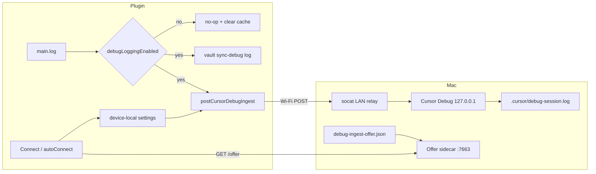
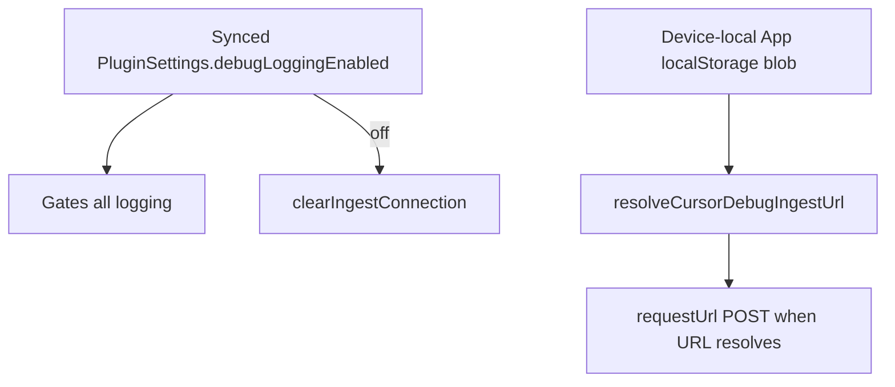

# Cursor Debug ingest (Wi‑Fi)

## Why it exists

When debugging sync on an iPad or another device, the agent needs **runtime evidence** on the Mac — not guesses from code alone. Obsidian mobile runs in WKWebView; `console.debug` does not reliably reach Cursor. This feature posts structured NDJSON from the plugin over Wi‑Fi into Cursor’s Debug log file (`.cursor/debug-<sessionId>.log`).

## Conceptual understanding

Debug logging and Cursor ingest are one pipeline with two destinations, plus a discovery sidecar so you rarely paste host/path by hand:

| Piece | Role |
|---|---|
| **Debug logging** (synced `debugLoggingEnabled`) | Master switch. Default **on**. Off → `main.log()` is a no-op **and** clears the device-local ingest connection cache |
| **Vault log** | `sync-debug-<deviceId>.log` at the **vault root** via `LogManager` — intentional so users can open/share it from the file list |
| **Device-local ingest fields** | Host, Port, Session ID, Ingest path, server name, offer token via App localStorage — **not** vault `data.json` |
| **Offer sidecar** | Python HTTP on **:7663** serves `GET /offer` from `.cursor/debug-ingest-offer.json` |
| **LAN relay** | `scripts/ingest-lan-relay.sh` runs socat (ingest port) **and** the offer sidecar |
| **Connect / auto-connect** | Plugin fills device-local fields from the offer (localhost auto; mobile taps **Connect**) |
| **Cursor Debug session** | Owns the HTTP ingest listener; shell scripts cannot start it |

When logging is on but ingest fields are incomplete, logs still go to the vault file only. Wi‑Fi POST runs only when an ingest **URL** can be resolved.



## Flows

### Per Debug session (preferred)

1. Start a **Cursor Debug** agent session. Note **session ID**, **ingest path** (`/ingest/<uuid>`), ingest **port**, and log file. Path UUID ≠ session slug.
2. On the Mac (agent via `/debug-ingest`):
   ```bash
   bash scripts/write-debug-ingest-offer.sh \
     --session <slug> --path /ingest/<uuid> --port <ingestPort>
   bash scripts/ingest-lan-relay.sh
   ```
3. In Obsidian → **Settings → Dropbox Sync → Troubleshooting**:
   - Enable **Debug logging**
   - **Same Mac:** auto-connects to `127.0.0.1:7663` → button shows **Connected to {ComputerName}**
   - **iPad / other device:** tap **Connect** (localhost → cached host → short private /24 probe)
   - Tap **Send test log**
4. Confirm a canary line appears in `.cursor/debug-<sessionId>.log`.
5. Reproduce; the agent reads the session log.

Turning **Debug logging off** clears the device-local connection (host/path/session/token). Quit/reopen Obsidian with Debug still on keeps the cache. Plugin uninstall may wipe App localStorage.

**Advanced** (collapsed in settings) still allows manual host/port/session/path paste.

Agent shortcut: `/debug-ingest`.

### Settings model



## Technical details

| Module | Role |
|---|---|
| `src/device-settings/` | Versioned blob including `cursorDebugServerName` / `cursorDebugOfferToken` |
| `src/debug/cursor-debug-discover.ts` | `fetchOffer`, `tryAutoConnect`, `connect`, `clearIngestConnection` |
| `src/debug/cursor-debug-ingest.ts` | URL resolve + `requestUrl` POST |
| `src/ui/settings-tab.ts` | Connect / Connected, Send test log, Advanced fields |
| `scripts/write-debug-ingest-offer.sh` | Writes `.cursor/debug-ingest-offer.json` |
| `scripts/debug-ingest-offer-sidecar.py` | `GET /offer` on `:7663` with magic header |
| `scripts/ingest-lan-relay.sh` | socat + sidecar together |

**Offer JSON** (`GET http://<host>:7663/offer`):

- `serverName`, `host` (LAN IP), `port`, `ingestPath`, `sessionId`, `token`
- Response header `X-Dropbox-Sync-Debug: 1` (required)
- Optional request header `X-Dropbox-Sync-Debug-Token` (cached token; wrong token → 401; missing allowed for bootstrap)

**Bootstrap port:** fixed `7663`. Ingest POSTs use the session port via socat.

URL shape for logs: `http://{host}:{port}{ingestPath}`

- Desktop with empty host → `127.0.0.1`
- Mobile with empty host → no URL (no POST)
- Missing ingest path → no URL

Ordinary plugin logs use `hypothesisId: "log"`. Structured sync monitoring (`src/debug/sync-monitor.ts`) tags continuous phase/progress lines as `hypothesisId: "sync"` and investigation tags such as `H-A`…`H-E`. `main.log(msg, data, meta?)` forwards optional `hypothesisId` / `location` into ingest.

Reusable Cursor templates also live under `_reference_ide-setup/obsidian-plugin/`.

## Technical Gotchas

- **Cursor binds localhost only.** Mobile needs the LAN relay; USB alone does not bridge iOS to `127.0.0.1` on the Mac.
- **Offer port ≠ ingest port.** Connect talks to `:7663`; POSTs go to the relay/session port from the offer.
- **Ingest path UUID ≠ session slug.** Wrong path → 404; wrong session id → log file mismatch.
- **Auto-connect never scans the LAN** — only `127.0.0.1` / `localhost`. Mobile must tap **Connect** (or already have a cache).
- **Clear on Debug logging OFF**, not on Obsidian quit. Leave Debug on across a new Cursor session and you may keep a stale path until you toggle off/on or Connect again (desktop settings open refreshes from localhost when the sidecar is up).
- **macOS Firewall** may block inbound TCP on the ingest port and `7663`.
- **Same Wi‑Fi** required between iPad and Mac.
- **Always use `requestUrl`**, never `fetch`.
- **Ingest is fire-and-forget** — verify with **Send test log**.
- **Scripts cannot start Cursor’s listener** — only a Debug-mode agent session can.
- **Offer file is gitignored** (`.cursor/debug-ingest-offer.json`) — session-specific.
- **Do not delete sync/debug logs mid-investigation.** Clear `.cursor/debug-<sessionId>.log` only when preparing a *new* reproduction you are about to ask for — never when the user already synced and you need to analyze. Never wipe vault `sync-debug-*.log` / `sync-logs/` until the user is finished committing or documenting (see `.cursor/rules/preserve-sync-debug-logs.mdc`).
- **Vault-root log path is product behavior** — see [Plugin persistence](plugin-persistence.md).
