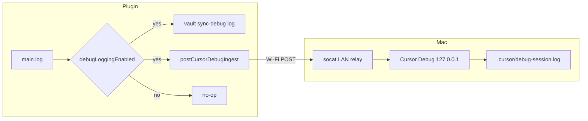
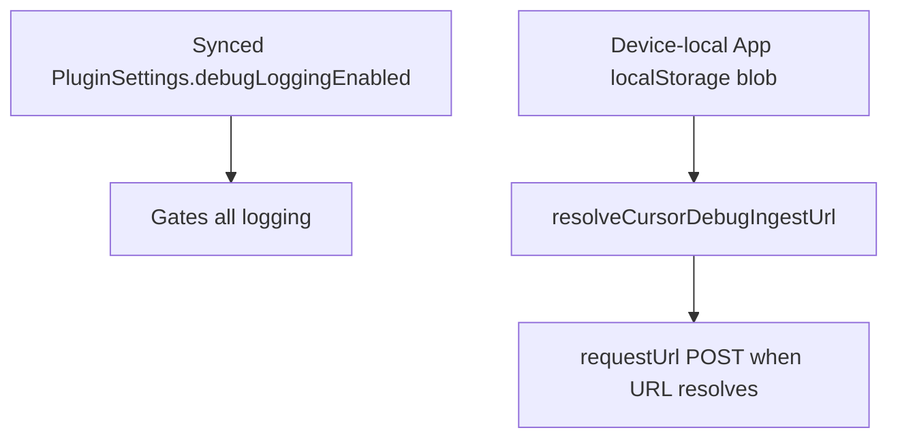

# Cursor Debug ingest (Wi‑Fi)

## Why it exists

When debugging sync on an iPad or another device, the agent needs **runtime evidence** on the Mac — not guesses from code alone. Obsidian mobile runs in WKWebView; `console.debug` does not reliably reach Cursor. This feature posts structured NDJSON from the plugin over Wi‑Fi into Cursor’s Debug log file (`.cursor/debug-<sessionId>.log`).

## Conceptual understanding

Debug logging and Cursor ingest are one pipeline with two destinations:

| Piece | Role |
|---|---|
| **Debug logging** (synced `debugLoggingEnabled`) | Master switch. Default **on**. Off → `main.log()` is a no-op (no vault file, no console mirror, no Wi‑Fi POST) |
| **Vault log** | `sync-debug-<deviceId>.log` at the **vault root** via `LogManager` — intentional so users can open/share it from the file list (not under `.obsidian/plugins`) |
| **Device-local ingest fields** | Host, Port, Session ID, Ingest path via Obsidian `App.loadLocalStorage` / `App.saveLocalStorage` (key `dropbox-sync-device-settings_v1`) — **not** vault `data.json` |
| **LAN relay** | `scripts/ingest-lan-relay.sh` (socat) exposes Cursor’s localhost-only ingest on the LAN |
| **Cursor Debug session** | Owns the HTTP listener; shell scripts cannot start it |

When logging is on but ingest fields are incomplete, logs still go to the vault file only. Wi‑Fi POST runs only when an ingest **URL** can be resolved (path required; host required on mobile).



## Flows

### One-time / per Debug session

1. Start a **Cursor Debug** agent session. Note **session ID** (short slug), **ingest path** (`/ingest/<uuid>`), and log file (`.cursor/debug-<slug>.log`). Path UUID ≠ session slug.
2. On the Mac:
   ```bash
   bash scripts/print-debug-ingest-settings.sh
   bash scripts/ingest-lan-relay.sh
   ```
3. In Obsidian → **Settings → Dropbox Sync → Troubleshooting**:
   - Ensure **Debug logging** is on
   - Set **Host** (Mac LAN IP on mobile; leave empty on desktop for `127.0.0.1`), **Port** (default `7662`), **Session ID**, **Ingest path**
   - Tap **Send test log**
4. Confirm a canary line (`cursor-debug-ingest canary`) appears in `.cursor/debug-<sessionId>.log` on the Mac.
5. Reproduce the bug; the agent reads the session log.

Agent shortcut: `/debug-ingest` (see `.cursor/commands/debug-ingest.md` and `.cursor/rules/cursor-debug-ingest.mdc`).

### Settings model



- **Synced:** turn logging on/off for the vault’s plugin settings (survives across devices as a preference).
- **Device-local:** Mac LAN IP and Debug session values use vault-scoped App localStorage on this machine so one device’s host does not overwrite another’s via Dropbox-synced `data.json`. Call `initDeviceSettings(app)` at the start of `onload` before any ingest reads.

## Technical details

| Module | Role |
|---|---|
| `src/device-settings/` | Versioned device-local blob via App localStorage + read/patch helpers |
| `src/debug/cursor-debug-ingest.ts` | URL resolve + `requestUrl` POST + `postCursorDebugLogLine` |
| `src/main.ts` `log()` / `sendDebugLogCanary()` | Gate + vault write + fire-and-forget ingest |
| `src/ui/settings-tab.ts` | Troubleshooting toggle, ingest fields, Send test log |
| `scripts/ingest-lan-relay.sh` | socat `0.0.0.0:7662` → `127.0.0.1:7662` |
| `scripts/print-debug-ingest-settings.sh` | Prints Host/Port for paste into settings |

URL shape: `http://{host}:{port}{ingestPath}`

- Desktop with empty host → `127.0.0.1`
- Mobile with empty host → no URL (no POST)
- Missing or blank ingest path → no URL (no POST)
- Session ID alone cannot deliver a POST; it only fills the payload / `X-Debug-Session-Id` header when a URL exists

Payload shape (one JSON object per POST; Cursor appends as NDJSON):

```json
{
  "sessionId": "e7cde3",
  "hypothesisId": "log",
  "location": "main.log",
  "message": "short description",
  "data": {},
  "timestamp": 1784206541263
}
```

Ordinary plugin logs use `hypothesisId: "log"`. Structured sync monitoring (`src/debug/sync-monitor.ts`) tags continuous phase/progress lines as `hypothesisId: "sync"` and investigation tags such as `H-A`…`H-E` (delete execution, re-infer, guard skip, cursor stall, item stall). `main.log(msg, data, meta?)` forwards optional `hypothesisId` / `location` into ingest.

Headers: `Content-Type: application/json`, optional `X-Debug-Session-Id`.

Reusable Cursor templates (rule, command, scripts) also live under `_reference_ide-setup/obsidian-plugin/` for other Obsidian plugins.

## Technical Gotchas

- **Cursor binds localhost only.** Mobile devices need the LAN relay; USB alone does not bridge iOS to `127.0.0.1` on the Mac.
- **Ingest path UUID ≠ session slug.** Wrong path → 404; wrong session id → log file mismatch.
- **Port can vary by session.** Default in settings is `7662`; match the active Debug listener / relay (`INGEST_RELAY_PORT` if overridden).
- **macOS Firewall** may block inbound TCP on the relay port.
- **Same Wi‑Fi** required between iPad and Mac (or routable LAN).
- **Always use `requestUrl`**, never `fetch`, for Obsidian mobile networking.
- **Ingest is fire-and-forget** from `main.log()` so vault flush is not delayed; failures are swallowed — verify with **Send test log**, do not treat silence as proof a code path did not run.
- **Scripts cannot start Cursor’s listener** — only a Debug-mode agent session can.
- **Existing installs** migrate missing `debugLoggingEnabled` to `true` so View logs keeps working after upgrade.
- **Legacy raw `window.localStorage` blob** is copied into App localStorage once per vault when App storage is empty; the next write clears the old global key.
- **Vault-root log path is product behavior**, not a packaging mistake — see [Plugin persistence](plugin-persistence.md).
