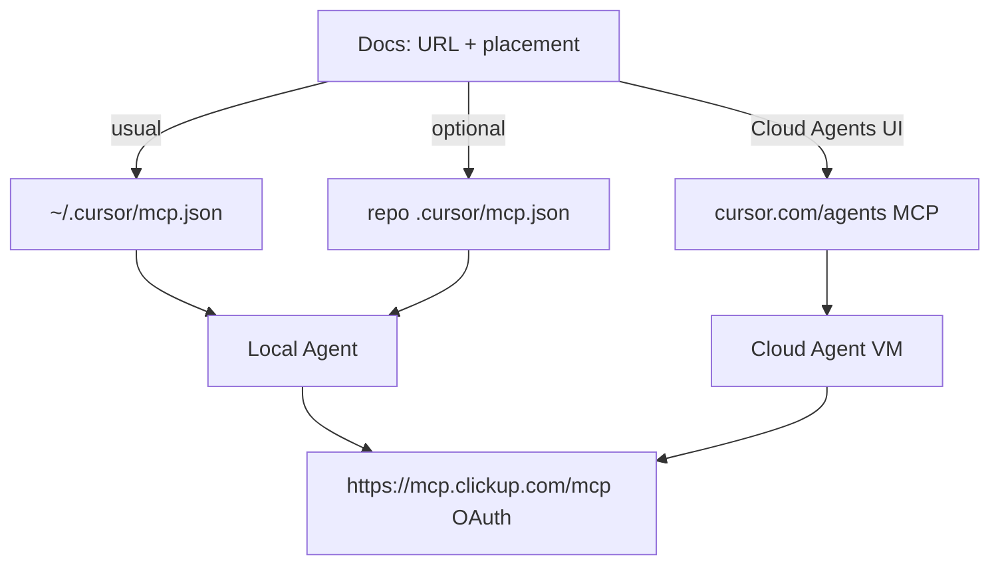

# ClickUp MCP for Cursor (local + Cloud Agents)

## Why it exists

Agents use ClickUp MCP for task status, PR field updates, and `/build-ready-tasks`. This doc records the official server URL and **where to configure it** — not a file to sync into every target repo.

## Conceptual understanding

ClickUp MCP is a developer/Cursor setting choice, not shared project tooling like rules or commands.

| Where to put it | Path / UI | When |
|---|---|---|
| **Global (usual)** | `~/.cursor/mcp.json`, or **Settings → Tools & MCP** | Personal machine-wide ClickUp. Covers every local project. Prefer this. |
| **Project (optional)** | `<repo>/.cursor/mcp.json` | Only if you want repo-local MCP for that clone (e.g. teammate without your global config). |
| **Cloud Agents** | [cursor.com/agents](https://cursor.com/agents) MCP dropdown, or team [Integrations & MCP](https://cursor.com/dashboard/integrations) | Required for Cloud Agent VMs. Separate from local IDE config. |

`/update-agent-tooling` and “copy `shared/`” workflows should **not** invent a project `mcp.json` for ClickUp. Point people at this doc (and the README snippet) instead.



Do **not** treat a committed project `mcp.json` as the Cloud Agent setup path. Cursor’s supported path for Cloud Agents is the dashboard.

## Official ClickUp MCP

- URL: `https://mcp.clickup.com/mcp`
- Auth: **OAuth only** (no personal API keys / bearer tokens)
- Docs: [ClickUp MCP Server](https://developer.clickup.com/docs/connect-an-ai-assistant-to-clickups-mcp-server)

Snippet to paste into whichever `mcp.json` you choose (global or project):

```json
{
  "mcpServers": {
    "clickup": {
      "url": "https://mcp.clickup.com/mcp"
    }
  }
}
```

Merge under an existing `mcpServers` object if the file already has other servers.

1. Add the entry (global or project).
2. Authenticate via the OAuth prompt.
3. Confirm tools such as `clickup_get_task` are available.

### What was wrong in common “Cloud Agents MCP” walkthroughs

| Claim | Reality |
|---|---|
| Use `npx @modelcontextprotocol/server-clickup` | Not ClickUp’s official MCP. Prefer the HTTP URL above. |
| Put `CLICKUP_API_KEY` in `mcp.json` or My Secrets | Official ClickUp MCP does not support API-key auth; OAuth only. |
| Commit `mcp.json` so Cloud Agents load it | Cloud Agents use the **agents dashboard**. |
| Ship ClickUp as shared syncable `mcp.json` | Document the URL and placement; developers configure global or project themselves. |

## Flows

### Enable ClickUp for Cloud Agents

**Cursor Cloud MCP ≠ ClickUp.** On [cursor.com/agents](https://cursor.com/agents), the MCP section already (or after first Add) shows **Cursor Cloud MCP** — Cursor’s built-in run-diagnostics tools. That is unrelated to ClickUp. You still have to **add ClickUp as a separate custom MCP**.

1. Open [cursor.com/agents](https://cursor.com/agents).
2. Open the **MCP** section / dropdown.
3. Do **not** stop after seeing **Cursor Cloud MCP**, and do **not** name your custom server `Cursor` or search only for “Cursor”.
4. **Add** a **custom** MCP named something like `clickup` (not `Cursor`).
5. Set HTTP / URL to `https://mcp.clickup.com/mcp`. Leave headers and env blank (OAuth only).
6. Click **Add**. After adding, it will not immediately be added for this particular automation. Go through the process again and you'll see it has been added to the dropdown of MCPs available to add now.
7. Complete **Login / Connect** OAuth for ClickUp when prompted. OAuth is **per user**, including for team-shared servers.
8. Enable ClickUp for runs that need it.
9. Team plan: admins can also add under [Dashboard → Integrations & MCP](https://cursor.com/dashboard/integrations) and optionally **Add to Team Marketplace**.

HTTP is recommended over stdio for Cloud Agents: tool calls are proxied through Cursor’s backend, and credentials are not present in the agent VM.

If the UI asks for JSON instead of discrete fields, paste:

```json
{
  "mcpServers": {
    "clickup": {
      "url": "https://mcp.clickup.com/mcp"
    }
  }
}
```

## Technical details

- Project and global `mcp.json` are merged; project wins on name conflict.
- Cloud Agents support HTTP and stdio; SSE and `mcp-remote` are not supported for custom Cloud Agent MCP.
- Sensitive dashboard fields (`env`, `headers`, OAuth `CLIENT_SECRET`) are encrypted and redacted after save.

## Technical Gotchas

- **Cursor Cloud MCP is not ClickUp.** Seeing Cursor Cloud MCP after Add does not mean ClickUp is configured — add ClickUp again as its own custom server (`clickup` + `https://mcp.clickup.com/mcp`).
- After adding ClickUp, it will not immediately be added for that particular automation. Go through the Add process again and you'll see it has been added to the dropdown of MCPs available to add now.
- If local ClickUp already works via global MCP, syncing reference rules/commands changes nothing for ClickUp.
- Local OAuth does not grant Cloud Agents; authenticate in the agents dashboard separately.
- Environment folders may still ship project-bound MCP (e.g. Unity `unity-mcp`). That is unrelated to ClickUp.
