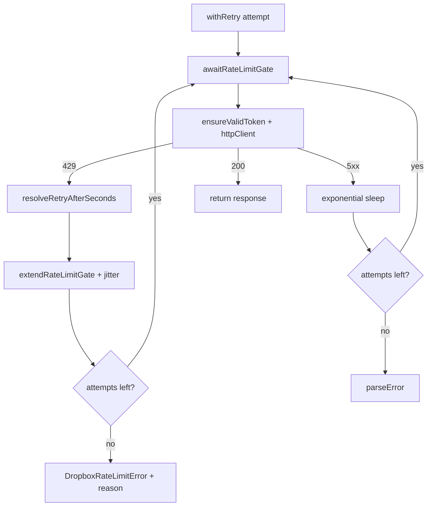

# Dropbox 429 / rate-limit retry

## Why it exists

Executor concurrency can issue many Dropbox RPCs and content uploads in parallel. Dropbox answers overload with HTTP **429** (`too_many_requests` or `too_many_write_operations`). Without coordinated backoff, concurrent workers stampede retries, burn the attempt budget, and surface rate-limit failures that a short shared pause would have avoided.

## Conceptual understanding

- Every `DropboxAdapter` HTTP call goes through **`withRetry`** (RPC and content endpoints).
- A **shared cooldown gate** on the adapter instance (`rateLimitedUntilMs`) pauses *all* concurrent callers after any 429 — not only the worker that received it.
- Wait duration prefers the **`Retry-After` response header**, then the JSON body `retry_after`, then **1 second**. `too_many_write_operations` often sends `Retry-After: 0`; that value is honored (plus small jitter).
- Uniform jitter (0–250ms) desynchronizes wake-ups so workers do not retry in lockstep.
- After the attempt budget is exhausted, both RPC and content paths throw **`DropboxRateLimitError`** with a classified `reason` for logging/UI.

## Flows

## Technical details

| Piece | Role |
|---|---|
| `rateLimitedUntilMs` | Instance-wide “do not start next attempt before” timestamp |
| `awaitRateLimitGate` / `extendRateLimitGate` | Wait / extend shared cooldown; overlapping 429s keep the later until-time |
| `resolveRetryAfterSeconds` | Header → body → default 1s; allows `0` |
| `retryJitterMs` | Uniform 0–`RATE_LIMIT_JITTER_MAX_MS` (250); tests stub to 0 |
| `sleep` | Abort-aware delay wrapper; tests stub for instant waits |
| `parseRateLimitReason` | Maps tag/summary to `too_many_requests` / `too_many_write_operations` / `unknown` |
| `DropboxRateLimitError.reason` | Classified reason alongside `retryAfter` seconds |
| `test/dropbox-adapter-retry.test.ts` | Header vs body, shared gate across workers, exhausted throws, content path parity |

Max retries remain **4** (5 attempts total). Network failures still use the longer 2s×2^n backoff; 5xx uses 1s×2^n — both go through `sleep` so they respect abort.

## Technical Gotchas

- **Header beats body.** Dropbox documents `Retry-After` on 429; reading only `error.retry_after` missed header-only responses and treated `Retry-After: 0` incorrectly when body was absent.
- **Shared gate is required at concurrency > 1.** Per-call backoff alone lets sibling workers keep hitting 429 while one sleeps.
- **Do not special-case content uploads to skip `DropboxRateLimitError`.** Exhausted 429s must throw the same typed error on content endpoints so the executor can surface a consistent failure.
- **Jitter must be stubbed in tests.** Random waits make duration assertions flaky; production keeps jitter for desync.
- **`Retry-After: 0` is intentional.** Write-ops rate limits often return zero; still extend the gate (at least by jitter) so workers serialize slightly rather than immediate full stampede.
