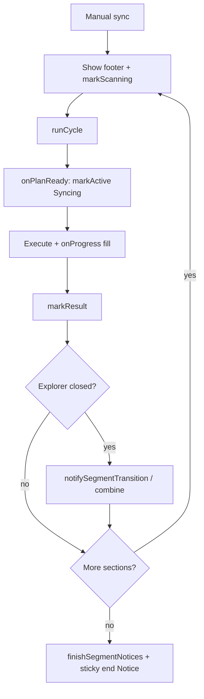
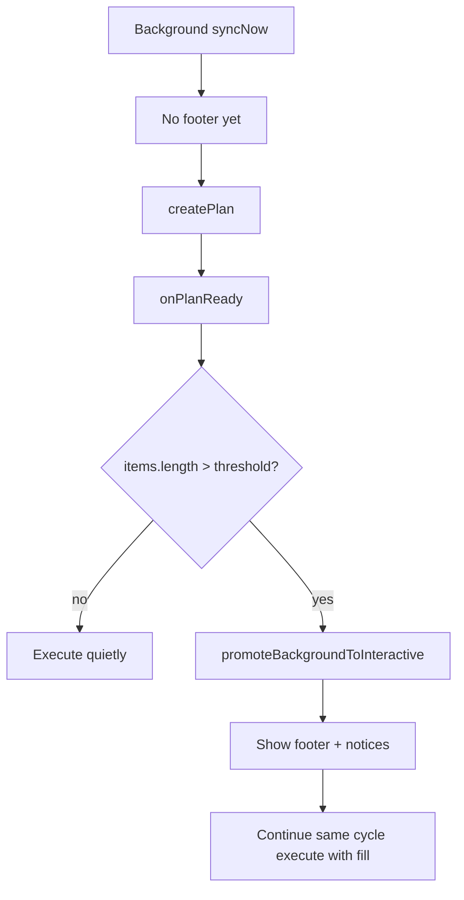

# Interactive sync progress

## Why it exists

Long syncs need visible structure: which vault section is running, whether the run is cancellable, and what happened when the file explorer (where the progress footer lives) is hidden. Interactive progress covers **manual Sync now** and **large background syncs** that cross a configurable action threshold so those runs get the same progress / cancel / notice UX.

## Conceptual understanding

- **Interactive UI** means: explorer progress footer, start/end Notices, rotating ribbon with a stop affordance, and confirmed cancel from the ribbon.
- **Manual Sync now** always uses interactive UI. The footer appears **immediately** with a **Scanning changes…** segment so slow local/remote scans are not an invisible wait.
- **Background sync** stays quiet unless the plan has more actionable items than **Settings → Large sync progress threshold** (default **10** → promote when `plan.items.length > 10`). `plan.items` excludes noops.
- **Minimize, don’t close.** Click the progress footer (or the chevron) to hide only the detail text; title and segment bars stay. There is no Close control that destroys the footer mid-run.
- **Ribbon while syncing.** The refresh icon spins; a non-rotating stop square sits in the center. Clicking asks **Cancel sync** / **Keep syncing** before aborting.
- **Explorer closed.** If the file explorer is not visible at footer `show()` (or later), segment start/end become Notices; adjacent end→start combine into one Notice.

## Flows

### Manual section run

### Large background promotion

## Technical details

| Piece | Role |
|---|---|
| `interactiveUi` (`src/main.ts`) | True for manual runs, or after background promotion; drives Notices and end sticky Notice |
| `largeSyncInteractiveThreshold` | Setting (default 10); promote when actionable plan size is **greater than** this value |
| `onPlanReady` (`SyncEngine`) | After plan, before guards/execute — flips Scanning→Syncing, or promotes background UI |
| `SyncSectionProgress` | Footer mount, minimize, scanning/active/result, segment Notices |
| `isFileExplorerVisible` | Layout-size check on file-explorer leaves |
| `setRibbonSyncing` | Spin class + centered non-spinning stop square overlay |
| `handleRibbonClick` / `ConfirmModal` | Confirm before `cancelCurrentSync` |

Minimize: root click toggles `.dbx-sync-explorer-progress-minimized` and flips chevron down↔up. Chevron is decorative for that same toggle (single handler on the footer).

Segment Notices: `show()` sets `segmentNoticesEnabled` from explorer visibility at start (sticky for the run). `notifySegmentTransition(ended, started)` holds a lone end until the next start so transitions combine; `finishSegmentNotices` flushes a trailing end.

## Technical Gotchas

- **Promotion is mid-cycle.** Background still runs one multi-section `runCycle`; the footer attaches after the plan exists, so the scan phase for that promote may already be finished — UI jumps to Syncing/execute fill.
- **Do not use bare `gh`-style host confusion here.** Interactive vs quiet is owned by `interactiveUi`, not by whether the ribbon happens to be spinning (background also spins the ribbon).
- **Promotion count is `plan.items.length`.** Noops are never in `items`; do not subtract `stats.noop` again.
- **Explorer “closed” is geometric.** Collapsed sidebars / zero-size leaves count as hidden even if a leaf still exists in the workspace.
- **Footer replacement.** A new interactive run destroys/rebuilds `SyncSectionProgress`; leftover Close semantics from older builds were removed on purpose.
