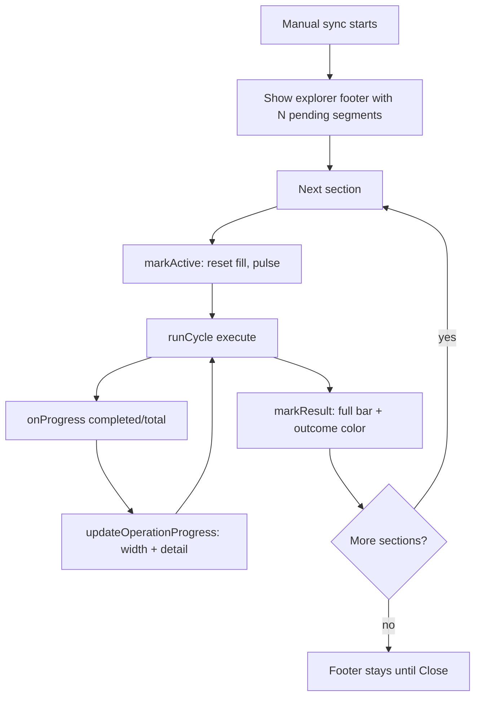

# Manual sync section progress

## Why it exists

Manual sync can run several vault sections in sequence (notes → settings → plugins → workspaces). Without per-section feedback, a long run looks like one opaque spinner. The file-explorer progress footer shows which section is active, how far that section’s execute phase has gone, and each section’s final outcome — and stays visible until the user closes it.

## Conceptual understanding

- **Manual only.** Background sync does not show this footer.
- **One segment per selected section.** Pending segments wait; the active segment fills; finished segments keep a full bar in success / partial / failed color.
- **Fill tracks execute ops.** Width is `completed / total` from the SyncEngine executor’s `onProgress` callback for the section currently running — not planner time, not wall-clock.
- **Detail line.** Under the bars, each section shows a short status string (e.g. `Syncing… 12/40` or the post-run summary).

## Flows

## Technical details

| Piece | Role |
|---|---|
| `SyncSectionProgress` (`src/ui/sync-section-progress.ts`) | Mounts a sticky footer under the file explorer; owns segment state and fill DOM |
| `progressSection` on the plugin (`src/main.ts`) | Which section’s fill `onProgress` should drive during sequential manual runs |
| `updateOperationProgress` | Patches fill width and detail without rebuilding the whole track (frequent execute ticks) |
| `fillPercent` | Pending → 0%; active with unknown total → 0%; finished with no totals → 100%; else `completed/total` |
| CSS (`.dbx-sync-section-seg-fill`) | Track is empty border color; fill grows L→R; active fill pulses |

Wiring: before each manual `runCycle`, the plugin sets `progressSection` and calls `markActive`. The shared executor `onProgress` handler updates the status bar always, and the explorer fill only when `progressSection` is set. On sync teardown, `progressSection` is cleared so leftover callbacks cannot paint a stale segment.

## Technical Gotchas

- **Background sync has no `progressSection`.** Status bar still shows `% · completed/total`; the explorer footer is not used.
- **Do not full-re-render on every op.** `updateOperationProgress` writes `fill.style.width` and refreshes detail only; rebuilding the track would drop the fill element map mid-update.
- **Empty plans.** If execute never reports a total, `markResult` forces a full bar so finished segments still read as complete in their outcome color.
- **Interrupted runs.** Cancel / auth / error paths call `markInterrupted`, which fails the current and later segments; fill width still snaps to full via `markResult`-style completion when applicable, or via the failed-state styling on re-render.
