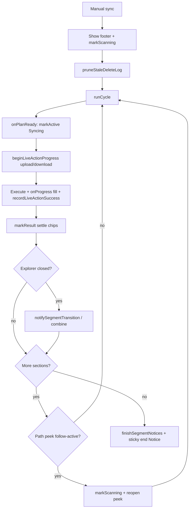
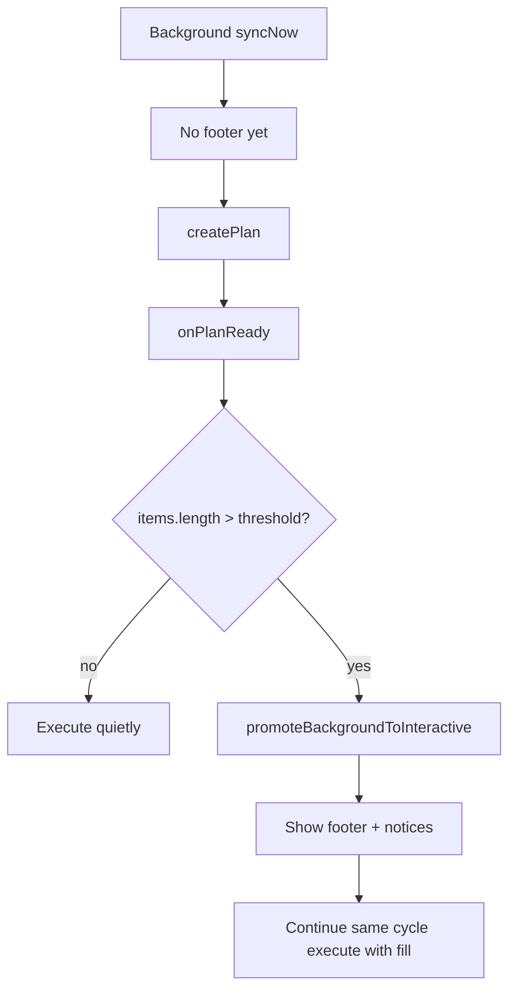
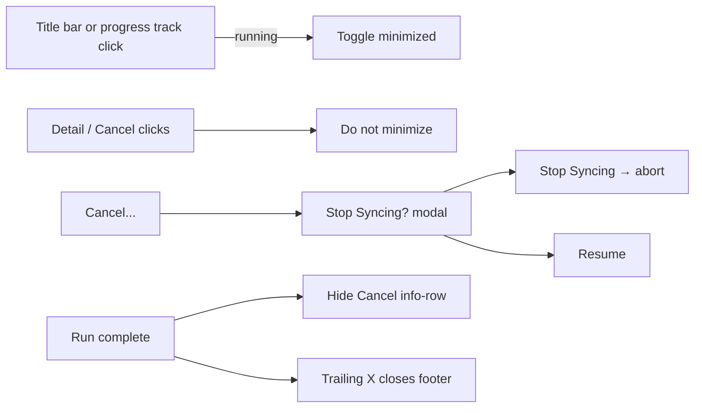
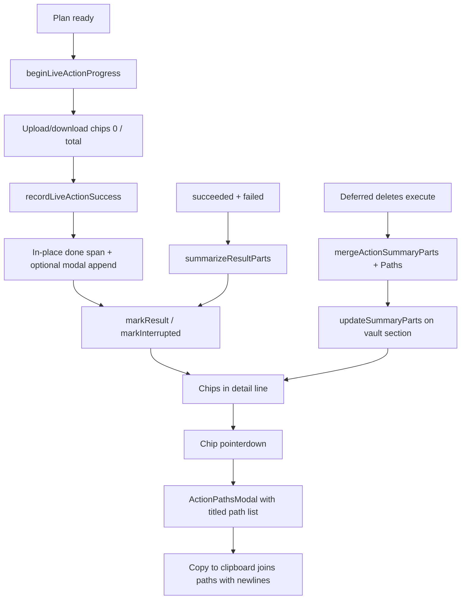

# Interactive sync progress

## Why it exists

Long syncs need visible structure: which vault section is running, whether the run is cancellable, and what happened when the file explorer (where the progress footer lives) is hidden. Interactive progress covers **manual Sync now** and **large background syncs** that cross a configurable action threshold so those runs get the same progress / cancel / notice UX.

## Conceptual understanding

- **Interactive UI** means: explorer progress footer, start/end Notices, rotating ribbon with a stop affordance, and confirmed cancel from the ribbon or the footer **Cancel sync...** control.
- **Manual Sync now** always uses interactive UI. The footer mounts **before** delete-log prune / engine setup, with a **Scanning changes…** segment, so a large stale delete log cannot leave the ribbon spinning with no panel.
- **Background sync** stays quiet unless the plan has more actionable items than **Settings → Large sync progress threshold** (default **10** → promote when `plan.items.length > 10`). `plan.items` excludes noops.
- **Minimize while running; dismiss when complete.** While syncing, click the **title bar** or the **progress track** to hide only the detail text and Cancel row; title and segment bars stay. The detail summary, count links, and Cancel are **not** minimize targets. When every section has a result, the title becomes **Sync completed**, the footer auto-expands if it was minimized, the **Cancel row collapses** (no empty min-height gap), and the trailing control becomes a plain **X** that destroys the footer.
- **Title while running** is **Syncing...** (ellipsis signals an in-progress state).
- **Scan fill stays at ~5%.** While a segment is in the scan / “figuring out how many files” phase, the bar holds a small indeterminate stub even if scan counts tick. Normal left-to-right fill starts once execute progress has a known total.
- **Live execute fill.** Progress `completed/total` advances as each plan item finishes (not only after the whole concurrent batch), so large downloads do not sit at `0/N` until the end.
- **Scan-phase recent-path peek.** During scan, the accent `completed/total` count is a link that toggles up to **three** activity paths. Display order is **oldest on top → newest at bottom**; the two older rows are much more faded than the current file. Paths use continuous RTL/LTR truncation (ellipsis clips the start; dir faint, filename theme-primary) so long vault paths stay readable. Opening the peek opts into **follow-active**: when the next section becomes active, its peek opens automatically until the user collapses it. Peek does **not** apply during execute chips.
- **Live execute chips.** Once a section’s plan is ready, upload/download work shows the **same accent chips** as the finished summary, with live **`done / total`** values (accent completed count; theme-normal spaced slash + total). Zeros start disabled until the first success. Chip click opens `ActionPathsModal`, which **appends** paths as items succeed (auto-scroll when near the bottom). On `markResult`, the same chips settle to count-only values; deletes/conflicts appear only in the finished summary.
- **Failed chips, not prose.** When a section (or whole run) has failures, the panel shows a **failed** chip (error wash + circle-x) plus upload/download/etc. for successes — not collapsed prose like `8 failed, 406 ok`. Notices still use the short prose form. Mid-cancel keeps any earned chips and appends **Cancelled**.
- **Cancel sync...** (centered under the detail) opens the cancel confirm modal — accent text on a faded accent wash (not error/danger). Modal chrome title is **Stop Syncing?** via `setTitle` (not a body heading). Body copy explains vault safety and resume-from-where-left-off; a muted safety line notes half-synced plugins may stop working. There is **no** separate interrupt-info modal. Ribbon/panel confirm buttons are **Resume** / **Stop Syncing**.
- **Finished summary chips.** When a vault section finishes with action counts, the detail line shows chips for failed / upload / download / local delete / cloud delete / conflict — Lucide icons + count, **no** middle-dot separators. Icons and path-name text use `--text-normal` (theme-aware), not hard-coded white. Clicking a chip opens a read-only path-list modal (`ActionPathsModal`) titled **Failed Files**, **Uploaded Files**, **Downloaded Files**, **Local Deletions**, **Cloud Deletions**, or **Conflicted Files**. The modal has **Copy to clipboard** (one path per line) plus **Close**. Trailing prose after the parts string (e.g. Cancelled, skipped counts) stays plain text beside the chips.
- **Trailing Deletions bar, not a finished Deletions text line.** Manual multi-section sync defers deletes into a **Deletions** progress segment; after that phase, trash chips (and their paths) merge onto the matching Files/Settings/… detail lines. The **Deletions:** detail text line is shown only while that segment is **active** — when finished it is omitted so delete counts are not duplicated.
- **Obsidian Sync status icon hidden.** Plugin CSS hides `.status-bar-item.plugin-sync` so core Sync does not compete with Dropbox Sync in the desktop status bar (no public API to hide another plugin’s status item).
- **Ribbon while syncing.** The refresh icon and stop square both use `--interactive-accent`. The refresh glyph spins at **4s** per revolution (quarter of the prior 1s speed); a non-rotating stop square sits in the center. Clicking asks **Stop Syncing** / **Resume** before aborting.
- **Explorer closed.** If the file explorer is not visible at footer `show()` (or later), segment start/end become Notices; adjacent end→start combine into one Notice.
- **Modal titles use `setTitle`.** Plugin modals set Obsidian’s modal title bar (`this.setTitle(...)`) instead of injecting `h2`/`h3` into `contentEl`. Body headings remain only for true in-content section labels (e.g. conflict merge column headers).

## Flows

### Manual section run

```mermaid
flowchart TD
  Start[Manual sync] --> Footer[Show footer + markScanning]
  Footer --> Prune[pruneStaleDeleteLog]
  Prune --> Cycle[runCycle]
  Cycle --> PlanReady[onPlanReady: markActive Syncing]
  PlanReady --> LiveChips[beginLiveActionProgress upload/download]
  LiveChips --> Exec[Execute + onProgress fill + recordLiveActionSuccess]
  Exec --> Result[markResult settle chips]
  Result --> Notice{Explorer closed?}
  Notice -->|yes| SegNotice[notifySegmentTransition / combine]
  Notice -->|no| Next
  SegNotice --> Next{More sections?}
  Next -->|yes| Follow{Path peek follow-active?}
  Follow -->|yes| FooterPeek[markScanning + reopen peek]
  Follow -->|no| Cycle
  FooterPeek --> Cycle
  Next -->|no| Done[finishSegmentNotices + sticky end Notice]
```

### Large background promotion

```mermaid
flowchart TD
  Bg[Background syncNow] --> Quiet[No footer yet]
  Quiet --> Plan[createPlan]
  Plan --> Ready[onPlanReady]
  Ready --> Check{items.length > threshold?}
  Check -->|no| ExecQuiet[Execute quietly]
  Check -->|yes| Promote[promoteBackgroundToInteractive]
  Promote --> Footer[Show footer + notices]
  Footer --> ExecVis[Continue same cycle execute with fill]
```

### Minimize / cancel chrome

```mermaid
flowchart LR
  TitleOrTrack[Title bar or progress track click] -->|running| MinToggle[Toggle minimized]
  Detail[Detail / Cancel clicks] --> NoMin[Do not minimize]
  CancelBtn[Cancel...] --> Confirm[Stop Syncing? modal]
  Confirm --> Abort[Stop Syncing → abort]
  Confirm --> Keep[Resume]
  Complete[Run complete] --> CollapseCancel[Hide Cancel info-row]
  Complete --> X[Trailing X closes footer]
```

### Live and finished summary chips

```mermaid
flowchart TD
  Plan[Plan ready] --> BeginLive[beginLiveActionProgress]
  BeginLive --> LiveChips[Upload/download chips 0 / total]
  LiveChips --> Success[recordLiveActionSuccess]
  Success --> Tick[In-place done span + optional modal append]
  Tick --> Mark[markResult / markInterrupted]
  Result[succeeded + failed] --> Parts[summarizeResultParts]
  Parts --> Mark
  Deferred[Deferred deletes execute] --> Merge[mergeActionSummaryParts + Paths]
  Merge --> Patch[updateSummaryParts on vault section]
  Mark --> Chips[Chips in detail line]
  Patch --> Chips
  Chips --> Click[Chip pointerdown]
  Click --> Modal[ActionPathsModal with titled path list]
  Modal --> Copy[Copy to clipboard joins paths with newlines]
```

## Technical details

| Piece | Role |
|---|---|
| `interactiveUi` (`src/main.ts`) | True for manual runs, or after background promotion; drives Notices and end sticky Notice |
| `largeSyncInteractiveThreshold` | Setting (default 10); promote when actionable plan size is **greater than** this value |
| `onPlanReady` (`SyncEngine`) | After plan, before guards/execute — flips Scanning→Syncing, or promotes background UI |
| `SyncSectionProgress` | Footer mount, chrome minimize, Sync completed + X, scanning/active/result, recent-path peek, live + finished chips, segment Notices |
| `beginLiveActionProgress` / `recordLiveActionSuccess` | Seed upload/download chip totals from the plan; tick completed counts + open modal append during execute |
| `summaryTotals` | Planned per-action totals while execute is active; cleared on `markResult` / interrupt so finished chips are count-only |
| `chipValueEls` | In-place live value hosts keyed by section+actionType so ticks do not rebuild the chip row |
| `summarizeResultParts` (`sync-reporter`) | Failed chip + succeeded action breakdown (paths included) for panel/cancel/error results |
| `ActionSummaryType` `"failed"` | Synthetic chip type (not an executor action); modal title **Failed Files**; error-wash CSS |
| Manual `syncNow` pre-prune mount (`src/main.ts`) | Creates/shows the footer before `pruneStaleDeleteLog` so long prune stays visible |
| `deferDeletes` / `pendingDeletes` / `executeDeletePlan` | Manual section loop holds deletes until a trailing Deletions segment; trash chips merge afterward |
| `summaryPaths` / `groupSucceededPathsByAction` | Paths per action type for chip modals; `mergeActionSummaryPaths` after deferred deletes |
| `ActionPathsModal` | Path list from a summary chip; live `appendPath` / `setPaths`; **Copy to clipboard** writes `paths.join("\n")` |
| `actionSummaryModalTitle` | Chip → modal title mapping (Failed Files, Local Deletions = `deleteLocal`, Cloud Deletions = `deleteRemote`) |
| `onActivityPath` / `recordActivityPath` | Newest **scan** path into the count-link peek (storage newest-first, display reversed) |
| `appendSplitPath` + `.dbx-sync-explorer-progress-path-inner` | RTL row + LTR inner so peek paths ellipsis from the left without a dir/name gap |
| `recentPathsFollowActive` | Set when the user opens the peek; `markScanning` / `markActive` call `adoptRecentPathsPeekForActiveSection` |
| `countTextEls` + detail `pointerdown` | In-place scan count text + delegated count/chip clicks so live ticks do not destroy the hit target |
| `fillPercent` | Scan phase / unknown total → 5% stub; execute with total → normal % |
| `isFileExplorerVisible` | Layout-size check on file-explorer leaves |
| `setRibbonSyncing` | Accent color on ribbon; 4s spin + centered non-spinning stop square |
| `SyncCancelConfirmModal` | `setTitle("Stop Syncing?")`; body + safety line; Resume / Stop Syncing — no interrupt-info modal |
| Modal `setTitle` convention | All plugin modals use the Obsidian title bar; do not put the modal title in `contentEl` as `h2`/`h3` |
| `.status-bar-item.plugin-sync` | CSS hide for core Obsidian Sync’s desktop status-bar icon |

While running: header and track clicks toggle `.dbx-sync-explorer-progress-minimized` and flip the decorative chevron. Spacing uses **18px** between title↔bars, bars↔detail, and the panel’s bottom padding so the chrome feels even. When complete: title **Sync completed**, class `dbx-sync-explorer-progress-complete`, Cancel info-row hidden (class + complete selector), X closes via `destroy()`.

Segment Notices: `show()` sets `segmentNoticesEnabled` from explorer visibility at start (sticky for the run). `notifySegmentTransition(ended, started)` holds a lone end until the next start so transitions combine; `finishSegmentNotices` flushes a trailing end.

## Technical Gotchas

- **Promotion is mid-cycle.** Background still runs one multi-section `runCycle`; the footer attaches after the plan exists, so the scan phase for that promote may already be finished — UI jumps to Syncing/execute fill.
- **Do not use bare `gh`-style host confusion here.** Interactive vs quiet is owned by `interactiveUi`, not by whether the ribbon happens to be spinning (background also spins the ribbon).
- **Promotion count is `plan.items.length`.** Noops are never in `items`; do not subtract `stats.noop` again.
- **Explorer “closed” is geometric.** Collapsed sidebars / zero-size leaves count as hidden even if a leaf still exists in the workspace.
- **Footer replacement.** A new interactive run destroys/rebuilds `SyncSectionProgress`; leftover Close semantics from older builds were removed on purpose.
- **Use DOM `removeAttribute`, not Obsidian `removeAttr`.** Obsidian’s `HTMLElement` exposes `setAttr` but not `removeAttr`. Calling `removeAttr` during `show()`/`render` threw, aborted the sync before `runCycle`, and left `outcome` stuck at the default `up_to_date` (instant “completed” with no work). Aria cleanup must use `element.removeAttribute(...)`.
- **Progress must settle per item inside the concurrent batch.** Calling `onSettled` only after `runWithConcurrency` returned made the bar sit at `0/N` until every download finished, then jump to done in one frame.
- **Do not rebuild chips or the scan count link on every progress tick.** `updateOperationProgress` / `recordLiveActionSuccess` must update `countTextEls` / `chipValueEls` in place; emptying `detailEl` on each tick made clicks miss while numbers re-rendered.
- **Scan fill must ignore scan completed/total for bar width.** `onScanProgress` still updates the count text, but `fillPercent` forces 5% while `phase === "scan"` so discovery does not paint a full segment before execute.
- **`--background-modifier-error` is solid danger red.** It is for warning buttons with light text, not a faded wash under error-coloured labels. Cancel and transfer chips use accent + `color-mix`; failed chips use `--text-error` + `color-mix` on purpose.
- **Do not hard-code chip icon / path white.** Use `--text-normal` so light and dark themes stay readable against the accent wash.
- **Live chip totals only for upload/download.** Deletes and conflicts stay finished-only; `LIVE_PROGRESS_ACTION_TYPES` is the allowlist.
- **Cancel mid-execute keeps earned chips.** `markInterrupted` / `applyInterruptToSegment` filters zero-count placeholders, settles `summaryTotals`, and appends the reason after the chip summary string.
- **Partial results must call `summarizeResultParts`.** Clearing `summaryParts` on failure forced prose-only detail lines; section merge after deferred deletes must include section failures so the failed chip survives trash-chip merge.
- **Follow-active survives `markResult`.** Finishing a section clears `recentPathsExpandedSection` for that section (no count link left) but keeps `recentPathsFollowActive` so the next `markScanning`/`markActive` reopens the peek.
- **Mount the footer before prune.** `pruneStaleDeleteLog` can take seconds on a large delete log; mounting after prune made manual sync look hung (ribbon only).
- **Do not show a finished Deletions detail line.** Delete counts already appear as trash chips on vault-section lines after `updateSummaryParts`; a second `Deletions: N deleted` line duplicates them. `renderDetail` skips the deletions segment unless `state === "active"`.
- **Hide the whole Cancel info-row when complete.** Hiding only the button left `min-height: 24px` + `margin-top` empty space under the summary.
- **Chip clicks need `summaryPaths`.** Counts alone are not enough for modals; deferred deletes must call `mergeActionSummaryPaths` when patching section chips or delete chips open empty.
- **Path modal copy is newline-joined full list.** Clipboard text is every path in `summaryPaths` for that chip (no 20-cap), one per line — keep that format so paste stays usable in editors / spreadsheets. Match the log viewer’s Copy CTA + Notice pattern rather than inventing a second clipboard UX.
- **Live path modal must clear its panel reference on close.** `ActionPathsModal.setOnCloseCallback` drops `openPathModal` so later successes do not append into a closed modal.
- **Modal titles belong in `setTitle`.** Body `h2`/`h3` titles duplicate Obsidian’s title bar and look wrong on mobile; keep in-body headings only for true content sections.
- **Hiding Sync is CSS-only.** There is no Plugin API to remove core Sync’s status item; `.status-bar-item.plugin-sync` matches Obsidian’s own class. Do not disable the Sync core plugin via internals from this plugin.
