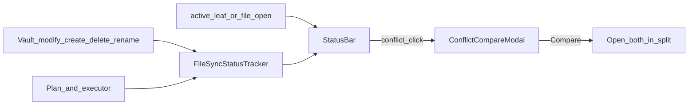

# Per-file status bar

## Why it exists

The Obsidian status bar used to show one vault-wide sync icon. That made it hard to tell whether *the note you are looking at* still needed sync, had just synced, or had a conflict copy on disk. The status bar now reflects only the **currently open file**, so the icon matches the tab you are reading.

## Conceptual understanding

- **No open file / empty tab** → no sync icon.
- **Idle and fully synced** → no icon (success is brief, then clears).
- **Switching tabs** updates the icon to that file’s status, or hides it.
- The glyph is always the same circular sync icon as the ribbon (`refresh-cw`); colour and spin convey state.
- Explorer progress bars and notices still cover vault-wide / multi-section sync. The status bar is file-scoped only.

| State | When | Appearance | Meaning (tooltip) |
|---|---|---|---|
| *(hidden)* | No file, or no pending work for this file | — | — |
| pending | Local create/modify not yet synced, or never in sync store | Accent colour | Local changes not synced / not yet on Dropbox |
| syncing | This path is in the current execute set | Accent + spin | Currently syncing with Dropbox |
| success | This path just succeeded | `--text-success` | Synced (clears after ~5s) |
| error | This path failed | `--text-error` | Sync failed for this file |
| conflict | keep_both wrote a `.conflict-*` sibling | `--text-error` | Both sides changed — click for details |

**Click behaviour**

- **conflict** → modal describing keep_both + **Compare** (opens both files in a split).
- **Other visible states** → existing vault Sync status modal (Sync now / auto-sync / settings).
- **Right-click** → unchanged context menu (Sync now / auto-sync / settings).

## Flows

**Conflict Compare**

1. User opens a file that has a conflict status and clicks the status bar icon.
2. Modal explains: local kept at the original path; Dropbox version saved as a sibling.
3. **Compare** opens the original in the current leaf and the sibling in a new split:
   - viewport wider than tall → side-by-side (`vertical` split)
   - taller than wide → stacked (`horizontal` split)

## Technical details

| Piece | Role |
|---|---|
| `FileSyncStatusTracker` (`src/sync/file-sync-status.ts`) | In-memory `pathLower` → status map; success timers; subscribe/notify |
| `StatusBar` (`src/ui/status-bar.ts`) | View of the active file’s record only (`setActiveFileStatus`) |
| `ConflictCompareModal` (`src/ui/conflict-compare-modal.ts`) | Description + Compare split |
| `handleConflictKeepBoth` | Returns `conflictSiblingPath`; executor stores it on `SyncPlanItem` |
| `findNewestConflictSibling` | Vault fallback if the stored sibling path is missing |
| `main.ts` | Vault events, `onPlanReady` / `onExecItem`, `applySyncResult`, `active-leaf-change` / `file-open` |

**How records are written**

1. Vault `modify` / `create` (in-scope, non-conflict paths) → `pending`.
2. `onPlanReady` → all actionable plan paths → `syncing`.
3. `onExecItem` start → `syncing`; live fail → `error`.
4. `applySyncResult` → success / error / conflict (when `conflictSiblingPath` is set) / deferred → pending.
5. Abort / cycle-level failure → in-flight `syncing` paths become pending or error via `requeueSyncing` / `failSyncing`.

**Dirty-on-open (no full hash)**

When the active file has no tracker record: if there is no `SyncEntry`, mark `pending` (“not yet synced to Dropbox”). If an entry exists, stay hidden. Mid-edit pending still comes from vault `modify`. Status is session-only (not persisted across restarts).

**Sibling naming** (from `makeConflictPath`): `name.conflict-YYYY-MM-DDTHHMM.ext` (ISO timestamp slice). Conflict siblings are excluded from sync planning (`isConflictFile`) but remain normal vault files for Compare.

## Technical Gotchas

- Do **not** drive this UI from vault-wide “syncing/success” again — that regressed the per-file contract.
- `onExecItem` must run for **background** cycles too (forwarded from `SyncEngine`), or syncing/success icons miss paths.
- Manual conflict strategy without a sibling must **not** set status `conflict` unless a `.conflict-*` file exists (`conflictSiblingPath` required).
- Opening a `.conflict-*` file itself does not get a “never synced” pending badge — siblings are not sync targets.
- Success auto-clear lives on the **tracker**, not the status bar view.
- Compare uses `workspace.getLeaf("split", direction)`; direction follows viewport aspect, not Obsidian’s mobile/desktop flag alone.
