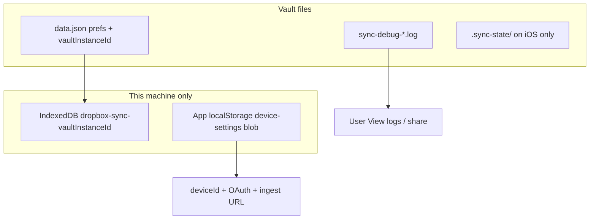

# Plugin persistence and sync state

## Why it exists

The plugin keeps several kinds of data in different places on purpose: preferences that should travel with the vault stay in plugin settings, sync history must stay **per device**, and identity / OAuth / Cursor Debug host fields must stay **per machine** so one device’s credentials or LAN IP are not written into another device’s `data.json`. Knowing where each piece lives is required for upgrades, resets during testing, and avoiding vault-name collisions on desktop IndexedDB.

## Conceptual understanding

| Kind of data | Where | Syncs with vault / Dropbox? |
|---|---|---|
| Preferences, `vaultInstanceId`, conflict UX, sync scope toggles | `.obsidian/plugins/dropbox-sync/data.json` via `loadData` / `saveData` | Yes, if that plugin folder is in sync scope |
| `deviceId`, Dropbox OAuth tokens, custom app key, Cursor Debug host / port / session / path / server name / offer token, `verboseDecisionLogging` | `App.loadLocalStorage` / `App.saveLocalStorage` key `dropbox-sync-device-settings_v1` | No — vault-namespaced on this Obsidian profile |
| Sync base (incl. `basePathDisplay`), Dropbox cursor, delete log, retry set, permanent skip set, resurrection deferred set, scope fingerprint | IndexedDB `dropbox-sync-<vaultInstanceId>` (desktop/Android); vault `.sync-state/` on iOS | No (device-local). `.sync-state/` is exclude-listed |
| User-facing debug log | Vault root `sync-debug-<deviceId>.log` | Can sync like any vault file (intentional — users open/share it) |

`vaultInstanceId` is a UUID minted once and stored in `data.json`. It names the IndexedDB database. It is **not** the Dropbox remote folder name (`syncName`) and **not** the short `deviceId` used in conflict copy names and log filenames.

## Flows

### Fresh install / first load

1. `initDeviceSettings(app)` binds App localStorage and may copy a legacy raw-`localStorage` blob into vault-scoped storage.
2. Settings load; if `vaultInstanceId` is empty, mint a UUID and save.
3. Migrate `deviceId` / OAuth out of synced `data.json` into the device-settings blob when present (G25 / G26), then clear those fields from synced settings on save.
4. Non‑iOS: if IndexedDB for the new id is empty and legacy `dropbox-sync-<vaultFolderName>` has data, copy entries/meta then clear the legacy DB (**before** `saveSettings` → background sync can start).
5. Engine deps open `IndexedDBStore(vaultInstanceId)` or `VaultFileStore` on iOS.

### Resetting sync history (testing “brand new plugin”)

Goal: empty vault should **re-download** from Dropbox instead of pushing local deletes.

**Preferred:** Settings → Dropbox Sync → Troubleshooting → **Clear sync history** (confirm). That clears only the sync store and in-memory delete log on this device. It does **not** clear Debug logging, Cursor Debug ingest fields, OAuth, debug log files, or vault/Dropbox files.

Manual alternative (if the UI is unavailable):

1. Disable or pause sync / quit Obsidian if needed.
2. Clear sync state only:
   - Desktop/Android: delete IndexedDB `dropbox-sync-<vaultInstanceId>` (id is in `data.json`).
   - iOS: clear or delete `.sync-state/entries.json` and `.sync-state/meta.json`.
3. Optionally delete `sync-debug-*.log` for a clean log; not required for planner behavior.
4. Leave `data.json` alone to keep prefs; OAuth lives in device-settings — clearing history does not sign you out.
5. Reload the plugin, then sync with an empty local vault.

Do **not** rely on `resetEngine()` — that rebuilds the engine and preserves the delete log; it does not wipe IndexedDB. Clear history is refused while a sync is running.

### Device-settings migrate (Cursor Debug + credentials)

Older builds stored the blob in raw `window.localStorage` (global across vaults) and kept `deviceId` / tokens in `data.json`. On init:

1. If App storage is empty, legacy raw-`localStorage` JSON is copied into `App.saveLocalStorage`.
2. If tokens / `deviceId` still sit in synced settings, they are copied into the device blob and stripped from `data.json` on the next save so Dropbox’s desktop client cannot round-trip credentials through the vault folder.

## Technical details

| Module | Role |
|---|---|
| `src/settings.ts` | Synced prefs + `vaultInstanceId`; migrates `newest` → `keep_both` |
| `src/adapters/indexeddb-store.ts` | DB naming helpers, `migrateLegacyIndexedDbIfNeeded`, `IndexedDBStore` |
| `src/adapters/vault-file-store.ts` | iOS sync-state files under `.sync-state/` |
| `src/device-settings/` | App-scoped device blob; `initDeviceSettings` in `onload`; OAuth / `deviceId` accessors |
| `src/log-manager.ts` + `main.ts` logger path | Vault-root `sync-debug-*.log` (user-visible by design) |
| `EngineManager.clearSyncHistory` / `main.clearSyncHistory` | UI **Clear sync history** — `store.clear()` + empty delete log; drop engine so intents are not rehydrated |
| `.cursor/rules/device-local-settings.mdc` | Prefer App localStorage over raw `window.localStorage` |

Built-in exclude patterns include `.sync-state/` so the iOS fallback does not round-trip through Dropbox.

## Technical Gotchas

- **Never key IndexedDB with `vault.getName()`.** Folder basenames collide; desktop IndexedDB is shared per Obsidian origin, so two vaults named `Notes` would share sync history.
- **Migrate legacy IDB before `saveSettings` on first mint.** `saveSettings` → `applySyncState` can schedule background sync; an empty new DB before copy would look like a fresh vault and can push deletes.
- **`vaultInstanceId` in `data.json` can sync across devices** if the plugin folder is synced. That is fine for naming: each machine still has its own IndexedDB. Wiping `data.json` mints a new id and orphans the old DB on that machine.
- **OAuth must not return to `data.json`.** Under P3 the Dropbox desktop client may sync the plugin folder; credentials in synced settings would leak across machines and fight per-device links (G25).
- **Vault-root debug logs are intentional.** Do not move them under `.obsidian/plugins` for “correctness”; users rely on seeing them in the vault and in View logs.
- **App localStorage is vault-namespaced.** After migration from the old global key, Cursor Debug host/session and tokens are per vault on this profile — re-auth in another vault if needed.
- **Debug logging OFF clears ingest connection fields.** Host/path/session/token/server name are wiped from the device blob so a later session does not POST to a stale Cursor ingest path; quitting Obsidian with Debug still on keeps the cache. OAuth / `deviceId` are **not** cleared when Debug turns off.
- **iOS Lockdown Mode** can break IndexedDB persistence in Obsidian generally; this plugin already falls back to `.sync-state/` on iOS.
