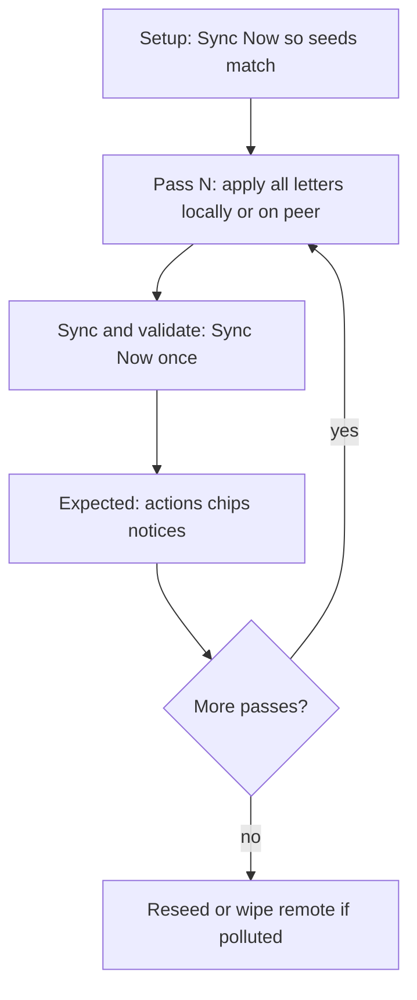

# QA runbooks

## Why it exists

Manual Dropbox QA used to mean thirteen short, preamble-heavy scripts that each required their own Sync Now. That slowed live checks and made logs hard to attribute when several independent edits landed in separate cycles. The runbooks were restructured into eight lean scripts that batch non-interacting work into shared passes, name exact paths, and protect the log strings those scripts assert.

## Conceptual understanding

Runbooks live in `qa/templates/_runbooks/` and are copied into the generated vault as `_runbooks/`. They are the human checklist for real Obsidian + Dropbox; automated coverage stays in `bun test` and `qa/SIMULATION_COVERAGE.md`.

| Principle | Meaning |
|---|---|
| No preamble | No Scenario / Seeds / Log-signals headers — Setup, Passes, Sync and validate, Expected only |
| One Sync Now per pass | Apply every lettered step in a pass before Sync Now; do not sync between letters |
| Disjoint paths | Letters in the same pass must not share a file or folder so chips and log lines stay separable |
| Explicit paths | Always name exact `_seeds/...` sources and destinations — never “move some files” |
| Minimal validate | Sync Now once, then validate logs and files (vault + Dropbox agree), then Expected bullets |



## Catalog (contiguous 01–08)

| # | Runbook | Covers |
|---|---------|--------|
| 01 | Basic operations | Create, modify, simple delete, case rename, empty folders, small folder wipe (§1, §2, §4 simple, §7, §8, §9 simple) |
| 02 | Renaming and moving | G7/G8 file and folder moves; compound / empty fallbacks (§6) |
| 03 | Delete protection | Bulk Skip, Approve, tree wipe, remote subtree wipe, coalesce blocker (§4 advanced / §9 R14) |
| 04 | Delete edge cases | R5 edit×delete, ordinary remote delete, never-saw R10 (§5, §11) |
| 05 | File size and content type | Empty / tiny binaries; optional binary conflict and large file (§12) |
| 06 | Interruptions | Mid-sync quit, open-editor deferral, exclude bait, debounce (§13) |
| 07 | Joining or rejoining | Fresh join via `bun run qa:empty`; re-link (§10) |
| 08 | Simultaneous editing | Conflict / keep_both last so conflict copies do not pollute earlier scripts (§3) |

INDEX is the vault-facing table: [`qa/templates/_runbooks/INDEX.md`](../qa/templates/_runbooks/INDEX.md).

## Flows

### Typical seeded runbook (01–06, 08)

1. `bun run qa:open` or Sync Now so `_seeds/` matches Dropbox.
2. Open the runbook under `_runbooks/`.
3. Complete each pass: all lettered edits, then Sync and validate.
4. If the remote is polluted (deletes, conflicts, casing), clear the Dropbox folder and `bun run qa:reset`.

### Join runbook (07)

1. `bun run qa:empty` (empty local vault — not `qa:restart`).
2. OAuth / link folder; follow Pass 1–2 in `07-joining-or-rejoining.md`.
3. Clear Dropbox separately when an empty remote peer is required.

## Technical details

### Pass batching

Independent operations that do not share paths are combined so one Sync Now produces multiple distinct plan items (e.g. runbook 01 Pass 1 letters A–H). Dependent or peer-timed work gets its own pass (peer create, Skip then Approve, fresh-join R10).

### Runbook-dependent logs

Manual Expected sections assert specific log messages, payload fields, and progress chips. Those sites are marked in source with:

```text
// Runbook-dependent log — do not remove: runbook NN …
```

(or the chip / notice variants). Search the repo for `Runbook-dependent` before deleting or rewording sync logs, `logIntent`/`logOutcome` action names, rename/move chips (`Aa` / `↳`), delete chips, conflict keep_both lines, `list_revisions` / R10 wording, “holding Dropbox cursor”, or `DropboxRateLimitError` / `too_many_write_operations`.

Primary files: `src/sync/executor.ts`, `planner.ts`, `plan-enhancements.ts`, `resurrection-guard.ts`, `conflict-handlers.ts`, `sync-reporter.ts`, `path-notices.ts`, `engine.ts`, `src/main.ts`, `src/adapters/dropbox-adapter.ts`.

### Related docs

- [Sync scenario testing](sync-scenario-testing.md) — matrix vs manual harness
- [Rename and move detection](rename-move-detection.md) — runbook 02 expectations
- [R6 upload ask](r6-upload-ask.md) — runbook 04 R5 / R10 distinction
- [qa/README.md](../qa/README.md) — generate / open / empty commands

## Technical Gotchas

- **Renumbering breaks links.** Filenames are `NN-slug.md`. Update INDEX, `qa/generate.mjs`, `scripts/qa-empty.sh`, `/debug-empty-vault`, coverage map rows, and `Runbook-dependent` comments when numbers change.
- **Same-pass path clashes hide chips.** If two letters touch one folder, folder-move coalesce or a single delete can merge evidence; keep paths disjoint inside a pass.
- **Join is not restart.** `qa:restart` reseeds `_seeds/`; join needs `qa:empty`. Local wipe never clears Dropbox.
- **Rate-limited moves are real failures.** Runbook 02 treats failed `moveRemote` chips with `too_many_write_operations` as executor failures — retry Sync Now; do not “fix” detection by swallowing the chip.
- **Do not strip runbook logs mid-debug.** Preserve sync/debug logs while investigating (`preserve-sync-debug-logs` rule); the Expected section depends on those strings remaining in the build.
