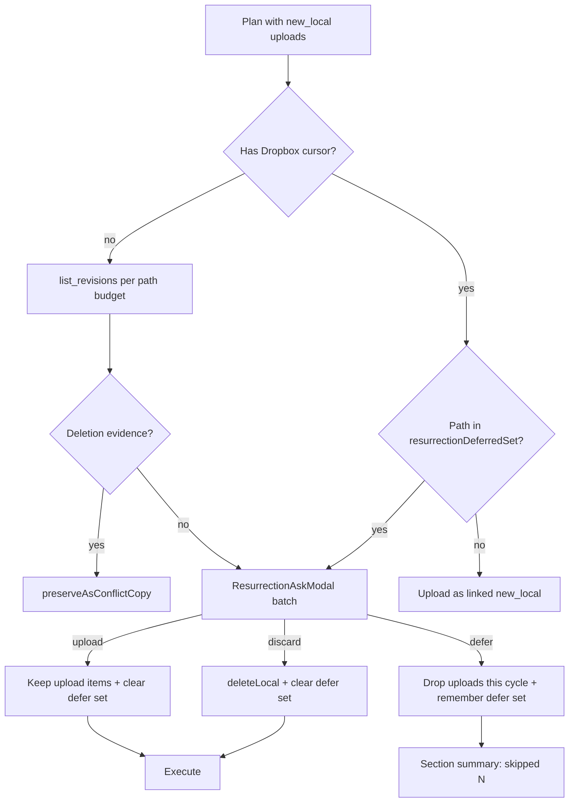

# R6 upload ask (first join / deferred locals)

## Why it exists

On a fresh join (or after sync history is cleared), many local files have **no Dropbox revision history**. Rule **R6** forbids silently uploading those paths (which would undo a remote delete the device never saw) and forbids silently discarding them. The plugin asks once per batch: Upload, Discard, or Cancel (“skip for now”).

Cancel must mean **skip for now**, not “forget forever.” After Files/Settings succeed, the device usually gains a Dropbox cursor. Without remembering deferred paths, the next sync would treat those locals as ordinary `new_local` on a linked device and upload them with **no ask**.

## Conceptual understanding

- **Fresh join (no cursor):** every `new_local` without deletion evidence goes into one batch ask per section cycle.
- **Linked device (has cursor):** ordinary new files upload without asking. Paths the user previously deferred stay gated until Upload or Discard.
- **Cancel / Esc / X** → `defer`: hold uploads this cycle; remember `path_lower` in sync-state meta.
- **Outside click** does **not** close the modal (requires an explicit button or Esc/X).
- Section progress shows **skipped** / **skipped N** for a deferred-only result — never **up to date**.

## Flows

## Technical details

| Piece | Role |
|---|---|
| `applyResurrectionGuard` (`resurrection-guard.ts`) | Gates `new_local`; returns plan + defer remember/clear lists |
| `ResurrectionAskModal` | Batch UI; default choice `defer`; blocks `.modal-bg` dismiss |
| `resurrectionDeferredSet` meta (`resurrection-deferred.ts`) | Durable `path_lower[]` in IndexedDB / `.sync-state/` |
| `CycleResult.resurrectionDeferred` | Count for section feedback (“skipped N”) |
| `buildSyncResultFeedback` | Maps deferred-only empty execute → partial + skipped copy |
| `clearSyncHistory` / re-link | Wipes the store, including the defer set |

## Technical Gotchas

- **Cursor commit after a deferred section is intentional.** Files may still checkpoint the cursor; deferred paths must survive in meta, not in “no cursor ⇒ ask again.”
- **Do not skip the whole guard when `hasSyncCursor`.** Only skip R6/R10 for *non-deferred* new locals; re-ask anything still in `resurrectionDeferredSet`.
- **Cancel must never mean discard.** Default modal choice is `defer` so Esc/X cannot mass-delete.
- **Per-section asks are expected on first sync.** Notes, settings, and plugins each run their own cycle and may each open the modal.
- **`list_revisions` budget** (`MAX_REVISION_CHECKS_PER_CYCLE`) still puts overflow paths in the same ask batch rather than silent-uploading them.
