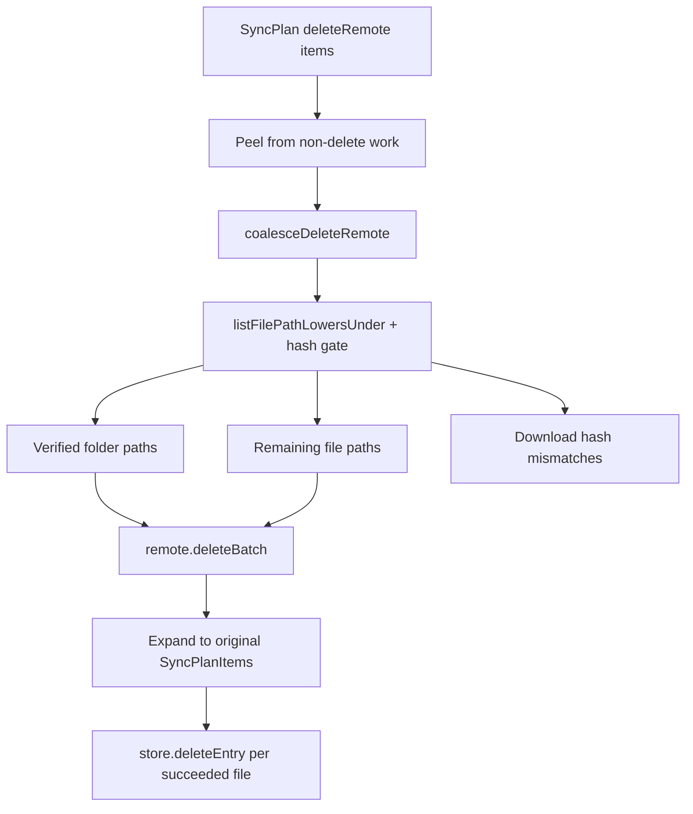

# Remote mass deletes (batch + folder coalesce)

## Why it exists

Deleting thousands of files on Dropbox one RPC at a time is slow and rate-limit heavy. When the planner has already decided many `deleteRemote` actions, the executor collapses safe complete subtrees into folder deletes and sends the rest through Dropbox `/files/delete_batch` so large cleanups finish in far fewer round-trips.

Planner intents stay path-level (files and explicit/inferred folder actions). Delete protection peels **both** file and folder delete actions into the trailing Deletions segment. Batching/coalesce remains an execution optimization for `deleteRemote` items.

## Conceptual understanding

- The sync plan still lists one `deleteRemote` per vault file path.
- Before those items run, the executor may:
  1. **Coalesce** complete delete subtrees into a single Dropbox **folder** path (recursive delete).
  2. **Batch** folder paths plus remaining file paths via `delete_batch` (chunks of ≤1000).
- Results are expanded back to the original file-level plan items so delete-log clearing, progress, and UI counts still say “N files,” not “1 folder.”
- Local `deleteLocal` (trash/remove in the vault) is unchanged — still per file.

Folder coalesce is allowed only when, using this cycle’s known remote file map:

- every known remote file under folder `F` is in the `deleteRemote` set,
- no other actionable plan path blocks under `F`,
- at least two delete paths are covered (`MIN_FOLDER_COVER_COUNT`),
- `F` is never the vault/app root (`""` / `"/"`).

## Flows

### Manual sync with deferred deletions

1. Section cycles plan uploads/downloads; `deferDeletes` holds **file and folder** deletes for the trailing Deletions segment (never run `deleteRemoteFolder` in the content phase).
2. User approves or skips bulk deletes (delete protection). Skip holds the Dropbox cursor so remote deletes reappear next sync.
3. On approve, `executeDeletePlan` runs the delete-only plan through the same batch/coalesce path; `deleteLocalFolder` runs after `deleteLocal` children.
4. Engine passes `lastExistingRemotePathLowers` so coalesce still sees the cycle’s remote file set.

### Per-entry outcomes

| Dropbox batch entry | Executor behavior |
|---|---|
| success | Treat covered file items as succeeded; clear store entries |
| `path_lookup/not_found` | Soft success (same as single `delete_v2`) |
| `too_many_files` on a folder | Expand that folder’s covered files and re-batch as files |
| whole job / transport failure | Fall back to per-item `remote.delete` |

## Technical details

| Piece | Role |
|---|---|
| `coalesceDeleteRemote` / `unionPathLowers` ([`src/sync/delete-coalesce.ts`](../src/sync/delete-coalesce.ts)) | Pure coalesce; empty snapshot → files only; min cover 2 |
| `RemoteStorage.deleteBatch` / `listFilePathLowersUnder` | Batch deletes + live folder verify with hashes |
| `DropboxAdapter.deleteBatch` | `/files/delete_batch` + `/files/delete_batch/check`; chunk 1000 |
| `executeDeleteRemoteBatch` ([`src/sync/executor.ts`](../src/sync/executor.ts)) | Coalesce → live verify → rescue downloads → batch → expand |
| `lastExistingRemotePathLowers` ([`src/sync/engine.ts`](../src/sync/engine.ts)) | Per-sync union of non-deleted remotes; reset in `syncNow` |
| Tests | `test/delete-coalesce.test.ts`, `test/dropbox-adapter-delete-batch.test.ts`, executor batch/verify cases |

Related: [Sync safety](sync-safety.md) (delete protection, infer guards), [Sync execute isolation](sync-execute-isolation.md) (concurrency for non-batch work), [Conflict resolution](conflict-resolution.md) (edit vs delete at plan time).

## Delete vs edit (plan time)

Folder/batch execution does not change planner rules. If local deleted a path but Dropbox content changed since base, classify chooses **download** (`remote_modified_local_deleted`) instead of `deleteRemote`. Those paths never enter the delete batch.

If a recursive **folder** delete already wiped Dropbox before the other device synced, later syncs follow normal local-only rules (unchanged local → `deleteLocal`; edited local → upload).

## Technical Gotchas

- **Empty remote snapshot → no folder coalesce.** `coalesceDeleteRemote` returns file deletes only when `existingRemotePathLowers` is empty (vacuous coverage is unsafe).
- **Multi-section sync unions the snapshot.** `resetCoalesceRemoteSnapshot()` runs once per `syncNow`; each section **unions** non-deleted remotes into `lastExistingRemotePathLowers` so a later empty settings map cannot wipe notes paths.
- **Live list + hash gate before folder delete.** After coalesce, each folder is verified with `listFilePathLowersUnder`. The **file** set must **exactly** match the planned delete set; nested folder entries and the folder path itself are ignored for that comparison (recursive Dropbox delete removes empty nested dirs with the parent). If any planned path’s live `content_hash` differs from sync-base, reject that folder delete, **download** the mismatched paths, and file-delete the rest.
- **Batch path skips per-item soft timeout.** Long `delete_batch` jobs poll until complete/failed/abort; do not wrap the whole job in the 90s item timeout.
- **Never send a folder and its children in the same batch.** Coalesce excludes covered files from the remaining file list.
- **Progress and delete-log stay file-level.** UI and `finalizeState` must see original `SyncPlanItem`s, not only the folder path. Successful downloads that restore a delete-logged path also clear the delete intent.
- **App/vault root must never be a folder delete target.** Coalesce skips empty/`"/"` prefixes.
- **Listing must not count the folder as its own member.** `listFilePathLowersUnder` excludes the queried folder path. Including it made `planned` vs `live` differ by one and forced file-only deletes, leaving empty folders on Dropbox.
- **Inferred `deleteRemoteFolder` must still await R9.** Folder actions are delete-plan actions; peeling only files left recursive Dropbox deletes running before the modal.
- **`deleteRemoteFolder` not_found is soft-ok.** Same policy as per-file `deleteRemote` — already-absent parents (prior wipe / parent folder delete) must not paint Deletions red.
