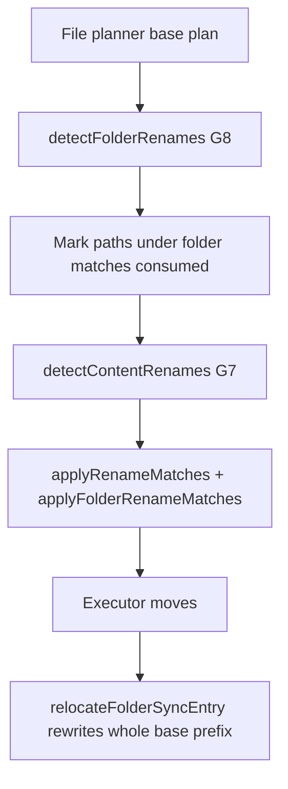

# Rename and move detection (G7 / G8)

## Why it exists

A path change that preserves content must be a **server-side move**, not delete-plus-upload. Re-uploading drops Dropbox revision history; at folder scale it also races with peers who added files under the old path. Gaps **G7** (file renames/moves) and **G8** (folder renames/moves, including empty folders) close that hole for both local edits and peer/Dropbox-side changes.

## Conceptual understanding

| Signal | Meaning |
|---|---|
| Same content hash, path gone on one side | Likely file rename/move (G7) |
| Same relative tree under a new folder path | Likely folder rename/move (G8) |
| Same parent directory, basename changed | UI **rename** chip (`Aa`) |
| Different parent directory | UI **move** chip (corner arrow) |

Cold sync uses the same three-way compare as live sync (P5): Obsidian rename events may only accelerate a plan a full scan would reach.

## Flows

### Local file rename / move (G7 → `moveRemote`)

1. Base still knows `old.md`; remote still has it; local only has `new.md` with the same hash.
2. Enhancement replaces `upload` + `deleteRemote` with one `moveRemote`.
3. Ambiguous hashes (two locals share one vanished base’s hash) refuse the pair — better a transfer than a wrong move.

### Peer file rename / move (G7 → `moveLocal`)

1. Local + base still at the old path; remote only at the new path with the same hash.
2. Plan emits `moveLocal` so the vault adopts Dropbox’s path without re-download.

### Local folder rename / move (G8 → `moveRemoteFolder`)

1. Old folder gone locally, still on remote; new local folder exists.
2. Score requires every base file/folder under the old root to appear under the new root at the **same relative path** with matching hash (empty trees use basename / uniqueness rules).
3. One `moveRemoteFolder` suppresses create/delete folder actions and per-file moves under that tree.

### Peer folder rename / move (G8 → `moveLocalFolder`)

1. Same scoring against the remote tree.
2. Emits `moveLocalFolder` and consumes paths so G7 does not emit N× `moveLocal` plus empty-folder deletes for leftovers.

### After execute

`relocateFolderSyncEntry` rewrites **every** sync-base row under the moved prefix (folder + nested files + nested empty folders). Without that, the next cycle sees ghost deletes/uploads for children that already moved on Dropbox.

### Sync panel chips

`toActionSummaryType` / `isSameParentRename` map `move*` / `move*Folder` onto rename vs move. Modal titles are file/folder-agnostic (`Renamed`, `Moved`, … — no trailing “Files”).

## Technical details

| Piece | Role |
|---|---|
| `src/sync/plan-enhancements.ts` | `detectFolderRenames`, `detectContentRenames`, `enhanceSyncPlan` order (G8 before G7) |
| `src/sync/executor.ts` | `moveLocalFolder` / `moveRemoteFolder` + `relocateFolderSyncEntry` |
| `src/sync/remote-move.ts` | Case-only Dropbox moves via temp path |
| `src/sync/sync-reporter.ts` | Chip classification and modal titles |
| Unit coverage | See [Sync scenario testing](sync-scenario-testing.md) — rename/move section |

## Technical Gotchas

- **G8 runs before G7 and consumes the tree.** A successful folder match must suppress child file moves; otherwise the plan double-applies.
- **Folder score today requires identical relative paths.** Renaming a folder **and** renaming a file inside it in the same offline window fails the folder match (`scoreLocalFolderRename` / `scoreRemoteFolderRename` look up `newFolder + oldRelative`). The cycle can fall back to create/delete + file transfers and surface a delete chip. Concurrent folder + inner path change needs residual same-tree file moves after the folder move (both directions).
- **Base rewrite is prefix-wide.** Updating only the folder row leaves children keyed under the old path_lower.
- **Empty-folder pairing is conservative.** Ambiguous empties without a unique basename match do not move.
- **Memory FS `rename` must handle folders** the same way as `VaultAdapter` so executor tests exercise `moveLocalFolder`.
