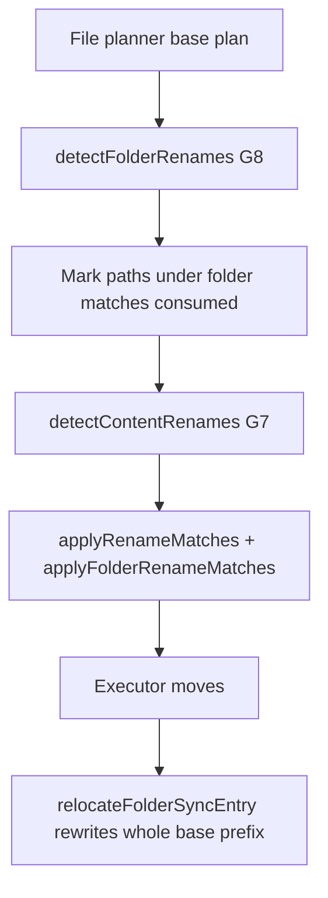

# Rename and move detection (G7 / G8)

## Why it exists

A path change that preserves content is **preferably** a **server-side move**, not delete-plus-upload. Re-uploading drops Dropbox revision history; at folder scale it also races with peers who added files under the old path. Gaps **G7** (file renames/moves) and **G8** (populated folder renames/moves) close that hole when detection is confident.

Rename/move detection is a **best-effort optimization**, not a correctness requirement. Correctness stays content-hash sync and delete protection. When the tree is ambiguous or compound, **create + delete is an accepted fallback** (upload/create folder + deleteRemote / deleteRemoteFolder), not a bug.

## Conceptual understanding

| Signal | Meaning |
|---|---|
| Same content hash, path gone on one side | Likely file rename/move (G7) |
| Same relative tree under a new folder path (populated) | Likely folder rename/move (G8) |
| Same parent directory, basename changed | UI **rename** chip (`Aa`) |
| Different parent directory | UI **move** chip (corner arrow) |
| Empty folder rename, folder+inner rename, or partial restructure | Create + delete fallback (no invented move) |

Cold sync uses the same three-way compare as live sync (P5): Obsidian rename events may only accelerate a plan a full scan would reach.

## Flows

### Local file rename / move (G7 → `moveRemote`)

1. Base still knows `old.md`; remote still has it; local only has `new.md` with the same hash.
2. Enhancement replaces `upload` + `deleteRemote` with one `moveRemote`.
3. Ambiguous hashes (two locals share one vanished base’s hash) refuse the pair — better a transfer than a wrong move.

### Peer file rename / move (G7 → `moveLocal`)

1. Local + base still at the old path; remote only at the new path with the same hash.
2. Plan emits `moveLocal` so the vault adopts Dropbox’s path without re-download.

### Local folder rename / move (G8 → `moveRemoteFolder`)

1. Old folder gone locally, still on remote; new local folder exists.
2. Score requires a **populated** tree: every base file under the old root appears under the new root at the **same relative path** with matching hash; destination must not hold unmatched extra files (bijection); nested base folders must exist under the new root.
3. One `moveRemoteFolder` suppresses create/delete folder actions and per-file moves under that tree.

### Peer folder rename / move (G8 → `moveLocalFolder`)

1. Same scoring against the remote tree.
2. Emits `moveLocalFolder` and consumes paths so G7 does not emit N× `moveLocal` plus leftover folder deletes for covered paths.

### Accepted fallbacks (not required to be moves)

| Case | Behaviour |
|---|---|
| Empty folder rename | `create*Folder` + `delete*Folder` |
| Folder rename **and** inner file rename in the same cycle | No compound `move*Folder` + residuals — create+delete and/or G7 file moves |
| Parent rename with children moved out / restructured | Unmatched shells may delete; content rematched elsewhere follows G7 / uploads |

### After execute

`relocateFolderSyncEntry` rewrites **every** sync-base row under the moved prefix (folder + nested files + nested empty folders). Without that, the next cycle sees ghost deletes/uploads for children that already moved on Dropbox.

### Sync panel chips

`toActionSummaryType` / `isSameParentRename` map `move*` / `move*Folder` onto rename vs move. Folder creates fold into the normal transfer chips (`createRemoteFolder` → upload ↑, `createLocalFolder` → download ↓) so one direction gets one count that includes both files and folders. Folder deletes map to trash chips (`delete*Folder` → deleteLocal / deleteRemote). Modal titles stay file/folder-agnostic (`Renamed`, `Moved`, `Uploaded`, `Downloaded`, `Cloud Deletions`, … — no trailing “Files”). Fallback create+delete cycles therefore show **upload/download + trash**, not a separate folder-plus chip.

## Technical details

| Piece | Role |
|---|---|
| `src/sync/plan-enhancements.ts` | `detectFolderRenames`, `detectContentRenames`, `enhanceSyncPlan` order (G8 before G7) |
| `src/sync/executor.ts` | `moveLocalFolder` / `moveRemoteFolder` + `relocateFolderSyncEntry` |
| `src/sync/remote-move.ts` | Case-only Dropbox moves via temp path |
| `src/sync/sync-reporter.ts` | Chip classification and modal titles |
| Unit coverage | See [Sync scenario testing](sync-scenario-testing.md) — rename/move section |

## Technical Gotchas

- **G8 runs before G7 and consumes the tree.** A successful folder match must suppress child file moves; otherwise the plan double-applies.
- **One-pass greedy matching.** Candidates are scored once and claimed parent-first among valid populated scores. There is no iterative rescore for “child moved out of tree” — that case falls back deliberately.
- **Folder score requires identical relative paths.** Renaming a folder **and** renaming a file inside it in the same window fails the folder match on purpose. Create+delete / G7 is the accepted fallback — residuals are not required.
- **Destination bijection.** A small folder cannot claim a larger destination that still has unmatched files (guards false pairs like `notes` → `_seeds (renamed)`).
- **Empty folders never use G8.** No content signal — always create+delete (guards false pairs like `empty-keep` → renamed parent).
- **Sync root (`""` / `"/"`) is never a folder-rename endpoint.** Empty remnants must not pair with the vault root (Dropbox rejects `move_v2` to `/`).
- **Base rewrite is prefix-wide.** Updating only the folder row leaves children keyed under the old path_lower.
- **Manual QA:** runbook `06-renaming-and-moving` uses two Sync Now passes — Pass 1 (A–D intact moves) then Pass 2 (E–H sibling renames + compound/empty fallbacks) — with exact seed paths. Rate-limited `move_v2` failures (`too_many_write_operations`) are real executor failures; retry Sync Now is expected, not a detection bug.
- **Memory FS `rename` must handle folders** the same way as `VaultAdapter` so executor tests exercise `moveLocalFolder`.
