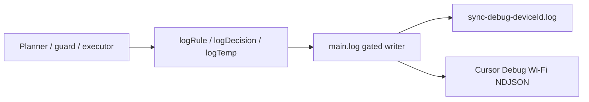

# Sync decision logging

## Why it exists

When sync misbehaves on desktop or iPad, maintainers need to see **which rule fired** and **why a path was classified**, not only “sync failed”. Release 0.2 extends the existing freeform `main.log()` / Cursor Debug NDJSON pipe with a stable taxonomy so every principle and rule has call sites and every cycle leaves an auditable trail.

## Conceptual understanding

Logs are still freeform strings. Structure lives in **metadata** on each line:

| Field | Role |
|---|---|
| `level` | `trace` / `debug` / `info` / `warn` / `error` |
| `category` | Subsystem tag from `SyncLogCategories` (`cycle`, `decision`, `rule`, `cursor`, …) |
| `ruleId` | `P1`–`P5` or `R1`–`R14` when a named contract is evaluated |
| `scenarioRow` | Optional row number from `docs/sync-scenarios.md` |
| `temp` | Phase tag for temporary validation logs (`logTemp`) that should be removed after a campaign |

`logRule` / `logDecision` wrappers in `sync-monitor.ts` stamp category + ruleId so filters on the NDJSON stream answer “why did sync decide that?” without grepping source.

## Flows

### Permanent decision trail

1. Planner / guards / executor call `logRule` or `logDecision` with a `SyncRules` id.
2. `test/sync-log-taxonomy.test.ts` fails if any `R1`–`R14` lacks a call site.
3. Lines reach the vault debug file and, when ingest is configured, the Mac Cursor Debug session.

### Verbose per-path firehose

1. Settings → Troubleshooting → **Verbose decision logging** (device-local).
2. `trace`-level decision lines are promoted to written output.
3. Leave off on large vaults — one line per path per cycle.

### Temporary validation (`meta.temp`)

1. Call `logTemp(log, phaseTag, message, data, meta)` during a fix campaign.
2. Filter NDJSON on `temp` / phase; remove call sites once the campaign’s final test confirms the fix via those logs (see project editing guidelines).

## Technical details

| Piece | Role |
|---|---|
| `CursorDebugLogMeta` | Extended ingest metadata (`src/debug/cursor-debug-ingest.ts`) |
| `SyncLogCategories` / `SyncRules` / `logRule` / `logDecision` | Taxonomy + helpers (`src/debug/sync-monitor.ts`) |
| `logTemp` | Temporary campaign convention (`src/debug/temp-log.ts`) |
| `verboseDecisionLogging` | Device-settings flag |
| `LogManager` | Higher `maxLines` (5000), size rotation to `.1`; built-in excludes for `sync-debug-*.log` and `sync-logs/` |
| Wi-Fi ingest | [Cursor Debug ingest](cursor-debug-ingest.md) |

## Technical Gotchas

- **Do not invent a parallel typed CycleContext log layer** for ordinary diagnosis — extend this freeform + meta pipe.
- **Never `fetch` localhost for mobile logs** — use the LAN relay + offer flow.
- **Taxonomy coverage is R-only.** Principles may also be tagged; the unit test asserts every `R*` appears in source.
- **Temp logs are not a license to leave noise forever.** Strip them after verified fix evidence.
