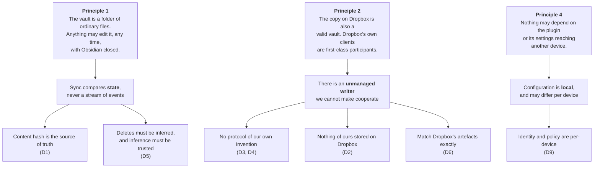

# Sync design decisions

## Why this page exists

[`sync-scenarios.md`](./sync-scenarios.md) says **what** should happen in every situation, and its gap list says what does not yet. Neither says **why** the target was chosen — and several of those choices look arbitrary or even wrong until you know what was ruled out first.

This page is the record of the reasoning. Each decision states the constraint that forced it, what else was considered, and what it costs, so that a future change can be made deliberately rather than by rediscovering the same argument. A decision here is not permanent; it is explained, which is what makes it safe to overturn.

Read the guiding principles in `sync-scenarios.md` before this page. Almost every decision below is downstream of one of them.

## The mental model

Three constraints sit above everything else, and most of the decisions are just consequences of taking them seriously.

The pattern worth noticing: the first principle makes information *disappear* — an event happened but left no trace we can read. The second makes cooperation *unavailable* — we can invent a scheme, but one participant will never follow it. The fourth makes shared configuration *unreliable* — we can write a setting down, but cannot assume it arrives. Every hard decision on this page is an attempt to work around one of those three, and the good answers all have the same shape: **find evidence that already exists rather than create evidence of our own.**

---

## D1 — `rev` decides collisions; clocks never do

**Constraint.** Two devices can modify the same file without either knowing about the other. Something has to detect the collision, and something has to decide the outcome. These are separate questions and it is a mistake to answer both the same way.

**Decision.** Detect collisions with Dropbox's `rev`, using it as an optimistic lock on upload. Never use a timestamp to decide which version survives.

**Why.** `rev` is *causal*, not chronological. Uploading with `mode: update(<rev>)` asserts "I edited the version I last saw, and I believe it is still current." Dropbox rejects the write if it is not. That is a statement about what the device knew, and it is true regardless of what any clock said.

A timestamp comparison asserts something much weaker and much less reliable. Device clocks drift, are user-settable, differ across timezone handling, and are set by the machine that stands to gain from the comparison. Two files a second apart may have been written in either real order. Worse, "newest wins" *discards* the loser, so being wrong destroys content rather than merely reordering it.

The critical property is that `rev` detects a collision but does not name a winner — which is correct, because there isn't one. Two people edited a file; both edits are real. The right response is to keep both, and the rest of the conflict machinery exists to do exactly that.

**Where clocks are still allowed.** A clock may decide a question where being wrong is *harmless*. Which capitalisation of a filename to adopt is such a question: both candidates name the same file, both contain the same bytes, and picking the older one is an annoyance rather than a loss. Deciding which of two versions to delete is not such a question, and no timestamp may ever be the reason content is destroyed.

**Cost.** Conflicts produce files instead of resolving silently. This is not really a cost — it is the correct behaviour — but users unfamiliar with sync read a conflicted copy as a malfunction, so it needs explaining in the interface.

**Consequences.** Gap `G5` (remove "newest wins") follows directly. Gap `G2` (the version already on Dropbox keeps the canonical name) also follows: anchoring to what is already on the server is deterministic for free, because `rev` already serialises uploads, so every device reaches the same conclusion without comparing anything.

---

## D2 — Nothing of ours is stored on Dropbox

**Constraint.** The second principle: the folder on Dropbox must remain a valid vault that Obsidian can open directly, so that a desktop machine can keep syncing it through Dropbox's own client while Obsidian is closed.

**Decision.** Remote paths mirror vault paths exactly. No sidecar files, no manifest, no metadata directory, no index. All sync state is local to each device.

**Why.** The moment we write a file to the shared folder, that folder stops being just a vault. A user browsing it in Finder sees our bookkeeping. A user who opens the folder in Obsidian sees it in their file tree. A second vault sharing the folder collides with it. And the file has to be kept correct by every writer — which brings us to the reason this decision is load-bearing rather than merely tidy: **a Dropbox-managed device will never update it.** Any shared structure we maintain is guaranteed to be stale in exactly the cases we most need it.

**Cost.** Substantial, and paid repeatedly. Any fact a fresh device needs, but cannot derive from the files themselves, has nowhere to live. Deletion history and rename timestamps are both in this category, and both appear as open problems below.

**Consequences.** This is the decision that rules out tombstones (D3) and complicates rename detection (D4).

---

## D3 — Deletion evidence is read from Dropbox, not written by us

**Constraint.** A device with no prior state cannot tell "this was deleted" from "this never existed." Rule 6 of the standard-practice list requires a durable record. D2 says we cannot store one.

**Decision.** Use Dropbox's own revision history (`list_revisions`) as the deletion record. Do not implement tombstones.

**Why.** The obvious objection to tombstones is that they pollute the folder and treat Dropbox as a database. That objection is real but it is not the decisive one — plugin state can legitimately live under `.obsidian/plugins/`, and the pollution would be tolerable.

The decisive objection is correctness. A tombstone is only written by a device running this plugin. Under the second principle, deletions also happen from the Dropbox desktop client, from the Dropbox web interface, and from Finder. None of those produce a tombstone. So the log would be **incomplete in a way that is invisible** — and an incomplete deletion log is worse than none at all, because a missing entry is indistinguishable from a positive assertion that the file was never deleted. We would have built a mechanism that is confidently wrong exactly when the hybrid setup is in use, which is the setup we expect people to have.

Dropbox, meanwhile, already records every deletion in the folder, whoever performed it, because it performed all of them. That record is complete by construction. Reading it needs no cooperation from anyone, survives our plugin being uninstalled, and costs nothing to maintain.

**Cost.** Three of them.

`list_revisions` answers *per path*: it can confirm "was this specific file deleted?" but cannot enumerate "what was deleted while I was away." So it works as a check against a suspicion — a device holding a file the remote lacks asks about that path — but it cannot drive a sweep. In practice that is the shape of the question we actually have, so the limitation bites less than it first appears.

Retention is Dropbox's to decide, not ours. Personal plans keep deleted files for 30 days. That is shorter than the offline periods worth designing for, and we cannot extend it. Whether a deletion remains *reported* after the file itself ages out is an open question worth confirming against the live API.

And it is an API call per suspicious path, which needs rate-limit care on a device rejoining after a long absence.

**Alternative rejected.** Tombstones under `.obsidian/plugins/dropbox-sync/tombstones/<deviceId>.json`, one file per device to avoid write conflicts, retained 90 days. Clean, conventional, and would have worked in a plugin-only world. Rejected solely because of the unmanaged writer.

**Consequences.** Gap `G3`. Note the dependency this creates: `G3` is now coupled to a third-party API's retention policy, which is a weaker foundation than a mechanism we control. It was still the better of the two options.

---

## D4 — Renames are detected by content, not only by events

**Constraint.** Obsidian reports a rename when it performs one. Under the first principle, a rename may also happen in Finder with Obsidian closed, in which case the next scan sees one path gone and another appeared — the same observation a delete plus an unrelated create produces.

**Decision.** Treat the vault's rename event as a fast path when available, and fall back to matching content hashes between disappeared and appeared paths. Execute the result as a server-side move.

**Why.** The event is strictly better information when we have it, so use it. But designing only for the event means renames done outside Obsidian degrade into delete-plus-upload, which loses version history, re-transfers every byte, and at folder scale is a correctness bug rather than an inefficiency: deleting a folder and re-uploading it under a new name discards any file another device added to that folder in the meantime.

Content matching is a heuristic and will occasionally be wrong — this is the same problem Git solves with similarity detection, and it is wrong there too, harmlessly. The failure mode is benign: a missed match falls back to delete-plus-create, which is the current behaviour.

**Cost.** Heuristics are hard to test and hard to explain. A rename plus an edit in the same offline window produces a changed hash and will not match.

**Consequences.** Gaps `G6` and `G7`. The rename-timestamp half of this remains unresolved — see the open problems below.

---

## D5 — Deletes are inferred from absence, but inference must be earned

**Constraint.** The first principle means a delete may leave no event at all. If we only ever act on witnessed deletions, a file deleted in Finder while Obsidian was closed never syncs, and the vault silently diverges. So absence *has* to be able to mean deletion.

**Decision.** Continue inferring deletes from absence, but gate the inference on positive confirmation that the scan is trustworthy, and defer rather than guess when it is not.

**Why.** This overturns the tempting principle "an absence is not a decision." That principle is right about the *evidence* and wrong about the *consequence*: absence really is weak evidence, but refusing to act on it breaks the principle outright.

The real problem is that a scan can be incomplete for reasons that have nothing to do with the user's intent — a vault still mounting, an index not yet built, a read error, a crash mid-startup. Every one of those looks exactly like a deletion. The current brake is a ratio test (skip inference when a section holds over 20 known files and fewer than half are present), which catches catastrophic cases and sails straight past the common one: a crash that loses a single file.

The fix is to make the *scan* something we can vouch for rather than to make the *inference* more timid. Confirm the vault was fully mounted, fully enumerated, and read without error; then absence within it is meaningful. Without that confirmation, defer to the next cycle — the deletion is not urgent, and a delayed delete is recoverable in a way a wrong one is not.

**Cost.** "Fully enumerated without error" is a stronger claim than it sounds, particularly on mobile where the app may be suspended mid-scan. Getting this wrong in the conservative direction means deletes stop propagating, which is its own failure.

**Consequences.** Gap `G22`. The bulk-delete threshold prompt remains as a second line of defence, but it should not be the primary one — it asks the user to adjudicate something they have no information about.

---

## D6 — Conflict copies use Dropbox's naming format exactly

**Constraint.** Under the second principle, Dropbox's own clients create conflicted copies in the same folder we do. A vault will contain both.

**Decision.** Use Dropbox's format character for character: `note (Dale's MacBook's conflicted copy 2026-07-26).md`.

**Why.** Two formats for one concept is two things for the user to learn and two patterns for us to recognise, in a vault where both kinds appear side by side and the distinction means nothing to the person reading it. Matching exactly means a conflicted copy looks the same however it arose, and our recognition logic covers artefacts we did not create.

An earlier draft used `note (Conflict from Dale's MacBook at 2026-07-26 1043).md`, which is more informative — it carries a time as well as a date, and the date is the modification date of the enclosed version rather than the moment of detection. That is genuinely better in isolation. It was rejected because consistency across the whole folder matters more than precision within our half of it.

**Cost.** Real, and worth stating plainly. Dropbox's format carries no time component, so two conflicts on the same file from the same device on the same day collide and need a counter appended. We also inherit a format we cannot change if Dropbox changes theirs.

**Trap.** Adopting the format means a conflict-file *filter* that matches Dropbox names would exclude those copies from syncing. Release 0.2 landed D6 together with D8 / `G1`: detection helpers associate siblings for UI and reuse only — they never strip paths from local or remote scans.

**Consequences.** Gaps `G9` and `G23` (closed on `release_0.2`; see [Sync gap closure](sync-gap-closure.md)).

---

## D7 — The remote may change mid-cycle, so a plan is a snapshot

**Constraint.** A Dropbox client writes to the folder continuously and on nobody's schedule. Nothing observed at the start of a sync cycle is guaranteed to still be true when the cycle acts on it.

**Decision.** Treat every plan as provisional. Verify destructive operations against live state at the moment of execution, and retry rather than force anything that fails.

**Why.** The alternative — locking, or assuming the plan is authoritative — is not available, because the other writer will not participate in any locking scheme we devise.

Two places already do this correctly and are worth studying as the pattern. Uploads carry a `rev`, so a stale upload is rejected by Dropbox rather than overwriting a newer version. And before a recursive folder delete is sent, the executor **re-lists the folder live from Dropbox** and requires the children to match the plan exactly; anything unexpected downgrades the operation to individual file deletes.

That second check is doing more work than it appears to. Because it queries Dropbox directly, its listing is unfiltered — so it catches not only files added mid-cycle, but also files that the planner's own exclusion rules had stripped from view. A folder containing an excluded file therefore survives, even though the planner believed the folder was complete. The safety comes from asking the authoritative source late, rather than from getting the earlier reasoning right.

**Cost.** An extra API call per coalesced folder delete, and a class of correctness that depends on remembering to re-verify. It is a discipline, not a mechanism.

**Consequences.** Gap `G24` (individual remote deletes now re-check live rev/hash) and `G20` (empty subfolders included in live verify). Closed on `release_0.2`; see [Sync gap closure](sync-gap-closure.md).

---

## D8 — Conflict copies must sync

**Constraint.** None. This one is a straightforward defect.

**Decision.** Conflict copies are ordinary files and must propagate to Dropbox and to every device.

**Why.** Filtering them out of local scans left a conflict copy on exactly one device — wipe that device and the losing version was gone. Both Dropbox and Syncthing propagate conflict copies for exactly this reason. The noise is the point: a conflict copy is a message that two versions existed, and a message delivered to one device is not delivered.

**Cost.** Conflict copies appear on every device, including the ones whose users did not cause the conflict.

**Consequences.** Gap `G1` (closed with D6 on `release_0.2`; see [Sync gap closure](sync-gap-closure.md)).

---

---

## D9 — Configuration is per-device, and sync behaviour may not depend on it

**Constraint.** The user chooses which vault sections sync, and syncing notes only is a reasonable choice. So no part of `.obsidian/` can be assumed to travel — settings, workspaces and the plugins folder alike. A user may sync notes only and install this plugin by hand on each device, leaving every installation independent, separately configured, and possibly on a different version.

**Decision.** Treat every setting, and the plugin's presence itself, as local. Exclude patterns, delete thresholds and conflict strategy are per-device preferences rather than shared policy, and no correctness argument may rest on two devices agreeing about any of them — or on the far device running this plugin at all.

**Why.** The failure this prevents is subtle, because settings *usually* do sync and the design appears to work until someone turns a section off. A rule that quietly assumes shared configuration does not fail loudly on the device that lacks it — it just behaves differently there, and the divergence surfaces later as a conflict or a deletion nobody can account for.

Two specific consequences follow. Anything that must be unique per device — a device identity above all — cannot live in a file that might be copied to another device, because the receiving device will adopt it rather than mint its own. And a device syncing a subset of the vault holds none of the sections it excluded, which is indistinguishable by state alone from a device that deleted them. Absence of a whole section has to be read as "out of scope", which is a fact about this cycle's configuration, not as "removed", which is a fact about the user's intent.

**Cost.** Some genuinely shared decisions have nowhere to live. A vault-wide exclusion policy, for instance, cannot be expressed at all — each device is configured separately, and drift between them is invisible. Independent installation also means version skew is normal, so any change to what we write into the vault has to stay readable by an older build that has not been updated yet.

**Consequences.** Gaps `G25` and `G26`. It also strengthens `G5`: a per-device conflict strategy means the same clash resolves differently depending on which device notices it first, so a strategy that can destroy content is worse than it looks.

## Open problems

These have no decision yet. They are recorded so the next attempt starts from the constraints rather than from scratch.

**Rename timestamps have nowhere to live.** D4 needs to know which of two competing renames happened later, and a rename does not change a file's modification date — so the timestamp must be recorded at rename time. D2 says it cannot be stored on Dropbox, and a fresh device needs to read it. The deletion equivalent of this problem was solved by finding evidence Dropbox already keeps (D3); the same trick may apply here, inferring the stamp from `server_modified` on the moved file rather than recording one. Unconfirmed.

**Case-only renames may not be expressible.** Dropbox is case-insensitive but case-preserving, and it is unclear whether `move_v2` will accept a source and destination that differ only in case. Section 7 of the scenarios document is unimplementable if it will not. Worth ten minutes against the live API before any of it is built.

**Folders are not modelled at all.** `G8` is a large gap that several other decisions lean on — folder moves, empty folders, and file-versus-folder path collisions all need folders to be first-class. Under the second principle this stops being optional, because the Dropbox client syncs empty folders natively, so they genuinely exist on the remote whether we model them or not.

## Technical gotchas

- **Every "just store it alongside the files" idea is already ruled out.** D2 is easy to forget because the alternative is so natural. If a design needs shared mutable state, it needs a different design — or it needs to find that state somewhere Dropbox already maintains it.

- **An incomplete record is worse than no record.** This is the heart of D3 and it generalises. A log that is missing entries invites confident wrong conclusions, whereas an acknowledged absence of information invites caution. Prefer no mechanism to a mechanism with a silent blind spot.

- **Detecting a collision and resolving one are different problems.** D1 depends on keeping them apart. Most sync bugs of the "wrong version won" variety come from a mechanism that tried to do both at once.

- **The unmanaged writer is not an edge case.** It is the expected desktop configuration. When evaluating a design, the question is not "does this work if everyone runs the plugin" but "what does this do when half the devices don't."

- **"The settings say so" is not an answer.** Any design that reads a setting to decide shared behaviour has to survive that setting never arriving. If the design only works when configuration is uniform, it does not work.
