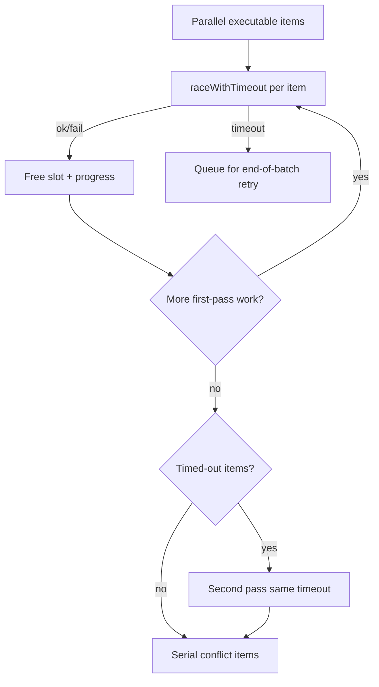
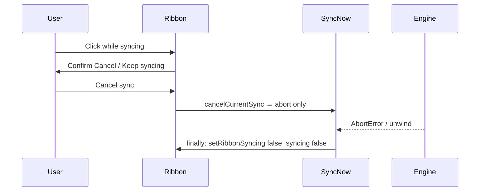

# Sync execute isolation and cancel

## Why it exists

A few slow or failing file operations used to monopolize the parallel executor and make the rest of a vault feel “stuck,” while cancel races could leave the ribbon spinning after a sync had already stopped. Soft timeouts push hanging items to the back; cancel cleanup belongs to a single owner so UI state stays truthful.

## Conceptual understanding

- **Independent items.** One file failing does not abort the other plan items (conflicts still run serially after the parallel batch).
- **Soft timeout (default 90s).** If an item takes longer than `itemTimeoutMs`, its worker slot is freed. The item is **retried once at the end** of the parallel pass so faster files are not blocked behind it.
- **Retry still times out → fail.** Second timeout records an `ItemTimeoutError` on that item; the cycle continues.
- **Cancel.** Ribbon confirm → `abortController.abort()` only. `syncing` and the ribbon spin clear in `syncNow`’s `finally`, not in `cancelCurrentSync`, so a follow-up sync cannot start (or get its spin cleared) while the aborted cycle is still unwinding.

## Flows

## Technical details

| Piece | Role |
|---|---|
| `executePlan` (`src/sync/executor.ts`) | Two-pass parallel batch + serial conflicts |
| `ItemTimeoutError` / `raceWithTimeout` | Soft timeout; does **not** cancel underlying I/O, only frees the concurrency slot |
| `DEFAULT_ITEM_TIMEOUT_MS` | `90_000`; override via `itemTimeoutMs` (`0` disables) |
| `concurrency` | Plugin sets `3` in engine options |
| `cancelCurrentSync` | Abort + status/notice only |
| `syncNow` `finally` | Always clears ribbon + `syncing` when that run ends |

Progress: first-pass timeouts do not bump `completed` until the retry (or abort path marks them failed) so the denominator stays “each item once.”

## Technical Gotchas

- **Soft timeout ≠ cancel network.** A timed-out Dropbox request may still complete in the background; the executor has already moved on. That is intentional so one hung call cannot stall the vault.
- **Conflicts are not timed out the same way.** Manual conflict modals are serial after the parallel batch and wait for the user.
- **Never clear `syncing` in cancel.** Early clear previously allowed a new sync to start before the old `finally`, which could leave the ribbon spinning or strip the new run’s spin.
- **Confirm modal does not abort until confirmed.** Closing with Keep syncing leaves the engine untouched.
