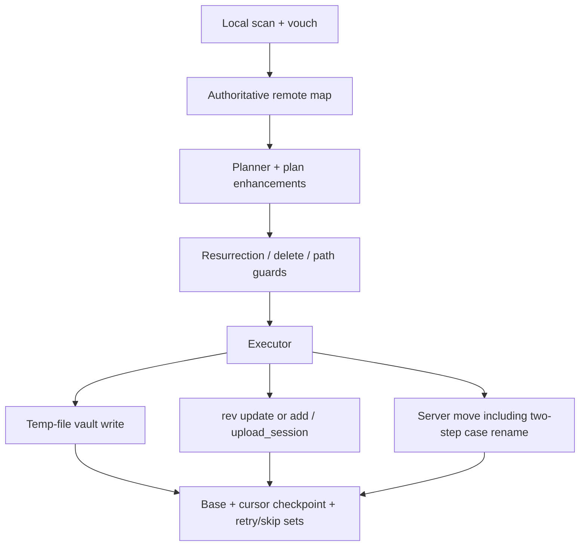

# Sync gap closure (release 0.2)

## Why it exists

`docs/sync-scenarios.md` defines principles (P1–P5), rules (R1–R14), and a gap list (G1–G30) of places the engine could lose or silently overwrite vault content. Release 0.2 closes that backlog so every sync cycle reconciles against live Dropbox truth, never discards a conflict side, and keeps durable evidence when a delete or rename is ambiguous.

## Conceptual understanding

Think of one sync cycle as: **observe → decide → verify → apply → remember**.

| Phase | Mental model |
|---|---|
| Observe | Local scan (vouched completeness) + authoritative remote listing / cursor delta |
| Decide | Planner emits actions tagged with rules; identical content still records base (`recordBase`) |
| Verify | Resurrection (`list_revisions`), delete live checks, folder membership matches |
| Apply | Temp-file local writes; rev/`add` uploads; upload sessions for large files; bounded open-editor deferrals |
| Remember | Base + `basePathDisplay`, cursor checkpoint with retry set, permanent skip set, scoped delete log |

Conflict copies are ordinary vault files: Dropbox keeps the canonical path (R2); the arriving device’s bytes land in a Dropbox-named sibling that syncs everywhere (R3).

## Flows

### Same content after a short absence (G4)

1. Planner sees matching content hashes → `recordBase` (not a silent noop drop).
2. Executor writes base (including `basePathDisplay`) so the next cycle does not treat the path as `new_local`.

### Keep both on concurrent edit (G1 / G2 / G5 / G9)

1. Rev conflict or dual change → conflict handler.
2. Canonical path keeps Dropbox bytes; local displaced bytes become `note (Device X's conflicted copy YYYY-MM-DD).md` (same-day counter when needed).
3. Both paths remain in scans and sync to every device. Settings only offer `keep_both` or `manual` UX — `newest` is migrated away.

### Fresh join vs delete (G3 / R6 / R10)

1. **Only when the device has no Dropbox cursor** (fresh join / cleared history) do `new_local` uploads pass through `applyResurrectionGuard`.
2. `list_revisions` shows a deletion → preserve as conflict copy, do not resurrect the path.
3. No evidence (or API unavailable) → ask upload vs discard; never silent resurrect.
4. A device that already has a cursor and recreates a path after its own delete uploads with `add` — R10 must not turn that recreate into a conflict copy.

### Empty folders (G8)

1. Empty folders are first-class: create/delete sync as folder actions, not inferred from file paths alone.
2. Peer deletes a remote folder → local **empty** folder becomes `deleteLocalFolder` (do not re-upload it). If the local folder still holds unmanaged files that were never on Dropbox, skip the folder wipe and only remove tracked children via the file planner.
3. Local deletes a folder (or its whole tree) → `deleteRemoteFolder` when the folder path is in the delete log **or** when base still knows the folder, local is gone, and no orphan local files remain under it (`inferred_local_tree_wipe`). Without that inference, missing folder delete intents restored empty shells via `createLocalFolder`.
4. Incremental sync still seeds folder rows from base (folders have no content hash/rev); otherwise the folder vanishes from the remote map and a child download can be wiped by a false `deleteLocalFolder`.
5. R14 coalesce live-verify compares **files only** (ignores nested/self folder entries) so complete file deletes still collapse to a recursive folder delete.

### Cursor progress with failures (G27 / G10 / G30)

1. Successful items write base immediately.
2. Transient failures stay in a durable retry set; the cursor may still checkpoint.
3. Open-editor / conflict deferrals expire after 60s (`DeferralTracker`), then apply or force the delete prompt so the cursor cannot stall forever.
4. Delete intents are scoped to what planning can act on; case-only renames do not `trackDelete`.

### Large upload / permanent local failure (G16 / G17)

1. Bodies above 8 MiB use Dropbox `upload_session` chunks.
2. Disk-full / oversize / local-path errors enter `permanentSkipSet` and stop retrying every cycle.

## Technical details

| Area | Modules |
|---|---|
| Decision logging | `src/debug/sync-monitor.ts`, `src/debug/cursor-debug-ingest.ts`, `src/debug/temp-log.ts` — see [Sync decision logging](sync-decision-logging.md) |
| Device identity / OAuth | `src/device-settings/` — see [Plugin persistence](plugin-persistence.md) |
| Conflicts | `src/sync/conflict-handlers.ts`, `ConflictStrategy` in `src/types.ts` — see [Conflict resolution](conflict-resolution.md) |
| Remote truth | `engine.buildFullRemoteState`, `scope-fingerprint.ts`, `resurrection-guard.ts` |
| Moves / folders | `plan-enhancements.ts`, `remote-move.ts` (two-step case move) |
| Transport | `upload-chunk.ts`, `vault-adapter` temp writes, `permanent-skip.ts`, `retry-set.ts` |
| Deferrals / editors | `deferral-tracker.ts`, `open-editors.ts` |
| Scenario harness | See [Sync scenario testing](sync-scenario-testing.md) — matrix + `qa/` harness / `qa-test-vault/` |
| Contract / historical gaps | `docs/sync-scenarios.md` (gap table wording is the pre-fix audit; behaviour lives here and in code) |

ClickUp phase tickets (Os: 0.1): `86d3u7bfu` … `86d3u7bjk`. Implementation commit on `release_0.2`: `86a8714`.

## Technical Gotchas

- **Dropbox rejects case-only `move_v2`.** Case renames use a two-step move through a unique temp path (`remote-move.ts`).
- **Never seed a full listing from base.** Cursor-less / authoritative listings replace the remote map; base∪delta only applies when the cursor delta is incremental.
- **Rev-less upload is `add`, never `overwrite`.** Unexpected remote occupants become conflicts instead of silent replacements (G29).
- **Conflict detection ≠ scan exclusion.** `isConflictFile` associates siblings for UI/reuse; it must not strip paths from local or remote scans (G1).
- **`verboseDecisionLogging` is device-local.** Trace-level per-path decisions would flood every machine if stored in synced settings.
- **Gap table in sync-scenarios.md is historical.** Do not treat “Today …” prose in G* rows as current behaviour after release 0.2 — verify against this page and the modules above.
- **Resurrection (R6/R10) only runs without a sync cursor.** Devices that already sync must recreate after their own delete via `add`, not `preserveAsConflictCopy`.
- **Folder base rows must seed incremental remote maps.** Empty folders have no hash/rev; omitting them made peers plan `deleteLocalFolder` and drop children just downloaded into that folder.
- **Do not `deleteLocalFolder` when unmanaged local children remain.** Peer folder deletes must leave unsynced extras (row 65); file-level deletes remove only tracked children.
