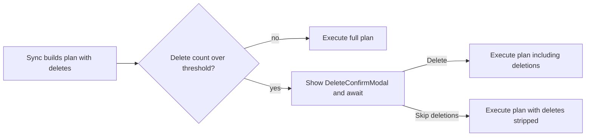

# Sync Safety

When you delete a file on one device, the sync plugin needs to delete it on your other devices too. This is risky — if something goes wrong, files could be lost everywhere. That's why this plugin uses three independent safety layers.

## Layer 1: Only intentional deletions are synced

The plugin only deletes files from Dropbox when it **sees you delete them in Obsidian**. It keeps a log of every file you delete or rename.

What this means in practice:

- If a file is missing because of a glitch or partial sync, it will **not** be deleted from Dropbox — it will be downloaded back instead
- If you exclude a file from sync using patterns, it will **not** be deleted from Dropbox
- Only files you deliberately delete (or rename) in Obsidian are removed from Dropbox

## Layer 2: Confirmation before bulk deletions

If a sync would delete more than 5 files at once (and delete protection is on), a confirmation window appears showing exactly which files will be deleted. The sync **waits** for your choice before continuing that cycle.

<!-- TODO: 스크린샷 — 대량 삭제 확인 모달 (파일 리스트 + Delete/Skip 버튼) -->
<!-- 파일: docs/images/delete-guard.png -->

This catches situations like:

- Accidentally deleting a folder
- Something going wrong with the sync state
- Switching to a different Vault ID (which could look like everything was deleted)

You can click **Delete** to proceed with those deletions in the **current** sync, or **Skip deletions** to sync everything else and leave those files alone.

The threshold (default: 5 files) can be changed in **Settings > Delete threshold**.

## Layer 3: Dropbox keeps deleted files

Even after a file is deleted from Dropbox, it's not gone forever. Dropbox keeps deleted files in its trash:

- **Free and Plus plans**: 30 days
- **Professional and Business plans**: 180 days

To recover a deleted file, go to [dropbox.com](https://www.dropbox.com), click **Deleted files** in the sidebar, find your file, and click **Restore**.

## What are "deferred" files?

Sometimes the plugin skips a file during sync instead of processing it:

- A file you're currently editing won't be overwritten mid-edit
- A conflict you chose to deal with "later" is deferred to the next sync

These files aren't lost — they'll be handled on the next sync cycle. The sync result tells you if any files were deferred.

## Technical details

| Piece | Role |
|---|---|
| `checkDeleteGuard` (`src/sync/guards.ts`) | Counts delete actions; returns a filtered plan when over threshold |
| `SyncEngine.applyDeleteGuard` | Awaits `onDeleteGuardTriggered`; `true` keeps deletes, `false` uses `filteredPlan` |
| `DeleteConfirmModal` | Lists pending deletes; resolves `true`/`false` when the user closes it |
| Plugin `onDeleteGuardTriggered` (`src/main.ts`) | Opens the modal and **awaits** the result for this cycle |

## Technical Gotchas

- **The modal must block the cycle.** Returning `false` immediately and deferring approval to a later debounced sync made both **Delete** and **Skip** look like Skip (especially when background sync was off). Always `await modal.waitForConfirmation()` and return that boolean.
- **One modal at a time.** If a confirm modal is already open, a second guard trigger returns `false` (skips deletes) to avoid stacked dialogs.
- **Threshold is independent of the interactive-progress threshold.** Delete protection uses `deleteThreshold`; large-background promotion uses `largeSyncInteractiveThreshold`.
