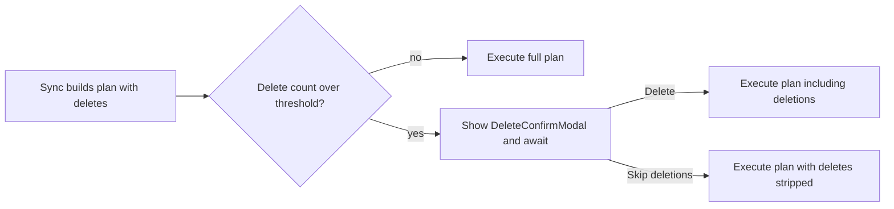

# Sync Safety

When you delete a file on one device, the sync plugin needs to delete it on your other devices too. This is risky — if something goes wrong, files could be lost everywhere. That's why this plugin uses three independent safety layers.

## Layer 1: Only intentional deletions are synced

The plugin only deletes files from Dropbox when it **sees you delete them in Obsidian**. It keeps a log of every file you delete or rename.

What this means in practice:

- If a file is missing because of a glitch or partial sync, it will **not** be deleted from Dropbox — it will be downloaded back instead
- If you exclude a file from sync using patterns, it will **not** be deleted from Dropbox
- Only files you deliberately delete (or rename) in Obsidian are removed from Dropbox

**Incomplete local scan guard (notes and plugins):** As a catch-up, the planner can *infer* deletes when a path is in the sync base and on Dropbox but missing locally. That is unsafe when the local listing is far smaller than the base (empty vault, partial index, mobile scan gaps). If the notes or plugins section is active and local count is under half of base (and base > 20), the engine **skips inferring** those deletes and clears prior non-`event` intents for that section so a bad mass-infer does not keep re-prompting. Vault delete/rename events (`event` source) still apply. Prefer re-download over mass `deleteRemote`.

## Layer 2: Confirmation before bulk deletions

If a sync would delete more than 5 files at once (and delete protection is on), a confirmation window appears showing exactly which files will be deleted. The sync **waits** for your choice before continuing that cycle.

<!-- TODO: 스크린샷 — 대량 삭제 확인 모달 (파일 리스트 + Delete/Skip 버튼) -->
<!-- 파일: docs/images/delete-guard.png -->

This catches situations like:

- Accidentally deleting a folder
- Something going wrong with the sync state
- Switching to a different Vault ID (which could look like everything was deleted)

You can click **Delete** to proceed with those deletions in the **current** sync, or **Skip deletions** to sync everything else and leave those files alone.

The threshold (default: 5 files) can be changed in **Settings > Delete threshold**.

```mermaid
flowchart LR
  Plan[Sync builds plan with deletes] --> Guard{Delete count over threshold?}
  Guard -->|no| Execute[Execute full plan]
  Guard -->|yes| Modal[Show DeleteConfirmModal and await]
  Modal -->|Delete| ExecuteDeletes[Execute plan including deletions]
  Modal -->|Skip deletions| Filtered[Execute plan with deletes stripped]
```

## Layer 3: Dropbox keeps deleted files

Even after a file is deleted from Dropbox, it's not gone forever. Dropbox keeps deleted files in its trash:

- **Free and Plus plans**: 30 days
- **Professional and Business plans**: 180 days

To recover a deleted file, go to [dropbox.com](https://www.dropbox.com), click **Deleted files** in the sidebar, find your file, and click **Restore**.

## What are "deferred" files?

Sometimes the plugin skips a file during sync instead of processing it:

- A file you're currently editing won't be overwritten mid-edit
- A conflict you chose to deal with "later" is deferred to the next sync

These files aren't lost — they'll be handled on the next sync cycle. The sync result tells you if any files were deferred.

## Stale delete-log cleanup

Before each sync cycle, the plugin **prunes** delete-log paths that have neither a sync-base entry nor a local file. Those orphans cannot produce a meaningful delete and only inflate planning.

Prune loads base keys and local vault paths **once** (set membership), then walks the log — not per-path store/vault scans. The old O(n²) approach stalled iPad sync start when thousands of intents accumulated.

## Technical details

| Piece | Role |
|---|---|
| `checkDeleteGuard` (`src/sync/guards.ts`) | Counts delete actions; returns a filtered plan when over threshold |
| `SyncEngine.applyDeleteGuard` | Awaits `onDeleteGuardTriggered`; `true` keeps deletes, `false` uses `filteredPlan` |
| `DeleteConfirmModal` | Lists pending deletes; resolves `true`/`false` when the user closes it |
| Plugin `onDeleteGuardTriggered` (`src/main.ts`) | Opens the modal and **awaits** the result for this cycle |
| `pruneStaleDeleteLog` (`src/main.ts`) | Drops orphan delete intents with one base + one local path set |
| `deleteRemote` (`src/sync/executor.ts`) | Dropbox `path_lookup/not_found` treated as success (remote already gone) |
| `shouldSkipNotesInfer` / `shouldSkipPluginInfer` | Incomplete-scan guards; shared threshold helper `shouldSkipInferForIncompleteLocal` |
| `SyncEngine.finalizeState` | Advances Dropbox cursor only when the cycle fully succeeded **and** the delete log is empty after clearing executed deletes |

## Technical Gotchas

- **The modal must block the cycle.** Returning `false` immediately and deferring approval to a later debounced sync made both **Delete** and **Skip** look like Skip (especially when background sync was off). Always `await modal.waitForConfirmation()` and return that boolean.
- **One modal at a time.** If a confirm modal is already open, a second guard trigger returns `false` (skips deletes) to avoid stacked dialogs.
- **Threshold is independent of the interactive-progress threshold.** Delete protection uses `deleteThreshold`; large-background promotion uses `largeSyncInteractiveThreshold`.
- **Do not advance the cursor while the delete log still has pending intents.** Multi-section manual sync used to update the cursor on a later section after an earlier section skipped deletes, which left remote files intact and the next cycle re-downloaded (or re-prompted). Clear succeeded deletes first, then require `deletedPaths.size === 0` (and no `deletesSkipped` / failures / deferred) before writing the cursor.
- **Incomplete-scan skip is not “user deleted half the vault.”** If local notes are still ≥ 50% of base, infer still runs. Explicit Obsidian delete/rename events always stay in the delete log.
- **`deleteRemote` not_found is success.** A 409 `path_lookup/not_found` means the remote path is already absent — clear the sync entry / delete intent instead of failing the item (stale intents otherwise stick and block cursor finalize).
- **Prune must stay O(n).** Never call `getEntry` / `vault.getFiles()` inside the per-path loop.
