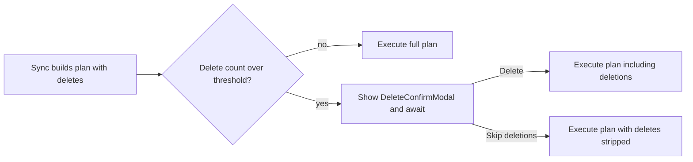

# Sync Safety

When you delete a file on one device, the sync plugin needs to delete it on your other devices too. This is risky — if something goes wrong, files could be lost everywhere. That's why this plugin uses layered safety around deletes, incomplete scans, and open editors.

## Layer 1: Only intentional deletions are synced

The plugin only deletes files from Dropbox when it **sees you delete them in Obsidian**. It keeps a log of every file you delete or rename.

What this means in practice:

- If a file is missing because of a glitch or partial sync, it will **not** be deleted from Dropbox — it will be downloaded back instead
- If you exclude a file from sync using patterns, it will **not** be deleted from Dropbox
- Only files you deliberately delete (or rename) in Obsidian are removed from Dropbox
- Case-only renames (same `path_lower`) do **not** record a delete intent — they become server-side moves instead

**Vouched scan completeness:** As a catch-up, the planner can *infer* deletes when a path is in the sync base and on Dropbox but missing locally. That is unsafe when the local listing is incomplete. Each section must present a positive completeness signal before inferred deletes run; when completeness is unavailable, those inferences are deferred. Vault delete/rename events (`event` source) still apply. Prefer re-download over mass `deleteRemote`.

## Layer 2: Confirmation before bulk deletions

If a sync would delete more than 5 files at once (and delete protection is on), a confirmation window appears showing exactly which files will be deleted. The sync **waits** for your choice before continuing that cycle.

<!-- TODO: 스크린샷 — 대량 삭제 확인 모달 (파일 리스트 + Delete/Skip 버튼) -->
<!-- 파일: docs/images/delete-guard.png -->

This catches situations like:

- Accidentally deleting a folder
- Something going wrong with the sync state
- Switching to a different Vault ID (which could look like everything was deleted)

You can click **Delete** to proceed with those deletions in the **current** sync, or **Skip deletions** to sync everything else and leave those files alone.

The threshold (default: 5 files) can be changed in **Settings > Delete threshold**.

```mermaid
flowchart LR
  Plan[Sync builds plan with deletes] --> Guard{Delete count over threshold?}
  Guard -->|no| Execute[Execute full plan]
  Guard -->|yes| Modal[Show DeleteConfirmModal and await]
  Modal -->|Delete| ExecuteDeletes[Execute plan including deletions]
  Modal -->|Skip deletions| Filtered[Execute plan with deletes stripped]
```

## Layer 3: Live checks and Dropbox trash

Before an individual remote delete runs, the executor re-checks the live Dropbox rev/hash so a mid-cycle remote edit is not wiped by a stale plan. Coalesced folder deletes re-list membership live (including empty subfolders) before `delete_batch`.

Even after a file is deleted from Dropbox, it's not gone forever. Dropbox keeps deleted files in its trash:

- **Free and Plus plans**: 30 days
- **Professional and Business plans**: 180 days

To recover a deleted file, go to [dropbox.com](https://www.dropbox.com), click **Deleted files** in the sidebar, find your file, and click **Restore**.

`list_revisions` is also used when a device sees a local file with no prior base: durable deletion evidence turns a would-be re-upload into a conflict copy (or asks you when evidence has aged out). See [Sync gap closure](sync-gap-closure.md).

## Layer 4: Bounded deferrals for open notes

Sometimes the plugin briefly delays applying a download, a **planned conflict**, or a remote delete:

- A note open in an editor (including dirty buffers in background tabs Obsidian exposes) can wait so the view reloads cleanly — including skipping conflict apply until a later sync cycle
- A conflict you chose to deal with “later” (Ask me → skip) can wait briefly

Every deferral expires after about **60 seconds**. After the bound, the change applies (unsaved work conflicts by the normal rules) or the delete prompt is forced. Deferral changes *when* a path finishes, not *what* a later manual sync would conclude — and it must not hold the shared Dropbox cursor forever. See [Conflict resolution](conflict-resolution.md) for the open-note conflict skip.

When the user **leaves** a deferred note (active-leaf / file-open change), pending downloads flush with an **immediate** sync cycle — they do not wait for the vault-event debounce used for typing settle. See [Background sync triggers](background-sync-triggers.md).

## Stale delete-log cleanup

Before each sync cycle, the plugin **prunes** delete-log paths that have neither a sync-base entry nor a local file. Those orphans cannot produce a meaningful delete and only inflate planning.

Prune loads base keys and local vault paths **once** (set membership), then walks the log — not per-path store/vault scans. The old O(n²) approach stalled iPad sync start when thousands of intents accumulated.

Delete intents are also **scoped** to paths the current sync sections can act on, so an out-of-scope intent cannot freeze cursor finalize.

## Technical details

| Piece | Role |
|---|---|
| `checkDeleteGuard` (`src/sync/guards.ts`) | Counts delete actions; returns a filtered plan when over threshold |
| `SyncEngine.applyDeleteGuard` | Awaits `onDeleteGuardTriggered`; `true` keeps deletes, `false` uses `filteredPlan` |
| `DeleteConfirmModal` | Lists pending deletes; resolves `true`/`false` when the user closes it |
| Plugin `onDeleteGuardTriggered` (`src/main.ts`) | Opens the modal and **awaits** the result for this cycle |
| `pruneStaleDeleteLog` (`src/main.ts`) | Drops orphan delete intents with one base + one local path set |
| `deleteRemote` (`src/sync/executor.ts`) | Live rev/hash check; Dropbox `path_lookup/not_found` treated as success |
| `deleteBatch` / `coalesceDeleteRemote` | Execution-only mass remote delete; see [Remote mass deletes](remote-mass-deletes.md) |
| Vouched scan / infer skip | Engine scan completeness signal before `inferMissingDeletes` |
| `applyResurrectionGuard` | `list_revisions` + ask path for `new_local` uploads |
| `DeferralTracker` / `open-editors.ts` | 60s bound; dirty background tabs; in-place reload after apply |
| `SyncEngine.finalizeState` | Cursor checkpoint with durable retry set; delete log must not retain moot/out-of-scope intents |

## Technical Gotchas

- **The modal must block the cycle.** Returning `false` immediately and deferring approval to a later debounced sync made both **Delete** and **Skip** look like Skip (especially when background sync was off). Always `await modal.waitForConfirmation()` and return that boolean.
- **Leaf flush is not vault debounce.** Applying an already-deferred remote download on click-away must call `syncNow` immediately; sharing the typing quiet window made remote refresh feel broken.
- **One modal at a time.** If a confirm modal is already open, a second guard trigger returns `false` (skips deletes) to avoid stacked dialogs.
- **Threshold is independent of the interactive-progress threshold.** Delete protection uses `deleteThreshold`; large-background promotion uses `largeSyncInteractiveThreshold`.
- **Do not advance the cursor while scoped pending deletes remain.** Clear succeeded deletes first; transient item failures live in `retrySet` so they do not block checkpoint forever (G27).
- **Incomplete-scan skip needs a positive vouch.** Ratio brakes alone were notes/plugins-only and still unsafe; prefer an explicit completeness signal per section.
- **`deleteRemote` not_found is success.** A 409 `path_lookup/not_found` means the remote path is already absent — clear the sync entry / delete intent instead of failing the item.
- **Folder coalesce is gated.** Empty remote snapshots refuse folder deletes; multi-section sync unions the snapshot; live Dropbox listing + hash check must pass before recursive folder `delete_batch`. Details: [Remote mass deletes](remote-mass-deletes.md).
- **Prune must stay O(n).** Never call `getEntry` / `vault.getFiles()` inside the per-path loop.
- **Re-link clears base/cursor/delete log.** Changing the linked Dropbox folder is not a mass delete of the new folder’s contents (R11 / G15).
