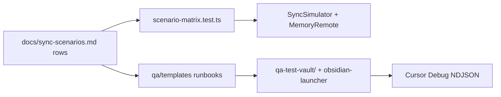

# Sync scenario testing

## Why it exists

Release 0.2 closed the sync-scenario gap backlog in code, but regressions are easy: multi-device orderings, empty folders, and Dropbox-app peers do not show up in a single-device smoke test. This project therefore splits **automated simulation** (cheap, CI) from **manual Dropbox QA** (real OAuth + ingest logs) and keeps a row-numbered matrix aligned with `docs/sync-scenarios.md`.

## Conceptual understanding

| Layer | Role | Entry point |
|---|---|---|
| Unit / planner | Pure decisions, adapters in memory | `bun test` under `test/` |
| Scenario matrix | One test slot per scenario row 1–101 | `test/simulation/scenario-matrix.test.ts` |
| Coverage map | Which rows are real vs `todo` | `qa/SIMULATION_COVERAGE.md` |
| Manual QA vault | Real Dropbox + sandboxed Obsidian | `bun run qa:open` → in-repo `qa-test-vault/` via `obsidian-launcher` |

`test.todo` rows are intentional when they need harness work or a human Dropbox peer (large binaries, device sleep, re-link UI). Claiming a row means adding a `run` and updating the coverage map.

Open-file deferral and continuous-typing debounce are now automated for matrix rows **9 / 18 / 21 / 22 / 29** (plus unit suites under `test/background-sync-schedule.test.ts` and friends). See [Background sync triggers](background-sync-triggers.md) for the quiet-window / leaf-flush contracts those tests lock. Row **23** (unsaved buffer after device sleep) remains a stub.

After the solo validation pass on `release_0.2`, most rows 1–101 have real `run`s; remaining todos are listed under “Highest-priority uncovered” / “Remaining for manual” in [`qa/SIMULATION_COVERAGE.md`](../qa/SIMULATION_COVERAGE.md).

## Flows

### Automated matrix cycle

1. `SyncSimulator` gives each device its own vault + store against one `MemoryRemoteStorage`.
2. Optional `DropboxAppDevice` writes with `forceUpload` (desktop-client overwrite), not plugin `add`/`update(rev)`.
3. Assertions check canonical content, conflict siblings, cursor progress, and folder presence.
4. `patchDeviceSettings({ deviceId: "test" })` stabilises conflict copy names in tests.

### Manual QA cycle

1. `bun run qa:open` builds, reseeds `qa-test-vault/` from `qa/` templates, and launches sandboxed Obsidian (`obsidian-launcher watch --plugin ./dist`). OAuth/`data.json` persist (no `--copy` by default).
2. Or `qa:generate` + `qa:deploy` into `SYNC_TESTER_VAULT` / `~/Documents/sync-tester` for system Obsidian.

Harness sources (`qa/generate.mjs`, `qa/templates/`) live **outside** the vault so deleting folders in Obsidian cannot wipe tracked runbooks.
3. Follow a runbook; capture decisions via debug ingest — see [Cursor Debug ingest](cursor-debug-ingest.md).

## Technical details

| Piece | Role |
|---|---|
| `SyncSimulator` / `Device` | Multi-device driver; `rename` / `renameFolder`; `setScanUnvouched` for G22; `addDeviceWithFailingRemote` |
| `DropboxAppDevice` | P3 peer; `forceUpload` / `move` / folder helpers on memory remote |
| `MemoryRemoteStorage.expireRevisions` | Clears revision history for row 83 ask path |
| `RecordingLog` | Captures `ruleId` / message for taxonomy checks |
| `applyResurrectionGuard({ hasSyncCursor })` | R10 only on fresh join — see [Sync gap closure](sync-gap-closure.md) |
| `qa:open` / `open-qa` / `qa:generate` / `qa:deploy` | `package.json` + `obsidian-launcher` |
| `qa:restart` | Local wipe + regenerate **with** `_seeds/` fixtures + open |
| `qa:empty` | Local wipe + regenerate **empty** vault (no fixtures) + open — runbook 10 |

## Technical Gotchas

- **Matrix failures are product bugs until proven otherwise.** Several G8/R10 defects only appeared when rows 32, 56, and 61 ran end-to-end.
- **Memory remote must preserve folder display casing.** Lowercasing `pathDisplay` invents false case-only `moveRemoteFolder` plans.
- **Incremental cursors omit empty folders from deltas.** Folder base rows must seed `buildFullRemoteState` or peers treat the folder as remotely deleted.
- **File planner must skip folders.** Folder `hash: null` coerced to `""` looked like `remote_modified_local_deleted`.
- **Manual reset does not wipe Dropbox.** Dirty remotes after delete/conflict/casing runbooks need a separate remote clear before `qa:reset`.
