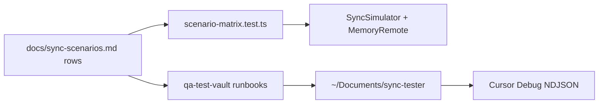

# Sync scenario testing

## Why it exists

Release 0.2 closed the sync-scenario gap backlog in code, but regressions are easy: multi-device orderings, empty folders, and Dropbox-app peers do not show up in a single-device smoke test. This project therefore splits **automated simulation** (cheap, CI) from **manual Dropbox QA** (real OAuth + ingest logs) and keeps a row-numbered matrix aligned with `docs/sync-scenarios.md`.

## Conceptual understanding

| Layer | Role | Entry point |
|---|---|---|
| Unit / planner | Pure decisions, adapters in memory | `bun test` under `test/` |
| Scenario matrix | One test slot per scenario row 1–101 | `test/simulation/scenario-matrix.test.ts` |
| Coverage map | Which rows are real vs `todo` | `qa-test-vault/SIMULATION_COVERAGE.md` |
| Manual QA vault | Real Dropbox + Obsidian runbooks | `bun run qa:generate` / `qa:deploy` → `~/Documents/sync-tester` |

`test.todo` rows are intentional: open-editor deferral, large binaries, and re-link UI need harness work or a human Dropbox peer. Claiming a row means adding a `run` and updating the coverage map.

## Flows

### Automated matrix cycle

1. `SyncSimulator` gives each device its own vault + store against one `MemoryRemoteStorage`.
2. Optional `DropboxAppDevice` writes with `forceUpload` (desktop-client overwrite), not plugin `add`/`update(rev)`.
3. Assertions check canonical content, conflict siblings, cursor progress, and folder presence.
4. `patchDeviceSettings({ deviceId: "test" })` stabilises conflict copy names in tests.

### Manual QA cycle

1. `bun run qa:generate` reseeds `_seeds/` and `_runbooks/` without wiping plugin `data.json`.
2. `bun run qa:deploy` builds and copies into the vault plugin folder (Hot Reload picks up `.hotreload`).
3. Follow a runbook; capture decisions via debug ingest — see [Cursor Debug ingest](cursor-debug-ingest.md).

## Technical details

| Piece | Role |
|---|---|
| `SyncSimulator` / `Device` | Multi-device in-memory engine driver; `rename` skips `trackDelete` on case-only paths |
| `DropboxAppDevice` | P3 peer; `forceUpload` / `move` / folder helpers on memory remote |
| `RecordingLog` | Captures `ruleId` / message for taxonomy checks |
| `applyResurrectionGuard({ hasSyncCursor })` | R10 only on fresh join — see [Sync gap closure](sync-gap-closure.md) |
| `qa:generate` / `qa:reset` / `qa:deploy` | `package.json` scripts |

## Technical Gotchas

- **Matrix failures are product bugs until proven otherwise.** Several G8/R10 defects only appeared when rows 32, 56, and 61 ran end-to-end.
- **Memory remote must preserve folder display casing.** Lowercasing `pathDisplay` invents false case-only `moveRemoteFolder` plans.
- **Incremental cursors omit empty folders from deltas.** Folder base rows must seed `buildFullRemoteState` or peers treat the folder as remotely deleted.
- **File planner must skip folders.** Folder `hash: null` coerced to `""` looked like `remote_modified_local_deleted`.
- **Manual reset does not wipe Dropbox.** Dirty remotes after delete/conflict/casing runbooks need a separate remote clear before `qa:reset`.
