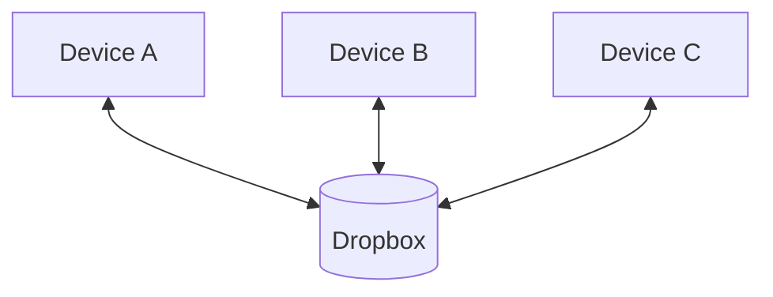
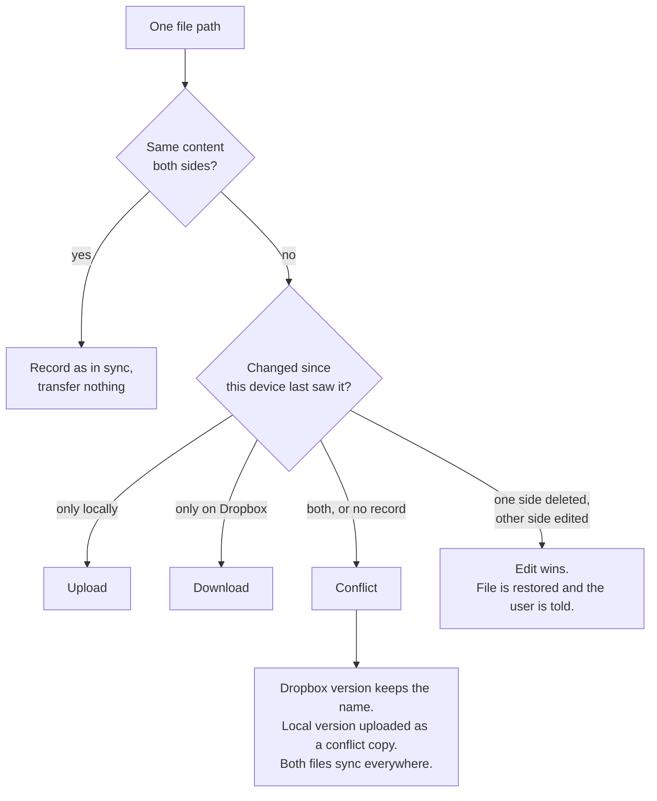

# Sync Scenarios

## Guiding principles

### P1 — The vault is a folder of ordinary files

Users create, edit, rename and delete vault files with any tool, at any time, with Obsidian closed. Sync therefore cannot depend on having witnessed a change: the durable source of truth is a three-way comparison between what is on disk, what is on Dropbox, and what this device last recorded seeing.

The vault must stay that way. Plugin metadata, sync state, tombstones, manifests and other bookkeeping must not be written into it as extra files — not even excluded ones if they can live outside the vault instead. Anything a user opens in Finder or the Dropbox folder should be their notes and attachments, not machinery this plugin left behind.

### P2 — The copy on Dropbox is also a valid vault

The same files at the same paths, with none of the plugin's own state or metadata stored alongside them, so a user can point Obsidian straight at that folder through Dropbox's own desktop client. Devices syncing that way — marked **(Dropbox app)** in the tables — are first-class participants, and the expected desktop setup rather than an edge case.

The reason is that it lets a desktop vault keep syncing while Obsidian is closed. This plugin can only work when Obsidian is running; Dropbox's client runs regardless, so a machine set up that way stays current whether or not anyone opens the app.

### P3 — The plugin and Dropbox desktop client are both valid sync approaches

Either may own a device's link to the shared folder: this plugin while Obsidian is open, or Dropbox's own client whether or not Obsidian is running. Devices marked **(Dropbox app)** in the tables are first-class participants using the latter. The Dropbox client does not follow our rules — no delete protection, no deferral for open notes, no base state, no plan — so anything whose correctness depends on *every* writer cooperating is unavailable to us. Running both syncers over the same folder on the same device is not supported and cannot be made to work.

### P4 — Operations must work without Obsidian settings or plugins syncing

"Notes only" is a reasonable sync scope, so no part of `.obsidian/` can be assumed to travel — not settings, workspaces, or the plugins folder. A user may sync notes alone and install this plugin by hand on each device; that is a sensible arrangement, not a broken one. Each installation is then independent, configured separately, and possibly on a different version.

Exclude patterns and delete thresholds are therefore per-device preferences rather than shared policy. **Conflict resolution that decides the canonical path is not** — that is R2, the same on every device. Per-device conflict UX (notices, which file to open first) is fine; anything that would change who keeps `note.md` is not. Anything sync needs in order to behave correctly must be derivable from the vault files themselves or held per device — never assumed to have arrived via Obsidian settings or plugins. The corollary is that a device must never read the absence of a section it does not sync as a deletion of that section.

### P5 — Manual sync and live sync must produce the same outcomes

A sync cycle is the same work whether the user pressed Sync Now or a vault change triggered it. Every decision — uploads, downloads, conflicts, deletes, renames, folder operations — must be valid under both. Nothing may depend on having watched the edit happen, on debounce timing, or on any other live-only signal that a cold manual sync would not see. Live triggers may choose *when* to run; they must not change *what* a run is allowed to conclude.

## General rules

### R1 — Never let a conflict destroy content in either direction

Both sides survive as two real files — neither the Dropbox version nor the local version may be discarded. Nothing merges automatically and no winner is picked silently.

### R2 — The version already on Dropbox keeps the canonical name

When two **different contents** compete for the same path, the bytes already on Dropbox keep that path and the later upload is renamed. Dropbox's `rev` check already serialises uploads, so every device reaches the same answer without comparing clocks or consulting a per-device setting. There is no "newest wins" (or any other strategy) that may override who holds the canonical name.

This rule is about content conflicts only. A capitalisation-only change is a rename of the same bytes (R8 / section 7), not an R2 conflict.

### R3 — Conflict copies are ordinary files and must sync everywhere

A conflict is just as much a conflict on every other device, and we cannot know which version the user considers best. A copy that reaches only one device is one wipe away from being lost.

### R4 — A conflict copy names the device that produced it

We use Dropbox's format exactly: `note (Dale's MacBook's conflicted copy 2026-07-26).md`. Matching it makes our copies and Dropbox's own indistinguishable, which is the point — one format for the user to learn, one pattern for us to detect. It carries a date but no time, so same-day repeats need a counter appended.

### R5 — An edit beats a delete

The modified file is resurrected, and the user who deleted it is told it came back.

### R6 — A delete needs durable evidence; without it, ask — never decide silently

A device that has never seen a path cannot tell "deleted" from "never existed". We read durable evidence from Dropbox's `list_revisions` rather than writing tombstones of our own, because a delete performed from a Dropbox-managed device would never produce a record of ours — leaving a log that is incomplete in a way nothing could detect.

When that evidence exists, the deletion stands. When it does not — including after Dropbox's revision retention ages out (on the order of **30 days** on personal plans, longer on some business plans) — the device must **ask** before re-uploading or removing the local copy. Silent resurrection and silent discard are both forbidden. A device that still holds a valid delta cursor and prior base state does not need revision history for deletes it already learned about through the cursor; retention limits bite fresh joins and cleared state, not every long offline period.

### R7 — Never write directly to the destination file

Changes go to a temporary copy that is moved into place, so a crash mid-write cannot leave a half-written note.

### R8 — Content hashes decide what changed; dates only break safe ties

A date may settle a question where **both answers are safe** — which capitalisation to adopt, what date to show the user — because a wrong clock then costs nothing. A date may never decide which version of someone's writing is discarded, because a wrong clock would silently destroy work. Two facts make this unavoidable: a rename does not change a file's modification date, and Dropbox stores no creation date at all.

Capitalisation races use the same three-way compare as content, on the **display path** recorded in base state — not a shared rename timestamp, and not local mtime. When both sides renamed casing before syncing, the casing that first lands on Dropbox wins; the other device adopts it.

### R9 — Removing many files at once needs confirmation

When one sync would remove more files than the delete threshold — **5** by default — the device asks before anything goes, and asks again on each other device as the deletion reaches it. The threshold is a per-device preference, so devices may not all ask; each protects only itself. This applies to every row below and is not repeated in them.

### R10 — Durable delete evidence plus local bytes becomes a conflict copy

When revision history (or equivalent durable evidence) shows the path was deleted, but this device still holds bytes at that path, the deletion stands at the canonical path and the local bytes are preserved as a conflict copy that syncs everywhere (R1, R3, R4). Neither silent restore of `note.md` nor silent discard of the local content is allowed. (Dropbox's own client would simply re-upload to the original path; under P3 that remains their behaviour, not ours.)

### R11 — Changing the linked folder is a re-link, not a mass delete

Repointing this installation at a different Dropbox folder, or otherwise changing vault / link identity, must be recognised as a re-link. The device asks what the user intends before removing local files or treating the new empty remote as authoritative. It must not infer a mass deletion (or mass upload) solely from "everything I knew is missing on the other side" after a folder change.

### R12 — Open editors may delay apply or delete; every deferral is bounded

An open or dirty editor may briefly delay applying an incoming download or a remote delete so the view can reload cleanly, or so the user can choose when a note open here was deleted elsewhere. Every such deferral expires after a bound: the change then applies (and unsaved work conflicts by the normal rules), or the delete prompt is forced. Deferral may change *when* a run finishes a path; it must not change *what* P5 would allow a later manual sync to conclude. Unsaved buffers in any tab Obsidian exposes — not only the active file — are protected until flushed, then treated as ordinary local modifications.

### R13 — Debounce to settled bursts; one unresolved conflict copy per device per path

Uploads from a typing burst are evaluated once the device settles, not once per autosave. A device holds at most one unresolved conflict copy per canonical path; further local edits update that copy rather than spawning another. Both must hold on a cold manual sync that already finds two divergent files on disk — not only during a live typing session.

### R14 — Folder-level operations need a confirmed membership match

A recursive folder delete or folder move may run only when the device has confirmed the folder contains exactly the paths it intends to act on (including empty subfolders once folders are tracked). Otherwise it falls back to per-file operations. An excluded or out-of-scope path the device is not allowed to manage makes the folder ineligible for a recursive delete, the same as an unknown file.

### What we do not need

**Version vectors.** Every device talks only to Dropbox, so "what I last saw on the server" plus the server's own `rev` carries the same causality for far less machinery.

**Automatic text merging.** No mainstream file-sync tool merges file contents, and neither do we.

**Shared rename timestamps.** Path and capitalisation changes are decided by three-way comparison on base display paths plus server-side moves (R8). Nothing of ours is written into the vault or Dropbox folder to stamp a rename.

## The mental model

Devices never talk to each other. Every device talks only to Dropbox, and each keeps its own private record of what it last saw there.

Three facts drive every decision for a single file: what the device holds locally, what Dropbox holds, and what the device last saw on Dropbox.

## What is stored, and where

### Per-file sync state — on the device only

One record per path, keyed by Dropbox's `path_lower`. This is the "what I last saw" third of every three-way comparison.

| Field | Holds |
|---|---|
| `baseLocalHash` | Local content hash at the last successful sync |
| `baseRemoteHash` | Remote content hash at the last successful sync |
| `basePathDisplay` | Display casing / path last successfully synced (for three-way capitalisation and rename detection; keyed with `path_lower`) |
| `rev` | Dropbox revision, used as the optimistic lock on upload |
| `lastSynced` | When the record was written |

Two values cover the cycle itself: the Dropbox **delta cursor**, and a **delete log** of paths this device intends to remove, persisted so that a reload does not lose the intent.

All of it lives in IndexedDB (`dropbox-sync-<vaultInstanceId>`), except on iOS where the same data is written to `.sync-state/entries.json` and `.sync-state/meta.json` inside the vault. That folder is excluded from sync, so the state stays device-local either way.

### Read from Dropbox each cycle, never stored

`content_hash`, `rev`, `server_modified`, `size` and both path forms. `server_modified` is the only clock in the system immune to device clock skew, which is why it is the one dates are compared against when dates are allowed to matter at all.

### Settings — in the vault

`data.json` in the plugin folder: sync interval and scope, exclude patterns, delete threshold, remote folder name, and **the Dropbox OAuth access and refresh tokens**. Any leftover "conflict strategy" field must not change R2 outcomes — at most UX such as which file to surface first.

Whether this file reaches another device is the user's choice, so by the fourth principle nothing may depend on it having done so. It also carries `deviceId`, which is minted only when absent — so a `data.json` that *does* travel gives two devices the same identity (`G26`).

### Device-local settings — outside the vault

A single vault-scoped `App.loadLocalStorage` / `App.saveLocalStorage` blob for values that must differ per machine. It currently holds the Cursor debug ingest host, port, session ID, ingest path, server name, offer token and connection timestamp. Kept out of `data.json` precisely because that file syncs.

### On Dropbox — nothing but the vault

Remote paths mirror vault paths one-to-one. The plugin writes no manifest, sidecar, index or state file of any kind, which is what keeps the second principle true.

Three things do reach Dropbox that a reader might not expect — not because sync puts them there, but because they are ordinary vault files:

| What | Why it syncs |
|---|---|
| `sync-debug-<deviceId>.log` | A file in the vault root, not excluded |
| `sync-logs/` | Per-sync reports, written when the user asks for one |
| `data.json`, **including the OAuth tokens** | Only when the Plugins section is enabled, which covers `.obsidian/plugins/`. Nothing excludes it — `G25`. |

### Not stored anywhere

| What | Consequence |
|---|---|
| `client_modified` | Never sent on upload **or mapped on download**; receiving devices apply `server_modified`, so they show the server/upload time instead of the editor's modification date (`G11`) |
| Creation date | Dropbox has no field for it, so it cannot survive a round trip and must never be load-bearing |
| Shared rename timestamps | Not used — capitalisation and path changes use three-way compare on `basePathDisplay` plus server-side moves (`G6`, R8). No vault or Dropbox sidecar stamps. |
| Folder entries | Only files are tracked, so empty folders and folder moves are invisible (`G8`) |
| Deletion records | Read from Dropbox's revision history instead of being written by us (R6) |

---

## 1. Creating a file

<table>
<colgroup>
<col style="width:4%">
<col style="width:13%">
<col style="width:13%">
<col style="width:13%">
<col style="width:39%">
<col style="width:18%">
</colgroup>
<thead>
<tr><th>#</th><th>Device A</th><th>Device B</th><th>Device C</th><th>Expected Outcome</th><th>Today</th></tr>
</thead>
<tbody>
<tr>
<td>1</td>
<td>Creates file, syncs</td>
<td>—</td>
<td>—</td>
<td>B and C download it, and it keeps <b>A's modification date</b> there, carried through <code>client_modified</code>, rather than showing the time it happened to upload. Creation date is not preserved — Dropbox has no field for it. <b>Dropbox holds:</b> • <code>note.md</code> — A's version, stamped with A's modification date</td>
<td>The transfer matches. Deviates on the date: <code>client_modified</code> is never sent, so Dropbox substitutes the upload time. A keeps its original local date until that file is replaced from Dropbox; B and C receive the upload time.</td>
</tr>
<tr>
<td>2</td>
<td>Creates file, stays offline</td>
<td>—</td>
<td>—</td>
<td>Nothing reaches Dropbox, and B and C never learn of the file until A syncs. <b>Dropbox holds:</b> • nothing</td>
<td>Matches</td>
</tr>
<tr>
<td>3</td>
<td>Creates file, syncs</td>
<td>Creates same path, <b>same content</b>, syncs</td>
<td>—</td>
<td>Identical bytes are not a disagreement, so nothing transfers — but B <b>records the path as in sync</b> rather than forgetting it. <b>Dropbox holds:</b> • <code>note.md</code> — uploaded by A</td>
<td>Deviates: B transfers nothing and therefore records nothing, leaving it with no memory of the file.</td>
</tr>
<tr>
<td>4</td>
<td>Creates file, syncs</td>
<td>Creates same path, <b>different content</b>, syncs</td>
<td>—</td>
<td>Conflict. A's version keeps the name because it reached Dropbox first, not because of any date. <b>Dropbox holds:</b> • <code>note.md</code> — A's version • <code>note (B's conflicted copy 2026-07-26).md</code> — B's version Nobody's existing file is renamed, and everyone is told a conflict occurred.</td>
<td>Deviates: B's version takes <code>note.md</code>, A and C are silently overwritten with it, and A's version survives only as a local-only copy on B.</td>
</tr>
<tr>
<td>5</td>
<td>Creates file, syncs</td>
<td>Creates same path, different content, syncs</td>
<td>Creates same path, third content, syncs</td>
<td>Two conflicts, resolved in turn. <b>Dropbox holds:</b> • <code>note.md</code> — A's version • <code>note (B's conflicted copy 2026-07-26).md</code> • <code>note (C's conflicted copy 2026-07-26).md</code> Nothing is lost anywhere.</td>
<td>Deviates: one file holding C's version. A's version survives only on B, B's only on C, and neither copy reaches anyone else.</td>
</tr>
<tr>
<td>6</td>
<td>Creates file, syncs</td>
<td>Creates same path, identical content, syncs</td>
<td>Creates same path, identical content, syncs</td>
<td>No conflicts. B and C each record it as in sync. <b>Dropbox holds:</b> • <code>note.md</code> — A's version</td>
<td>Deviates: same missing record as row 3.</td>
</tr>
<tr>
<td>7</td>
<td><b>(Dropbox app)</b> syncs</td>
<td>—</td>
<td>—</td>
<td>C receives it through Dropbox's own client, with no plugin involved anywhere in the path. Nothing special happens, and that is the point — this is the baseline the second principle promises. <b>Dropbox holds:</b> • <code>note.md</code> — A's version</td>
<td>Matches. Remote paths mirror vault paths and no plugin metadata is stored remotely, so a Dropbox client sees an ordinary folder of notes.</td>
</tr>
</tbody>
</table>

## 2. Modifying a file

<table>
<colgroup>
<col style="width:4%">
<col style="width:13%">
<col style="width:13%">
<col style="width:13%">
<col style="width:39%">
<col style="width:18%">
</colgroup>
<thead>
<tr><th>#</th><th>Device A</th><th>Device B</th><th>Device C</th><th>Expected Outcome</th><th>Today</th></tr>
</thead>
<tbody>
<tr>
<td>8</td>
<td>Modifies file, syncs</td>
<td>—</td>
<td>—</td>
<td>B and C download the new version. <b>Dropbox holds:</b> • <code>note.md</code> — A's new version</td>
<td>Matches</td>
</tr>
<tr>
<td>9</td>
<td>Modifies file, syncs</td>
<td>Has the file open in the editor</td>
<td>—</td>
<td>C updates immediately. B holds the download briefly, then writes it through a temporary file and lets the editor reload. The wait is <b>bounded</b> — if B keeps the file open indefinitely the change applies anyway and B's unsaved work becomes an ordinary conflict. <b>Dropbox holds:</b> • <code>note.md</code> — A's new version</td>
<td>Deviates: the deferral is unbounded, and a permanently open file blocks B's sync cursor indefinitely.</td>
</tr>
<tr>
<td>10</td>
<td>Modifies file, syncs</td>
<td>Modifies the same file differently, syncs</td>
<td>—</td>
<td>Conflict. A's version keeps the name because it landed first (R2); neither device's modification date is consulted, and no per-device strategy may override that. <b>Dropbox holds:</b> • <code>note.md</code> — A's version • <code>note (B's conflicted copy 2026-07-26).md</code> — B's version Both files reach all three devices, so everyone sees the clash.</td>
<td>Deviates: <code>note.md</code> becomes B's version, A and C are silently overwritten with it, and A's version survives only as a local-only copy on B. The <code>newest</code> setting is worse again — it discards the loser entirely.</td>
</tr>
<tr>
<td>11</td>
<td>Modifies file, syncs</td>
<td>Modifies to <b>identical</b> content, syncs</td>
<td>—</td>
<td>No conflict — identical bytes are not a disagreement, whatever the dates say. B records it as in sync. <b>Dropbox holds:</b> • <code>note.md</code> — the shared content</td>
<td>Matches on transfer. Deviates on the record: noop writes nothing, so B keeps a <b>stale</b> base (old hashes) rather than refreshing it — same root cause as row 3 when there was never a base.</td>
</tr>
<tr>
<td>12</td>
<td>Modifies, syncs</td>
<td>Modifies differently, syncs</td>
<td>Modifies differently, syncs</td>
<td>Two conflicts, resolved in turn. <b>Dropbox holds:</b> • <code>note.md</code> — A's version • <code>note (B's conflicted copy 2026-07-26).md</code> • <code>note (C's conflicted copy 2026-07-26).md</code> Nothing is lost anywhere.</td>
<td>Deviates: one file with C's version; A's and B's versions each stranded on a single device.</td>
</tr>
<tr>
<td>13</td>
<td>Modifies and uploads</td>
<td>Modifies and uploads at the same instant</td>
<td>—</td>
<td>Dropbox rejects B's upload as out of date, by <code>rev</code> rather than by any clock comparison. B re-reads, sees a genuine conflict, and uploads under the conflict name. <b>Dropbox holds:</b> • <code>note.md</code> — A's version • <code>note (B's conflicted copy 2026-07-26).md</code> — B's version Never a silent overwrite.</td>
<td>Deviates: the rejection is handled, but B then takes <code>note.md</code> as in row 10.</td>
</tr>
<tr>
<td>14</td>
<td>Modifies twice, syncs after each</td>
<td>—</td>
<td>—</td>
<td>B and C only ever see the final version; the first is in Dropbox version history. <b>Dropbox holds:</b> • <code>note.md</code> — A's second version</td>
<td>Matches</td>
</tr>
<tr>
<td>15</td>
<td>Modifies, syncs</td>
<td>Modifies, stays offline for a month</td>
<td>—</td>
<td>C gets A's version. When B returns it conflicts, and <b>B's month-old edit does not displace anyone</b> — newer or older on the clock is irrelevant, because B's version arrives second. <b>Dropbox holds, from B's return onward:</b> • <code>note.md</code> — A's version • <code>note (B's conflicted copy 2026-07-26).md</code> — B's version</td>
<td>Deviates: on return, B's stale version takes <code>note.md</code> on every device.</td>
</tr>
<tr>
<td>16</td>
<td>Opens and re-saves with no content change</td>
<td>—</td>
<td>—</td>
<td>Nothing syncs, because the hash is unchanged, and no new revision is created even though the modification date moved. <b>Dropbox holds:</b> • <code>note.md</code> — unchanged</td>
<td>Matches</td>
</tr>
<tr>
<td>17</td>
<td>Modifies file, syncs</td>
<td>—</td>
<td><b>(Dropbox app)</b> modifies the same file at about the same time</td>
<td>Two writers, one following none of our rules. Dropbox's client detects the clash itself and writes its own conflicted copy — in the format we now share. That artefact <b>is</b> the resolution; we adopt it rather than layering a second one on top. <b>Dropbox holds:</b> • <code>note.md</code> — whichever landed first • <code>note (C's conflicted copy 2026-07-26).md</code> — written by Dropbox, not by us</td>
<td>Deviates: the plugin does not recognise Dropbox's conflicted-copy names, so it treats the copy as an ordinary new note and can raise its own conflict on top of Dropbox's.</td>
</tr>
</tbody>
</table>

## 3. Simultaneous editing

The previous section treats each edit as a single event. In practice Obsidian autosaves continuously, so "two people editing the same note" is not one clash but a stream of them. **R13** keeps that stream from turning into a pile of files: uploads are debounced to a settled burst, and a device holds at most one unresolved conflict copy per path.

Having a file open is also not a claim on it. **R12** allows a brief delay so the view can reload cleanly, but every deferral is bounded — that bound is also [G10](#gap-list) in the codebase.

<table>
<colgroup>
<col style="width:4%">
<col style="width:13%">
<col style="width:13%">
<col style="width:13%">
<col style="width:39%">
<col style="width:18%">
</colgroup>
<thead>
<tr><th>#</th><th>Device A</th><th>Device B</th><th>Device C</th><th>Expected Outcome</th><th>Today</th></tr>
</thead>
<tbody>
<tr>
<td>18</td>
<td>Has it open, types, autosaves</td>
<td>Has it open, reading only</td>
<td>—</td>
<td>B's copy updates underneath the open editor and the view reloads in place, keeping B's scroll position and cursor. An open file that nobody is editing is just a file. <b>Dropbox holds:</b> • <code>note.md</code> — A's version</td>
<td>Deviates: B defers the download for as long as the note is the active file, so a note left open never updates. Other planned files still execute and the periodic timer still runs, but the deferral prevents B's cursor advancing and suppresses the next long-poll, so every later cycle replays the old delta until the file stops being active.</td>
</tr>
<tr>
<td>19</td>
<td>Has it open, types, autosaves</td>
<td>Has it open, types, autosaves</td>
<td>—</td>
<td>Whichever burst reaches Dropbox first keeps the name; the other becomes one conflict copy. Continued typing on both sides updates those same two files rather than spawning more. <b>Dropbox holds:</b> • <code>note.md</code> — the first burst to land • <code>note (B's conflicted copy 2026-07-26).md</code> — B's ongoing version</td>
<td>Deviates: local vault events do share the ordinary configurable debounce from row 22, but manual sync and remote long-poll do not, and there is no conflict-specific settled-burst window or single-copy rule. Each later clash overwrites the canonical path again and normally creates another local-only timestamped sibling; clashes within the same minute instead overwrite the same sibling path.</td>
</tr>
<tr>
<td>20</td>
<td>Has it open, typing</td>
<td>Has it open, typing</td>
<td>Has it open, typing</td>
<td>Three-way version of row 19 and still only three files. One canonical note plus one conflict copy per losing device — never a chain of copies of copies, because a conflict copy is never itself conflicted against. <b>Dropbox holds:</b> • <code>note.md</code> • <code>note (B's conflicted copy 2026-07-26).md</code> • <code>note (C's conflicted copy 2026-07-26).md</code></td>
<td>Deviates: the last device to resolve a clash takes the canonical path. Earlier Dropbox versions are written as excluded, local-only siblings on the devices that displaced them, so the three versions may survive but are scattered rather than becoming three files on Dropbox; wiping either device can still lose the version held only there.</td>
</tr>
<tr>
<td>21</td>
<td>Types, syncs</td>
<td>Has it open with <b>unsaved</b> changes in the editor buffer</td>
<td>—</td>
<td>An unsaved buffer is invisible to sync, so B's incoming change waits for the buffer to flush — bounded, as always. Once flushed, B's text is an ordinary local modification and conflicts by the normal rules. Nothing typed on B is discarded. <b>Dropbox holds:</b> • <code>note.md</code> — A's version, then a conflict copy once B flushes</td>
<td>Deviates twice: the wait is unbounded, and only the note Obsidian reports as <i>active</i> is protected. For a background tab the executor writes the backing file immediately with no conflict copy or dirty-buffer check; whether the in-memory editor then reloads or later overwrites that file is left to Obsidian rather than protected by sync.</td>
</tr>
<tr>
<td>22</td>
<td>Types continuously for an hour</td>
<td>Has it open, reading</td>
<td>—</td>
<td>B receives periodic settled versions, not one per keystroke, and Dropbox accumulates one revision per burst rather than thousands. <b>Dropbox holds:</b> • <code>note.md</code> — A's latest settled version</td>
<td>Matches: the sync trigger is already debounced.</td>
</tr>
<tr>
<td>23</td>
<td>Types, syncs</td>
<td>Had it open and unsaved when the device slept</td>
<td>—</td>
<td>On wake B flushes and finds the file changed beneath it, which is row 21 with a longer gap. B's version becomes the conflict copy because A's arrived first. <b>Dropbox holds:</b> • <code>note.md</code> — A's version • <code>note (B's conflicted copy 2026-07-26).md</code> — B's version</td>
<td>Deviates as row 21</td>
</tr>
<tr>
<td>24</td>
<td>Types, syncs</td>
<td>Has the file open and a conflict copy already unresolved</td>
<td>—</td>
<td>The new change applies to <code>note.md</code> normally. An unresolved conflict copy is an ordinary file and never blocks the note it came from. <b>Dropbox holds:</b> • <code>note.md</code> — A's version • the existing conflict copy, untouched</td>
<td>Deviates: conflict copies are excluded from sync, so B's copy is invisible to every other device regardless.</td>
</tr>
<tr>
<td>25</td>
<td>Has it open, types, autosaves</td>
<td>—</td>
<td><b>(Dropbox app)</b> has the same note open and is typing</td>
<td>Debouncing and the one-copy-per-device rule govern A only; C uploads on Dropbox's schedule and cannot be coordinated with. The outcome stays bounded anyway, because Dropbox applies the same one-copy-per-clash rule on its side. <b>Dropbox holds:</b> • <code>note.md</code> • one conflicted copy per unresolved clash</td>
<td>Deviates: Dropbox-named copies do travel as ordinary files, but the planner does not associate one with its canonical note. It can therefore resolve the canonical clash again and create an additional old-format local sibling instead of recognising that Dropbox already preserved the losing stream.</td>
</tr>
</tbody>
</table>

## 4. Deleting a file

<table>
<colgroup>
<col style="width:4%">
<col style="width:13%">
<col style="width:13%">
<col style="width:13%">
<col style="width:39%">
<col style="width:18%">
</colgroup>
<thead>
<tr><th>#</th><th>Device A</th><th>Device B</th><th>Device C</th><th>Expected Outcome</th><th>Today</th></tr>
</thead>
<tbody>
<tr>
<td>26</td>
<td>Deletes file, syncs</td>
<td>—</td>
<td>—</td>
<td>Removed from Dropbox, then from B and C. <b>Dropbox holds:</b> • nothing at <code>note.md</code> • the deletion recorded in Dropbox's own revision history for as long as retention lasts (R6), so late-arriving devices with evidence apply R10 rather than resurrecting</td>
<td>Deviates: the deletion works, and this device keeps a local delete log, but nothing durable is read from Dropbox for other devices — see rows 82 to 85.</td>
</tr>
<tr>
<td>27</td>
<td>Deletes file, syncs</td>
<td>Deletes the same file, syncs</td>
<td>—</td>
<td>The second delete finds it already gone and treats that as success. <b>Dropbox holds:</b> • nothing at <code>note.md</code></td>
<td>Matches</td>
</tr>
<tr>
<td>28</td>
<td>Deletes file, syncs</td>
<td>Offline for months, then syncs</td>
<td>—</td>
<td>B removes its copy on rejoin. <b>Dropbox holds:</b> • nothing at <code>note.md</code></td>
<td>Matches while B's cursor is still valid — the deletion arrives as a delta entry. If Dropbox invalidated the cursor in the meantime, B depends on the full re-listing returning a <code>deleted</code> tombstone for the path, because absence alone never clears the base-seeded entry (<code>G28</code>, Q4).</td>
</tr>
<tr>
<td>29</td>
<td>Deletes file, syncs</td>
<td>Has the file open in the editor</td>
<td>—</td>
<td>C removes its copy immediately. B cannot have a note vanish from under a cursor, so B is <b>asked</b> — a modal naming the file, saying it was deleted on <i>Device A</i> and that continuing to edit will re-create it as a new file everywhere: • <b>Keep editing</b> — B's copy stays and re-uploads as a new file, which is the edit-beats-delete rule of section 5 applied deliberately rather than by accident • <b>Delete here too</b> — B closes the note and removes it The rest of B's sync continues either way; only this path waits. <b>Dropbox holds:</b> • nothing at <code>note.md</code>, unless B keeps editing</td>
<td>Deviates: no prompt at all. B silently defers the local delete for as long as the note is active, and the deferral also holds B's sync cursor back.</td>
</tr>
<tr>
<td>30</td>
<td>Creates then deletes a file before ever syncing</td>
<td>—</td>
<td>—</td>
<td>Nothing happens anywhere. <b>Dropbox holds:</b> • nothing — it never saw the file</td>
<td>Matches</td>
</tr>
<tr>
<td>31</td>
<td>File goes missing with no real delete (crash, half-loaded vault)</td>
<td>—</td>
<td>—</td>
<td>Nothing is deleted from Dropbox, and A downloads its own copy back. Absence alone is never enough for a remote delete (P1): a path may be planned for remote delete only when base knew it <b>and</b> the local scan is vouched complete. If the scan cannot be trusted, deletes are deferred to a later cycle and the file is restored instead. <b>Dropbox holds:</b> • <code>note.md</code> — unchanged</td>
<td>Deviates. The planner is right — a missing file with no recorded intent becomes a restore — but the engine <i>infers</i> a delete intent for any base path absent from the local scan before the planner runs. It must do something of the kind, since a delete made with Obsidian closed has no event to catch; the problem is that it cannot tell that case apart from this one, so a single file lost to a crash is planned as a remote delete.</td>
</tr>
<tr>
<td>32</td>
<td>Deletes file, syncs</td>
<td>Re-creates the same path with new content, syncs</td>
<td>—</td>
<td>The new file wins and supersedes the deletion record. <b>Dropbox holds:</b> • <code>note.md</code> — B's new content</td>
<td>Matches</td>
</tr>
<tr>
<td>33</td>
<td>Deletes file, syncs</td>
<td>—</td>
<td>Offline throughout, rejoins with an unmodified copy</td>
<td>C removes its copy. <b>Dropbox holds:</b> • nothing at <code>note.md</code></td>
<td>Matches</td>
</tr>
<tr>
<td>34</td>
<td>—</td>
<td>—</td>
<td><b>(Dropbox app)</b> deletes the file in Finder</td>
<td>It reaches Dropbox at once, with no confirmation and no threshold — Dropbox's client has no delete protection. A and B must treat it as a real deletion, because it is one, and remove their copies. Dropbox's revision history records it, which is what keeps it both recoverable and visible to devices that were not present. <b>Dropbox holds:</b> • nothing at <code>note.md</code> • the deletion, in Dropbox's own revision history</td>
<td>Matches for propagation: the path disappears from the remote and the plugin removes it locally.</td>
</tr>
</tbody>
</table>

## 5. Delete crossed with edit

<table>
<colgroup>
<col style="width:4%">
<col style="width:13%">
<col style="width:13%">
<col style="width:13%">
<col style="width:39%">
<col style="width:18%">
</colgroup>
<thead>
<tr><th>#</th><th>Device A</th><th>Device B</th><th>Device C</th><th>Expected Outcome</th><th>Today</th></tr>
</thead>
<tbody>
<tr>
<td>35</td>
<td>Deletes file, syncs</td>
<td>Had already modified it, syncs after</td>
<td>—</td>
<td>The edit wins and the file returns — because it was edited, not because of when. <b>A is told</b> its deleted file came back and why. <b>Dropbox holds:</b> • <code>note.md</code> — B's edited version</td>
<td>Deviates only in the notice: the resurrection is correct but silent</td>
</tr>
<tr>
<td>36</td>
<td>Modifies file, syncs</td>
<td>Deletes the file, syncs after</td>
<td>—</td>
<td>The edit wins. B downloads A's version back and is told why its delete was undone. <b>Dropbox holds:</b> • <code>note.md</code> — A's version, never removed</td>
<td>Deviates only in the notice</td>
</tr>
<tr>
<td>37</td>
<td>Modifies file, syncs after B</td>
<td>Deletes the file, syncs first</td>
<td>—</td>
<td>Same result in the other order: B's delete lands, then A's edit restores the file. <b>Dropbox holds:</b> • <code>note.md</code> — A's version</td>
<td>Matches</td>
</tr>
<tr>
<td>38</td>
<td>Deletes file, syncs</td>
<td>Deletes the same file, syncs</td>
<td>Had modified it, syncs last</td>
<td>The edit wins over both deletes. <b>Dropbox holds:</b> • <code>note.md</code> — C's version</td>
<td>Matches</td>
</tr>
<tr>
<td>39</td>
<td>Deletes file, syncs</td>
<td>Modifies it, syncs</td>
<td>Modifies it differently, syncs</td>
<td>B's edit resurrects the file, then C conflicts against it. <b>Dropbox holds:</b> • <code>note.md</code> — B's version • <code>note (C's conflicted copy 2026-07-26).md</code> — C's version</td>
<td>Deviates: C's version takes <code>note.md</code> and B's survives only as a local-only copy on C.</td>
</tr>
<tr>
<td>40</td>
<td>Modifies file, syncs</td>
<td>—</td>
<td><b>(Dropbox app)</b> deletes the file at about the same time</td>
<td>Edit beats delete, but only plugin devices know that rule — Dropbox's client just applies whichever operation lands last. A restores the file and says why, and the restoration propagates back to C as an ordinary create. <b>Dropbox holds:</b> • <code>note.md</code> — A's version, restored</td>
<td>Deviates only in the notice</td>
</tr>
</tbody>
</table>

## 6. Renaming and moving

<table>
<colgroup>
<col style="width:4%">
<col style="width:13%">
<col style="width:13%">
<col style="width:13%">
<col style="width:39%">
<col style="width:18%">
</colgroup>
<thead>
<tr><th>#</th><th>Device A</th><th>Device B</th><th>Device C</th><th>Expected Outcome</th><th>Today</th></tr>
</thead>
<tbody>
<tr>
<td>41</td>
<td>Renames <code>old.md</code> to <code>new.md</code>, syncs</td>
<td>—</td>
<td>—</td>
<td>Executed as a <b>server-side move</b>, so no content is re-uploaded and version history follows the file. Detected by three-way compare (and content similarity when the rename happened outside Obsidian); live rename events may only accelerate the same plan (P5). B and C move their copies rather than deleting and re-downloading. <b>Dropbox holds:</b> • <code>new.md</code> — the moved file, history intact • nothing at <code>old.md</code></td>
<td>Deviates: performed as a delete plus a fresh upload, which re-transmits the file and restarts its history.</td>
</tr>
<tr>
<td>42</td>
<td>Moves file to a different folder, syncs</td>
<td>—</td>
<td>—</td>
<td>Same as a rename: one move, no re-transfer. <b>Dropbox holds:</b> • the file at its new folder path • nothing at the old path</td>
<td>Deviates the same way</td>
</tr>
<tr>
<td>43</td>
<td>Renames <code>old.md</code> to <code>new.md</code>, syncs</td>
<td>Had edited <code>old.md</code>, syncs after</td>
<td>—</td>
<td>An edit beats the delete half of a rename, so both files survive. Inherent and not reconcilable, but the user is <b>told</b> rather than left to find the duplicate. <b>Dropbox holds:</b> • <code>new.md</code> — A's content • <code>old.md</code> — B's edited content</td>
<td>Deviates only in the notice</td>
</tr>
<tr>
<td>44</td>
<td>Renames to <code>new.md</code>, syncs</td>
<td>Renames the same file to <code>other.md</code>, syncs</td>
<td>—</td>
<td>Both names survive, holding identical content. Also inherent, also announced. <b>Dropbox holds:</b> • <code>new.md</code> • <code>other.md</code> • nothing at <code>old.md</code></td>
<td>Deviates only in the notice</td>
</tr>
<tr>
<td>45</td>
<td>Uses a filename another platform cannot store</td>
<td>On iPad, syncs</td>
<td>—</td>
<td>B stops and offers to rename the path; accepting moves it on Dropbox and on every device. <b>Dropbox holds:</b> • the file under the compatible name</td>
<td>Matches</td>
</tr>
<tr>
<td>46</td>
<td>—</td>
<td>—</td>
<td><b>(Dropbox app)</b> renames <code>old.md</code> to <code>new.md</code> in Finder</td>
<td>Dropbox's client detects the rename and performs a server-side move, so no content re-uploads and history follows the file — exactly what <code>G7</code> wants, arriving from the other direction. A and B should recognise it as a move rather than a delete plus an unrelated create. <b>Dropbox holds:</b> • <code>new.md</code> — history intact • nothing at <code>old.md</code></td>
<td>Deviates: the plugin sees only one path gone and another appeared, so it deletes and re-downloads instead of moving.</td>
</tr>
</tbody>
</table>

## 7. Capitalisation

Dropbox is case-insensitive, so it will never hold `Note.md` and `note.md` at once. Every row here therefore ends with exactly one file — the only question is which capitalisation, and since the content is identical either way, **no answer can lose data** (R8).

Decisions use a **three-way compare on display casing** against `basePathDisplay` (same pattern as content under P1) — not shared rename timestamps, and not local mtime:

| Local vs base | Remote vs base | Action |
|---|---|---|
| changed | same | This device renamed → push a case-only server move |
| same | changed | Remote renamed → adopt Dropbox's casing locally |
| same | same | In sync |
| both changed, differently | — | First casing that lands on Dropbox wins; the other adopts |

Live Obsidian rename events may only accelerate the same plan a cold sync would reach (P5). A device that never renamed simply sees "remote changed, local did not" and adopts — it does **not** push its old casing back.

<table>
<colgroup>
<col style="width:4%">
<col style="width:13%">
<col style="width:13%">
<col style="width:13%">
<col style="width:39%">
<col style="width:18%">
</colgroup>
<thead>
<tr><th>#</th><th>Device A</th><th>Device B</th><th>Device C</th><th>Expected Outcome</th><th>Today</th></tr>
</thead>
<tbody>
<tr>
<td>47</td>
<td>Creates <code>note.md</code>, syncs. Later renames it to <code>Note.md</code>, syncs</td>
<td>—</td>
<td>—</td>
<td>Local casing changed, remote still matches base → A pushes a case-only server-side move. B and C see remote casing changed and local unchanged → they adopt <code>Note.md</code>. The file's modification date is irrelevant and unchanged by the rename. <b>Dropbox holds:</b> • <code>Note.md</code> — one file, new capitalisation</td>
<td>Deviates: nothing propagates, B and C keep <code>note.md</code>. The rename also calls <code>trackDelete</code> on the same <code>path_lower</code> while the file still exists, so the delete intent never clears and <b>A's sync cursor stalls</b> until the log is cleared manually or C1/C10 is fixed. <code>pruneStaleDeleteLog</code> cannot remove it because both the base row and local file still exist.</td>
</tr>
<tr>
<td>48</td>
<td>Renamed it to <code>Note.md</code> earlier, as in row 47</td>
<td>Renames it back to <code>note.md</code>, syncs</td>
<td>—</td>
<td>B's local casing changed against base while remote still had <code>Note.md</code> → B pushes the case move. A and C then adopt. Renaming back and forth keeps working indefinitely. <b>Dropbox holds:</b> • <code>note.md</code> — one file</td>
<td>Deviates the same way as row 47</td>
</tr>
<tr>
<td>49</td>
<td>Renames to <code>Note.md</code>, syncs</td>
<td>Renames the same file to <code>NOTE.md</code> at about the same time, syncs</td>
<td>—</td>
<td>Both diverge from base before either lands. Whichever case-only move reaches Dropbox first wins; the other device adopts that casing. No content is lost. <b>Dropbox holds:</b> • one file, under the casing that landed first</td>
<td>Deviates: neither rename propagates</td>
</tr>
<tr>
<td>50</td>
<td>Creates <code>Note.md</code>, syncs</td>
<td>Independently creates <code>note.md</code>, <b>identical content</b>, syncs</td>
<td>—</td>
<td>No rename on either side relative to a shared history — B has no base (or content matches with casing differing from Dropbox). The capitalisation already on Dropbox wins and B adopts it. B records the path as in sync under that casing. <b>Dropbox holds:</b> • <code>Note.md</code> — one file</td>
<td>Deviates: the content match is recognised, but B keeps <code>note.md</code> locally forever — the capitalisation difference persists silently and nothing is recorded</td>
</tr>
<tr>
<td>51</td>
<td>Creates <code>Note.md</code>, syncs</td>
<td>Independently creates <code>note.md</code>, <b>different content</b>, syncs</td>
<td>—</td>
<td>A content conflict, not a capitalisation question, so R2 settles it and the surviving capitalisation is A's. <b>Dropbox holds:</b> • <code>Note.md</code> — A's version • <code>Note (B's conflicted copy 2026-07-26).md</code> — B's version Both devices are warned the casing differed.</td>
<td>Deviates: resolves as today's row 4, and the casing difference is never surfaced</td>
</tr>
<tr>
<td>52</td>
<td>Renames <code>note.md</code> to <code>Note.md</code>, syncs</td>
<td>Edits <code>note.md</code> before hearing, syncs after</td>
<td>—</td>
<td>The move and the edit concern the same file, so they compose rather than conflict. <b>Dropbox holds:</b> • <code>Note.md</code> — B's edit under A's new capitalisation</td>
<td>Deviates: the case rename does not propagate at all, so B's edit simply lands on <code>note.md</code></td>
</tr>
<tr>
<td>53</td>
<td>—</td>
<td>—</td>
<td><b>(Dropbox app)</b> renames <code>note.md</code> to <code>Note.md</code> in Finder</td>
<td>Dropbox performs a server-side case move. Plugin devices see remote casing changed against base and local unchanged → they adopt <code>Note.md</code>. No stamp from us is required or possible (P3); the three-way table is enough. <b>Dropbox holds:</b> • <code>Note.md</code> — one file</td>
<td>Deviates: case renames do not propagate at all, from either kind of device.</td>
</tr>
</tbody>
</table>

## 8. Folders and empty folders

Folders are tracked as entities in their own right, not merely implied by the files inside them. Dropbox supports real folder entries, so an empty folder a user deliberately created should reach their other devices — Syncthing syncs empty directories for the same reason. **Nearly every row here is a deviation today**, because the current implementation tracks files only and never creates, moves, or deletes a folder except as a side effect.

<table>
<colgroup>
<col style="width:4%">
<col style="width:13%">
<col style="width:13%">
<col style="width:13%">
<col style="width:39%">
<col style="width:18%">
</colgroup>
<thead>
<tr><th>#</th><th>Device A</th><th>Device B</th><th>Device C</th><th>Expected Outcome</th><th>Today</th></tr>
</thead>
<tbody>
<tr>
<td>54</td>
<td>Creates an <b>empty</b> folder <code>Projects/</code>, syncs</td>
<td>—</td>
<td>—</td>
<td>B and C create the folder locally, still empty. <b>Dropbox holds:</b> • <code>Projects/</code> — folder entry, empty</td>
<td>Deviates: nothing is tracked, so the folder never leaves A</td>
</tr>
<tr>
<td>55</td>
<td>Creates nested empty folders <code>x/y/z</code>, syncs</td>
<td>—</td>
<td>—</td>
<td>The whole chain appears on B and C. <b>Dropbox holds:</b> • <code>x/</code> • <code>x/y/</code> • <code>x/y/z/</code> — all empty</td>
<td>Deviates: none of them leave A</td>
</tr>
<tr>
<td>56</td>
<td>Deletes an empty folder, syncs</td>
<td>—</td>
<td>—</td>
<td>Removed from B and C as well. <b>Dropbox holds:</b> • nothing at that folder path</td>
<td>Deviates: the deletion is invisible to sync</td>
</tr>
<tr>
<td>57</td>
<td>Renames an empty folder, syncs</td>
<td>—</td>
<td>—</td>
<td>One folder move; B and C rename theirs. <b>Dropbox holds:</b> • the folder under its new name, empty • nothing at the old name</td>
<td>Deviates: invisible to sync</td>
</tr>
<tr>
<td>58</td>
<td>Creates folder <code>Notes/</code>, syncs</td>
<td>Creates folder <code>notes/</code>, syncs</td>
<td>—</td>
<td>The same folder as far as Dropbox is concerned, resolved by the section 7 rules: with no rename involved, the capitalisation already on Dropbox wins. <b>Dropbox holds:</b> • <code>Notes/</code> — one folder</td>
<td>Deviates: neither folder is tracked</td>
</tr>
<tr>
<td>59</td>
<td>Creates a <b>file</b> named <code>Draft</code>, syncs</td>
<td>Creates a <b>folder</b> named <code>Draft</code>, syncs</td>
<td>—</td>
<td>No filesystem permits this: a directory maps each name to exactly one entry, so <code>Draft</code> is a file or a folder and never both. Neither device could reach this state alone — <b>sync is what manufactures it</b>, by asking a device to create something whose name the other kind of object already holds. The write cannot succeed, so it is <b>reported</b> rather than retried forever, and the losing device is told why. Syncthing takes the same stance on case conflicts. <b>Dropbox holds:</b> • <code>Draft</code> — whichever arrived first, as a file or as a folder</td>
<td>Deviates: the folder is invisible to sync, so the clash is never detected</td>
</tr>
<tr>
<td>60</td>
<td>Creates a folder containing only excluded files, syncs</td>
<td>—</td>
<td>—</td>
<td>The folder syncs and appears empty on B and C; its excluded contents do not. <b>Dropbox holds:</b> • the folder entry only</td>
<td>Deviates: neither the folder nor its contents sync</td>
</tr>
<tr>
<td>61</td>
<td>Creates empty <code>Projects/</code>, syncs</td>
<td>Creates a file inside that same folder, syncs</td>
<td>—</td>
<td>No conflict — creating a folder and filling it are compatible actions. <b>Dropbox holds:</b> • <code>Projects/</code> • <code>Projects/note.md</code> — B's file</td>
<td>Matches for the file outcome; the folder is untracked and exists only because the file's path implies it.</td>
</tr>
<tr>
<td>62</td>
<td>—</td>
<td>—</td>
<td><b>(Dropbox app)</b> creates an empty folder <code>Projects/</code></td>
<td>Dropbox syncs empty folders natively, so this one genuinely exists on Dropbox and should appear on A and B. This is the row that makes <code>G8</code> unavoidable rather than merely desirable: the folder is not an abstraction we could decline to model — it is really there, created by something we do not control. <b>Dropbox holds:</b> • <code>Projects/</code> — a real folder entry</td>
<td>Deviates: the plugin tracks files only, so the folder exists on Dropbox and on C but never reaches A or B.</td>
</tr>
</tbody>
</table>

## 9. Folders containing files

A populated folder is where folder-level operations meet per-file sync, and it is the one place where an optimisation can cause data loss. Deleting or moving a folder is far cheaper as a single recursive operation than as hundreds of per-file ones — but a recursive operation applies to **whatever is in the folder right now**, which is not necessarily what the acting device thinks is in it. Another device may have added files it has never seen, or hold files it never received, or the folder may contain files this device is configured to ignore.

That gate is **R14**. This is the one part of folder handling that is already implemented well for files: the delete coalescer collapses a subtree into a single folder delete only after checking that every remote file beneath it is in the delete set, declines when the remote listing is empty, and declines when any other pending action touches a path underneath. The gap is what that check can *see* — covered in row 67 and G20 (empty subfolders).

<table>
<colgroup>
<col style="width:4%">
<col style="width:13%">
<col style="width:13%">
<col style="width:13%">
<col style="width:39%">
<col style="width:18%">
</colgroup>
<thead>
<tr><th>#</th><th>Device A</th><th>Device B</th><th>Device C</th><th>Expected Outcome</th><th>Today</th></tr>
</thead>
<tbody>
<tr>
<td>63</td>
<td>Creates <code>Projects/</code> and puts a file in it, syncs</td>
<td>—</td>
<td>—</td>
<td>B and C get both. <b>Dropbox holds:</b> • <code>Projects/</code> • <code>Projects/note.md</code></td>
<td>Matches, by side effect — the folder exists only because the file's path implies it</td>
</tr>
<tr>
<td>64</td>
<td>Deletes <code>Projects/</code> holding 12 files, syncs</td>
<td>—</td>
<td>—</td>
<td>All 12 go and the folder goes with them. Before collapsing this into one recursive folder delete, sync <b>confirms the remote folder holds exactly those 12 files</b>; if it holds anything else, it deletes file by file instead. <b>Dropbox holds:</b> • nothing at <code>Projects/</code></td>
<td>Matches, and carefully. The check runs <b>twice</b>: the planner will only coalesce when every remote file under the folder is in the delete set, refuses outright when the remote listing is empty, and is blocked when any other pending action touches a path underneath — and then, immediately before the recursive delete is sent, the executor re-lists the folder <i>live from Dropbox</i> and requires an exact match. Anything unexpected downgrades the operation to file-by-file deletes.</td>
</tr>
<tr>
<td>65</td>
<td>Deletes <code>Projects/</code> holding 12 files, syncs</td>
<td>Holds the same folder plus 3 files of its own that have never synced</td>
<td>—</td>
<td>Only the 12 shared files are deleted on B. B's 3 files were never part of what A deleted, so they survive, <code>Projects/</code> survives with them, and they upload as ordinary new files. <b>Dropbox holds:</b> • <code>Projects/</code> — holding B's 3 files</td>
<td>Matches for the files. The folder is untracked, so it comes back only because B's files imply it.</td>
</tr>
<tr>
<td>66</td>
<td>Deletes <code>Projects/</code> holding 12 files, syncs</td>
<td>Added a 13th file to the folder, which reached Dropbox first</td>
<td>—</td>
<td>The folder is no longer complete, so the recursive delete is not allowed. The 12 known files are deleted individually and B's file keeps the folder alive. <b>Dropbox holds:</b> • <code>Projects/</code> • B's 13th file</td>
<td>Matches: the completeness check sees the extra remote file and declines to coalesce.</td>
</tr>
<tr>
<td>67</td>
<td>Deletes <code>Projects/</code>, which also holds a file matched by A's exclude pattern, syncs</td>
<td>—</td>
<td>—</td>
<td>The excluded file <b>survives</b>, and the folder survives with it. Sync must never delete what it is not allowed to look at, so an exclusion makes a folder ineligible for a recursive delete exactly as an unknown file does. <b>Dropbox holds:</b> • <code>Projects/</code> • the excluded file</td>
<td>Matches, and only because of where the second check runs. The planner's snapshot has already had excluded paths stripped from it, so the folder does look complete there — but the executor's live re-list comes straight from Dropbox and is not filtered, so the excluded file appears, the sets disagree, and the recursive delete is abandoned in favour of deleting the 12 known files individually.</td>
</tr>
<tr>
<td>68</td>
<td>Deletes <code>Projects/</code> holding 12 files, syncs</td>
<td>—</td>
<td>Only ever received 8 of the 12</td>
<td>C removes the 8 it holds and treats the other 4 as already done. Holding a partial copy is not an error and must not stall the deletion. <b>Dropbox holds:</b> • nothing at <code>Projects/</code></td>
<td>Matches: deleting a path a device does not hold is a no-op.</td>
</tr>
<tr>
<td>69</td>
<td>Deletes <code>Projects/</code>, syncs</td>
<td>Adds a new file inside it before hearing, syncs after</td>
<td>—</td>
<td>The new file wins, exactly as an edit beats a delete, and the folder comes back to hold it. <b>Dropbox holds:</b> • <code>Projects/</code> — recreated • <code>Projects/newnote.md</code> — B's file</td>
<td>Deviates: the file returns, but because the folder is only implied by its contents, an <i>empty</i> folder could not have survived the same way</td>
</tr>
<tr>
<td>70</td>
<td>Renames a folder holding 200 files, syncs</td>
<td>—</td>
<td>—</td>
<td>One folder move on Dropbox, and B and C move their local folders. No file content crosses the network. <b>Dropbox holds:</b> • the folder under its new name, with all 200 files • nothing at the old folder path</td>
<td>Deviates: 200 deletes plus 200 uploads, re-transmitting the entire folder.</td>
</tr>
<tr>
<td>71</td>
<td>Renames <code>Projects/</code> to <code>Archive/</code>, syncs</td>
<td>Had added a file to <code>Projects/</code> that reached Dropbox first</td>
<td>—</td>
<td>A server-side move carries everything at that path, so B's file moves too and nothing is left behind. <b>Dropbox holds:</b> • <code>Archive/</code> — A's files and B's • nothing at <code>Projects/</code></td>
<td>Deviates: the rename runs as a delete of the paths A knew plus fresh uploads, so B's file is not carried across. It stays at the old path and re-creates the folder A meant to rename away.</td>
</tr>
<tr>
<td>72</td>
<td>Renames <code>Projects/</code> to <code>Archive/</code>, syncs</td>
<td>Renames the same folder to <code>Old/</code>, syncs</td>
<td>—</td>
<td>Both names survive, each holding the contents — the folder-scale version of row 44, inherent rather than resolvable, and announced rather than left to be discovered. <b>Dropbox holds:</b> • <code>Archive/</code> • <code>Old/</code> • nothing at <code>Projects/</code></td>
<td>Deviates: no notice, and as delete-plus-upload the surviving contents depend on ordering rather than being deterministic</td>
</tr>
<tr>
<td>73</td>
<td>Moves <code>Projects/</code> into <code>Archive/</code>, syncs</td>
<td>Deletes one file inside it, syncs after</td>
<td>—</td>
<td>The move and the delete compose: the folder arrives at its new location with that one file missing. <b>Dropbox holds:</b> • <code>Archive/Projects/</code> — 11 of the 12 files</td>
<td>Deviates: as delete-plus-upload the two race, and A re-uploading at the new path can undo B's delete</td>
</tr>
<tr>
<td>74</td>
<td>Moves every file out of <code>Projects/</code>, leaving it empty, syncs</td>
<td>—</td>
<td>—</td>
<td>The folder <b>stays</b>, empty, on Dropbox and on every device. The user emptied it; they did not delete it, so sync must not delete it for them. <b>Dropbox holds:</b> • <code>Projects/</code> — folder entry, now empty • the files at their new location</td>
<td>Deviates: with no folder tracking, whether an emptied folder lingers is left to each device's filesystem</td>
</tr>
<tr>
<td>75</td>
<td>—</td>
<td>—</td>
<td><b>(Dropbox app)</b> deletes a folder of 200 files in Finder</td>
<td>Removed wholesale. There is no completeness check and no coalescing decision to make — Dropbox's client simply deletes the tree, and it deletes exactly what was in it. A and B accept the removal, each prompting its own user because the count is over the threshold. <b>Dropbox holds:</b> • nothing under that folder</td>
<td>Matches for propagation, and the prompt on A and B is the only point at which anyone is asked.</td>
</tr>
</tbody>
</table>

## 10. A device joining or rejoining

<table>
<colgroup>
<col style="width:4%">
<col style="width:13%">
<col style="width:13%">
<col style="width:13%">
<col style="width:39%">
<col style="width:18%">
</colgroup>
<thead>
<tr><th>#</th><th>Device A</th><th>Device B</th><th>Device C</th><th>Expected Outcome</th><th>Today</th></tr>
</thead>
<tbody>
<tr>
<td>76</td>
<td>Already synced</td>
<td>Already synced</td>
<td>Installs the plugin with an empty vault, syncs</td>
<td>C downloads everything, including empty folders. <b>Dropbox holds:</b> • everything it already held, unchanged — C only reads</td>
<td>Deviates only for empty folders</td>
</tr>
<tr>
<td>77</td>
<td>Already synced</td>
<td>Already synced</td>
<td>Joins with its own copy of a file, <b>identical content</b></td>
<td>Nothing transfers, and C records the path as in sync. <b>Dropbox holds:</b> • everything it already held, unchanged</td>
<td>Deviates: no record is written, which is what makes row 82 possible</td>
</tr>
<tr>
<td>78</td>
<td>Already synced</td>
<td>Already synced</td>
<td>Joins with its own <b>older or different</b> copy of a file</td>
<td>Conflict. The shared version keeps the canonical name — a newly joined device must never displace what the established devices agreed on, regardless of which copy has the newer modification date. <b>Dropbox holds:</b> • <code>note.md</code> — the shared version, unchanged • <code>note (C's conflicted copy 2026-07-26).md</code> — C's older copy A and B keep what they had and simply gain the copy.</td>
<td>Deviates: C's stale copy overwrites <code>note.md</code> on A and B, and the version they had survives only as a local-only copy on C</td>
</tr>
<tr>
<td>79</td>
<td>Already synced</td>
<td>Already synced</td>
<td>Reinstalls the plugin or clears sync state, vault intact</td>
<td>Matching files transfer nothing; any file that differs behaves like row 78. <b>Dropbox holds:</b> • everything it already held, unchanged • one conflict copy per differing file</td>
<td>Deviates the same way as row 78</td>
</tr>
<tr>
<td>80</td>
<td>Already synced</td>
<td>Already synced</td>
<td>Already synced, then repointed at a different (empty) Dropbox folder</td>
<td>Recognised as a re-link (R11) rather than a mass deletion, and C is asked what it intends before anything is removed. <b>Dropbox holds:</b> • the original folder — untouched • the new folder — still empty</td>
<td>Deviates, though not in the way the settings copy implies. Changing the vault ID saves the setting and resets the engine; the sync base, the delete log and <b>the Dropbox cursor all survive</b>. The next cycle therefore continues a cursor bound to the <i>old</i> folder, so C keeps reading the old folder's changes while writing to the new one — and because the remote-path prefix no longer matches, those entries arrive renamed and download into a new <code>oldname/</code> folder inside the vault. There is no mass upload (the promised behaviour) and no mass delete either: the remote snapshot is seeded from base, so every path C already knew still looks present on Dropbox. C mostly goes quiet. See <code>G15</code> and <code>G28</code>.</td>
</tr>
<tr>
<td>81</td>
<td>—</td>
<td>—</td>
<td>Joins fresh with the plugin, into a folder a <b>(Dropbox app)</b> device has maintained for a year</td>
<td>C downloads a vault that already contains Dropbox's own conflicted copies and whatever else the desktop left behind. Those are ordinary files and sync as ordinary files; C must not mistake them for artefacts of its own to clean up or hide. <b>Dropbox holds:</b> • everything it already held, unchanged — C only reads</td>
<td>Matches today, but by luck: the plugin's conflict filter matches only its own old <code>.conflict-&lt;timestamp&gt;</code> names, so Dropbox's copies are treated as ordinary notes. Adopting Dropbox's format makes that filter start matching them, which is only safe once <code>G1</code> removes the filter.</td>
</tr>
</tbody>
</table>

## 11. Deletes a device never saw

These rows are separated out because they all fail the same way: a device arrives holding files that everyone else agreed to delete, and with no durable evidence of that agreement it re-uploads them.

<table>
<colgroup>
<col style="width:4%">
<col style="width:13%">
<col style="width:13%">
<col style="width:13%">
<col style="width:39%">
<col style="width:18%">
</colgroup>
<thead>
<tr><th>#</th><th>Device A</th><th>Device B</th><th>Device C</th><th>Expected Outcome</th><th>Today</th></tr>
</thead>
<tbody>
<tr>
<td>82</td>
<td>Deletes file, syncs</td>
<td>—</td>
<td>Joins fresh, still holding its own copy of that file</td>
<td>C finds durable deletion evidence for the path (R6), so the deletion stands at <code>note.md</code>. C's bytes are preserved as a conflict copy and sync everywhere (R10). <b>Dropbox holds:</b> • nothing at <code>note.md</code> • <code>note (C's conflicted copy 2026-07-26).md</code> — C's copy</td>
<td>Deviates: C re-uploads the file, <code>note.md</code> returns on A and B, and nothing indicates it happened</td>
</tr>
<tr>
<td>83</td>
<td>Deletes file, syncs</td>
<td>—</td>
<td>Was offline, rejoins after the deletion record expired</td>
<td>No durable evidence left (R6 retention). C asks before re-uploading or discarding — never silently resurrects and never silently deletes the local copy. (A device that kept a valid cursor through the offline period is not this row; see row 28.) <b>Dropbox holds:</b> • nothing at <code>note.md</code>, until the user decides otherwise</td>
<td>Deviates: silently resurrects, as row 82</td>
</tr>
<tr>
<td>84</td>
<td>Deletes 200 files, syncs</td>
<td>—</td>
<td>Joins fresh with an old copy of the vault</td>
<td>The deletion records cover all 200, so none return. <b>Dropbox holds:</b> • nothing at those 200 paths</td>
<td>Deviates: all 200 return, and A and B watch them reappear</td>
</tr>
<tr>
<td>85</td>
<td>—</td>
<td><b>(Dropbox app)</b> deleted 200 files months ago</td>
<td>Joins fresh with the plugin today</td>
<td>C must not resurrect them. No plugin was running when they were deleted, so no record of ours could possibly exist — the only durable evidence anywhere is Dropbox's own revision history (R6 / R10). This row is the reason <code>G3</code> resolves to reading that history rather than writing tombstones of our own. If retention has already aged out, C asks (row 83), still without silent mass restore. <b>Dropbox holds:</b> • nothing at those 200 paths • the deletions, in Dropbox's revision history while retention lasts</td>
<td>Deviates: all 200 return, and the desktop watches them reappear.</td>
</tr>
</tbody>
</table>

## 12. File size and content type

Every row so far assumes a text note of a few kilobytes. Attachments break that assumption, and they break it in the transport rather than in the sync logic — the decisions are all the same, but the transfer mechanics that carry them out have hard limits. These are the rows where a correct plan can still fail.

<table>
<colgroup>
<col style="width:4%">
<col style="width:13%">
<col style="width:13%">
<col style="width:13%">
<col style="width:39%">
<col style="width:18%">
</colgroup>
<thead>
<tr><th>#</th><th>Device A</th><th>Device B</th><th>Device C</th><th>Expected Outcome</th><th>Today</th></tr>
</thead>
<tbody>
<tr>
<td>86</td>
<td>Adds a 400 MB attachment, syncs</td>
<td>—</td>
<td>—</td>
<td>Uploaded through a <b>resumable upload session</b> in chunks, so a dropped connection resumes rather than restarting, and hash-verified once assembled. <b>Dropbox holds:</b> • the attachment — A's version</td>
<td>Deviates: uploads go in a single request, which Dropbox caps at 150 MB, so a larger file fails on every cycle and retrying cannot help.</td>
</tr>
<tr>
<td>87</td>
<td>Added a 400 MB attachment</td>
<td>Syncs on a phone</td>
<td>—</td>
<td>Streamed to disk in chunks and hash-verified, so the transfer is bounded by free space rather than by available memory. <b>Dropbox holds:</b> • the attachment, unchanged — B only reads</td>
<td>Deviates: the whole response is held in memory as one buffer before anything is written, so a large attachment can exhaust a phone's memory before it ever reaches disk.</td>
</tr>
<tr>
<td>88</td>
<td>Edits an image or PDF, syncs</td>
<td>Edits the same file differently, syncs</td>
<td>—</td>
<td>An ordinary conflict, resolved by R2. No merge is attempted and the bytes are never decoded as text — a binary conflict is always a two-file outcome for the user to settle. <b>Dropbox holds:</b> • the file — A's version • <code>image (B's conflicted copy 2026-07-26).png</code> — B's version</td>
<td>Matches on handling — the resolver already detects text by extension and leaves everything else as raw bytes — but inherits the same wrong winner and local-only copy as row 10.</td>
</tr>
<tr>
<td>89</td>
<td>Creates a zero-byte file, syncs</td>
<td>—</td>
<td>—</td>
<td>Syncs like any other file. An empty file is <b>content, not absence</b>, and must never be mistaken for a missing or failed file. <b>Dropbox holds:</b> • the empty file</td>
<td>Matches</td>
</tr>
<tr>
<td>90</td>
<td>Syncs while a large attachment is still being written into the vault</td>
<td>—</td>
<td>—</td>
<td>Whatever bytes existed at read time are hashed and uploaded together, so the upload is at least internally consistent, and the next cycle notices the file has changed again and re-uploads the finished version. <b>Dropbox holds:</b> • the partial file briefly, then the complete one</td>
<td>Matches in effect, by self-correction rather than by design. The partial version does reach other devices in the meantime.</td>
</tr>
<tr>
<td>91</td>
<td>First sync of a vault with 20,000 files</td>
<td>—</td>
<td>—</td>
<td>Listing pages through the remote, transfers run batched within Dropbox's rate limits, and an interruption resumes from where it stopped rather than restarting the whole vault. <b>Dropbox holds:</b> • progressively more of the vault, consistent at every point</td>
<td>Partially: listing paginates and transfers are concurrency-limited with backoff on rate limits. Successful items do persist their per-file base and therefore do not transfer again, but the cursor commits only on a fully clean cycle, so one failed file makes every later run refetch and re-plan the accumulated delta from the old cursor.</td>
</tr>
<tr>
<td>92</td>
<td>Adds an attachment larger than B's free space</td>
<td>Syncs</td>
<td>—</td>
<td>That one download fails, B's other files still sync, and B is told which file could not fit rather than being left with a silently incomplete vault. <b>Dropbox holds:</b> • the attachment, unchanged</td>
<td>Partially: per-file failure already isolates correctly, the first failed path and raw error appear in the completion notice, and per-file UI/logs retain errors. There is no permanent-failure classification or durable skip, so the same file is retried indefinitely and the cursor remains behind.</td>
</tr>
<tr>
<td>93</td>
<td>—</td>
<td>Syncs on a phone</td>
<td><b>(Dropbox app)</b> adds a 2 GB video to the vault</td>
<td>Dropbox's client uploads it natively without difficulty — this is precisely the work the hybrid arrangement hands to the desktop. The phone should decline gracefully: skip what it cannot store, keep syncing everything else, and say which file it skipped. <b>Dropbox holds:</b> • the video</td>
<td>Deviates: the download is buffered whole in memory, so the phone fails hard rather than skipping, and retries every cycle.</td>
</tr>
</tbody>
</table>

## 13. Interruptions and other cases

<table>
<colgroup>
<col style="width:4%">
<col style="width:13%">
<col style="width:13%">
<col style="width:13%">
<col style="width:39%">
<col style="width:18%">
</colgroup>
<thead>
<tr><th>#</th><th>Device A</th><th>Device B</th><th>Device C</th><th>Expected Outcome</th><th>Today</th></tr>
</thead>
<tbody>
<tr>
<td>94</td>
<td>Upload fails partway (network drops)</td>
<td>—</td>
<td>—</td>
<td>That file is left untouched and retried next cycle; the rest of the sync completes. <b>Dropbox holds:</b> • the failed file — its previous version • every other file in the sync — its new version</td>
<td>Matches</td>
</tr>
<tr>
<td>95</td>
<td>Download interrupted or corrupted in transit</td>
<td>—</td>
<td>—</td>
<td>Content is hash-verified before it is written, and written via a temporary file swapped into place, so neither a network failure nor a crash can leave a half-written note. <b>Dropbox holds:</b> • everything unchanged</td>
<td>Partially: the hash check happens, but the write goes straight to the destination with no temporary file</td>
</tr>
<tr>
<td>96</td>
<td>Modifies a file matched by an exclude pattern</td>
<td>—</td>
<td>—</td>
<td>Never uploaded, and never deleted. <b>Dropbox holds:</b> • whatever was already there, untouched — possibly a stale copy from before the pattern was added</td>
<td>Matches</td>
</tr>
<tr>
<td>97</td>
<td>Modifies file, syncs</td>
<td>Conflict appears, user defers it</td>
<td>—</td>
<td>Deferred and re-offered next sync, with the same bound as row 9 so it cannot be postponed forever. <b>Dropbox holds:</b> • <code>note.md</code> — A's version, until B resolves</td>
<td>Deviates: deferral is unbounded and holds back B's sync cursor</td>
</tr>
<tr>
<td>98</td>
<td>—</td>
<td>Holds <code>note (B's conflicted copy 2026-07-26).md</code> from an earlier clash</td>
<td>—</td>
<td>The conflict copy is an ordinary file, living on Dropbox and on every device until someone resolves it. Resolving means merging what is wanted into <code>note.md</code> and deleting the copy, which then propagates as a normal delete and disappears everywhere. <b>Dropbox holds, until resolved:</b> • <code>note.md</code> • <code>note (B's conflicted copy 2026-07-26).md</code></td>
<td>Deviates: conflict copies are excluded from sync entirely and exist only on the device that created them, so deleting one has no effect anywhere else</td>
</tr>
<tr>
<td>99</td>
<td>Modifies file, syncs</td>
<td>Dropbox invalidates B's change cursor</td>
<td>—</td>
<td>B does a full rescan. Same outcome, just slower. <b>Dropbox holds:</b> • <code>note.md</code> — A's version</td>
<td>Matches for a modification, which is what this row tests: the re-listed file overwrites what base remembered. A <b>deletion</b> made while the cursor was invalid is a different matter: the rebuilt snapshot is seeded from base and merged into, not replaced, so the path is cleared only if the full listing returns a <code>deleted</code> tombstone for it. Absence alone leaves it looking present and the local copy stays (<code>G28</code>, Q4).</td>
</tr>
<tr>
<td>100</td>
<td>Sync cycle running</td>
<td>—</td>
<td><b>(Dropbox app)</b> writing to the folder throughout</td>
<td>The remote can change at any moment during A's cycle, so a plan is a snapshot that may already be stale when it executes. Every operation must therefore be safe to attempt against a moved target: <code>rev</code> checks reject stale uploads, and anything that fails is retried next cycle rather than forced. <b>Dropbox holds:</b> • a moving target — consistent at every individual moment, never frozen</td>
<td>Partially: an ordinary upload with base state uses <code>update(rev)</code>, and a coalesced folder delete re-lists and hash-checks its files live. Believed-new and conflict-resolution uploads use <code>overwrite</code> (<code>G29</code>), while an individual <code>deleteRemote</code> deletes by path with no live rev/hash check, so a remote edit that lands after planning can still be overwritten or deleted (<code>G24</code>).</td>
</tr>
<tr>
<td>101</td>
<td>Syncs <b>notes only</b> (no <code>.obsidian/</code> section)</td>
<td>Syncs the full vault, including <code>.obsidian/</code></td>
<td>—</td>
<td>A's local absence of <code>.obsidian/</code> is out of scope, not a deletion (P4). A must not plan remote deletes for that section, and B's settings and plugins on Dropbox stay untouched. Within notes, sync behaves normally. <b>Dropbox holds:</b> • notes — as A and B agree • <code>.obsidian/</code> — B's copy, unchanged by A's scoped sync</td>
<td>Matches for absence outside the selected sections: local files, base rows and remote entries are all scope-filtered before delete inference and planning. Three adjacent defects remain. Within an <i>enabled</i> section, an incomplete scan can still be mistaken for deletes; the ratio brake exists only for notes and plugins, not settings or workspaces (<code>G22</code>). A also consumes deltas for disabled sections, so later widening the scope does not replay those changes (<code>G28</code>). Finally, if a path remains in base from an earlier broader sync, a live delete event recorded while that path's section is disabled cannot be planned or cleared; it freezes the shared cursor and causes repeated background cycles (<code>G30</code>).</td>
</tr>
</tbody>
</table>

---

## Principles and Rules Gaps

Gaps between the **Expected Outcomes** and the **Guiding principles / General rules**. This is not about the codebase; that is the [Gap list](#gap-list) below.

None open. The Expected Outcomes and P1–P5 / R1–R14 currently agree; remaining work is implementation (`G*` below) plus the open API questions.

## Gap list

Ordered by how much user data is at risk. Gaps between **today's codebase** and the **Expected Outcomes** — not between those outcomes and the principles (see [Principles and Rules Gaps](#principles-and-rules-gaps) above). IDs are stable labels rather than positions, so a gap added by a later audit sits where its risk puts it instead of at the end.

Re-audited against the current planner, executor, conflict handlers, delete coalescer, engine finalize path, and Dropbox/vault adapters. Every gap already listed still reproduces and none has been fixed. Two entries were wrong or incomplete: `G15` (and row 80) described the wrong failure mode — the Dropbox cursor survives a folder change, so the device keeps reading the *old* folder rather than mass-deleting against the new one — and `G22`'s incomplete-scan brake turns out to cover only the notes and plugins sections. Three gaps were missing entirely. `G28` and `G29` share a root: the plan is built against a *remembered* remote rather than an observed one, and the writes that follow assume that memory is complete. `G30` is unrelated to both — delete intents are recorded and gated globally while planning is scope-filtered, so an intent no enabled section can act on stops the cursor for good.

Second verification (same code paths): confirmed `G15`, `G29`, and `G30` as written, and `G22`'s notes/plugins-only brake — though the third pass below then corrected `G22`'s separate claim about out-of-scope absence. Softened `G28` where the first pass overstated outcomes (stale-base paths miss downloads rather than always uploading; cursor-reset deletions are invisible only when the full listing also omits Dropbox's `deleted` tombstone — see Q4). Removed row 76 from `G28` (a fresh empty vault has no base to seed from; its remaining deviation is empty folders / `G8`).

Third verification traced every entry through trigger, scan, scope filtering, planning, execution, adapter calls, state writes, finalize and follow-up scheduling. The open set is unchanged, but several descriptions needed correction. `G22` does **not** infer deletes for disabled sections — local, base and remote inputs are scope-filtered first — so its defect is incomplete scans *inside enabled sections*. `G10`, `G27` and `G30` stall the shared cursor and live polling/replay progress rather than erasing successful per-file progress; successful actions write base immediately and the periodic timer still runs. `G17` already reports the first failed path/raw error but cannot classify or durably skip permanent failures. `G18` already has a generic local-event debounce, not conflict-specific settling or one-copy reuse. `G23` is a missing canonical-copy association, not a reason to exclude Dropbox-named copies. `G24` now names the concrete unguarded mutation: individual remote deletes do no live rev/hash check. Rows 1, 18–21, 25, 91–92 and 100–101 were tightened to match those flows.

Final cross-checks added the remaining edge qualifications: `G6`'s case-only intent cannot be removed by the existing prune pass; `G11` ignores `client_modified` on both upload and download; `G19` does not defer active-file uploads; `G29` also retries rev-conflict-plus-remote-delete as a rev-less overwrite; `G30`'s logged `cursorUpdated` flag can disagree with what `finalizeState` actually wrote; and `G25` needs device-local credentials, not only a plugin exclude, if Dropbox's desktop client is also a valid sync path.

Fourth verification re-read the same flows against the third pass's corrections and confirmed all of them, including the scope-filter finding that overturned the earlier `G22` wording (`engine.runCycleInner` filters local files, base rows and the remote map before `inferMissingDeletes` iterates base). Only the `G30` flag claim needed narrowing: `cursorUpdated` feeds the sync log and the long-poll decision, not user-facing status, and the pending-delete branch is tested first — so it misreports a stalled cursor rather than causing one.

| ID | Change | Rows | Why it matters |
|---|---|---|---|
| **G1** | Conflict copies must sync to Dropbox and to every device | 4, 5, 10, 12, 15, 19, 20, 24, 39, 78, 79, 88, 98 | A losing version currently exists on exactly one device (`isConflictFile` strips `.conflict-*` from local and remote scans). Wipe that device and the content is gone from the vault. Both Dropbox and Syncthing propagate conflict copies for this reason. Must land with **G2** — uploading today's inverted sibling would propagate the *wrong* bytes as the "copy". |
| **G2** | The version already on Dropbox keeps the canonical path; the arriving version becomes the conflict copy | 4, 5, 10, 12, 13, 15, 19, 20, 39, 51, 78, 79, 88 | Today `keep_both` downloads remote into a local sibling then **uploads local onto the canonical path**, so the last device to sync silently replaces the file on every other device. The displaced Dropbox content survives only on the device that caused the conflict. |
| **G29** | Never upload with `overwrite`; a path the planner believes is new must not silently replace whatever is there | 4, 5, 10, 13, 78, 101 | `DropboxAdapter.upload` uses `mode: update(rev)` only when a `rev` argument is supplied; the executor passes `base?.rev` on ordinary uploads and omits it when there is no base, which falls back to `mode: overwrite`. That is precisely the case where the device knows least about what is already at that path — it replaces the remote bytes with no rev check, no conflict, and no copy of what it displaced. The same hole appears inside conflict resolution: `keep_both`, `newest` (local wins), and `manual` (local/merged) all call `upload` with no rev. A fourth path does too: if an update gets a rev conflict but conflict resolution then finds the remote path deleted, the executor retries as a fresh rev-less upload. The `rev` rejection that row 13 relies on therefore protects nothing once those fallbacks start. Use `add` with `autorename: false` (or re-check the live `rev`) so an unexpected occupant becomes a conflict under R1/R2 instead of a casualty. Compounds `G2` and is the mechanism by which `G28` loses data when a previously out-of-scope local file is first planned as `new_local`. |
| **G28** | Reconcile against an authoritative remote listing; base must never stand in as evidence that Dropbox still holds a path | 28, 80, 99, 101 | Each cycle builds remote state as base ∪ delta: `buildFullRemoteState` synthesises one `RemoteEntry` per base row (from `baseRemoteHash`, `rev` and `localPath`) and then applies the cursor delta, so a path is only ever removed from the map when a delta (or full listing entry) explicitly says `deleted`. A cursor-less `list_folder` still merges into that seeded map — it does not replace it. Three ways that diverges from Dropbox. **Scope:** `fetchRemoteDeltas` keeps every cursor entry, but section and exclude filters drop the out-of-scope ones before planning, and the cursor still advances at the end of that cycle — so those changes are consumed and never offered again. Enabling a section or removing an exclude therefore leaves the device blind to everything that changed there while it was out of scope, and what follows depends on base/local presence. With neither base nor a local file, a remote-only path is absent from all planner inputs and is never downloaded. With no base but a local file at that path, it is planned as `new_local` and uploaded with `overwrite`, destroying the remote copy (`G29`). A path that still has base but unchanged local content keeps a stale "remote present" view and misses the download. A path with base and changed local content uploads against a stale `rev`, which Dropbox rejects into today's inverted `keep_both` (`G1` / `G2`). **Cursor reset:** a deletion made while the cursor was invalid is invisible unless the full listing also returns a `deleted` tombstone for that path (Q4) — absence alone never clears a base-seeded entry. **Re-link:** the same seeding makes an empty new folder look fully populated (`G15`). |
| **G3** | Durable evidence of deletion, read from Dropbox's own revision history; ask when evidence is missing (R6, R10) | 26, 82, 83, 84, 85 | Without it a device with no prior state cannot tell "deleted" from "never existed", so today it re-uploads and undoes the deletion — the same defect currently reported against Obsidian Sync. There is no `list_revisions` call anywhere; only a per-device delete log. Dropbox already records every deletion and exposes it through `list_revisions`, which is the only source that also covers deletions made by a Dropbox client rather than by us. Writing our own tombstones would miss exactly those. When evidence exists, apply R10 (conflict copy, path stays deleted). When it has expired, ask — do not silently resurrect. |
| **G4** | Record a path as in sync even when nothing transfers | 3, 6, 11, 50, 77 | A device that finds its copy already identical returns `noop` / `same_content` and **drops it from the plan**, so the executor never writes base state (and never refreshes a stale base). It later treats the file as new. This is what makes G3's failure reachable even after a short absence. Row 50 is the same hole under a casing-only difference. |
| **G5** | Remove conflict strategies that discard a side without a conflict copy | 10 | `newest` decides using wall-clock times from two different devices and overwrites the loser with no sibling kept. `manual` choosing local/remote/merged can do the same. R1 and R2 are absolute for automatic resolution: the version already on Dropbox keeps the canonical name, and the other bytes survive as a conflict copy. Per-device conflict *UX* (notices, which file to open first, optional merge UI that still keeps both until the user deletes a copy) may remain; nothing in settings may auto-discard or silently reassign who holds `note.md`. |
| **G6** | Propagate path and capitalisation changes via server-side moves and three-way compare on `basePathDisplay` | 41, 47, 48, 49, 50, 52, 53, 58 | No shared rename timestamps (P1/P2/P3). `SyncEntry` has no `basePathDisplay` today. Record display casing in base state; push a case-only move when local casing changed against an unchanged remote; adopt Dropbox when only remote changed; first landing wins if both renamed. Live Obsidian rename events may only accelerate the same plan. **Also** stop `trackDelete` when `path_lower` is unchanged (C1): a case-only rename currently leaves a stuck delete intent and blocks cursor finalize. The ordinary prune pass cannot clear it because the base row and local file still exist at that key. Depends on Dropbox supporting case-only move (open question 1). |
| **G7** | Execute renames as server-side moves, and detect renames by content | 41, 42, 46, 57, 70, 71, 72, 73 | Avoids re-uploading content, preserves version history, and makes a 200-file folder rename free instead of a full re-transfer. At folder scale it is also a correctness fix, not just a speed one: delete-plus-upload drops files another device added to the folder. `remote.move` exists today only for path-guard remaps, not user renames. By the first principle this needs a content-similarity pass as well as the vault's rename event, since a rename done outside Obsidian arrives as one path gone and another appeared — the same problem Git solves heuristically. |
| **G8** | Sync folders as first-class entities | 54–62, 69, 74, 76 | Empty folders, empty-folder moves/deletes, and emptied folders are invisible today (`listChanges` keeps only `file` \| `deleted`). Populated-folder *file* delete coalescing (rows 63–68, 75) already works; the gap is folder entries themselves. Folder structure a user deliberately created does not reach their other devices. |
| **G9** | Name conflict copies after the device that produced them (Dropbox format, with same-day counter) | 4, 5, 12, 98 | Today names are `.conflict-<timestamp>` with no device identity. Expected format is Dropbox's `note (Device's conflicted copy YYYY-MM-DD).md`, with a counter when the same device conflicts again the same day (R4). The identity this uses has to be device-local storage, not synced settings — see `G26`. |
| **G10** | Bound every deferral (R12); do not let deferrals stall the cursor | 9, 18, 21, 29, 97 | Active-file deferral and manual conflict `skip` are unbounded. `finalizeState` requires `deferred.length === 0`, so one indefinitely open file or postponed conflict holds the shared cursor behind and prevents the next long-poll from being scheduled. Other items in that plan still execute and the periodic timer still runs, but each later cycle refetches the old delta and defers the path again. After the bound, apply the change (unsaved work conflicts normally) and reload the open editor in place — row 18 also expects scroll/cursor to survive that reload. |
| **G30** | Scope the delete log the way planning is scoped — an unplannable intent freezes the shared cursor and retries forever | 101 | `trackDelete` records every vault delete event that is not exclude-matched, with no scope check at all, and `finalizeState` refuses to commit the cursor while the log is non-empty. Planning is scope-filtered, so an intent for a path outside the current sections is never turned into a `deleteRemote`, never succeeds, and is never cleared. If the path remains in base from an earlier broader sync, `pruneStaleDeleteLog` keeps it too. Deleting one such `.obsidian/` file while background sync is notes-only therefore stops the cursor advancing for every section and schedules another debounced background cycle after every run. Transfers for other paths can still succeed and persist base state, but the stale delta is fetched repeatedly and no wait clears the loop; only enabling the section, clearing history, or otherwise removing the intent does. The loop is also easy to miss while triaging, because `syncNow` derives its own `cursorUpdated` flag from failures, deferrals and skips without consulting the pending delete log — so the sync log records cursor progress on a cycle where `finalizeState` refused to write it. Scheduling itself still behaves (the pending-delete branch is tested before the long-poll one), so that flag misreports rather than misbehaves. Same family as `C1` / `C10` / `G27`, but distinct because planning can never act on the intent in the current scope. |
| **G11** | Send and read `client_modified` | 1 | The upload API arg has no `client_modified`, and `RemoteStorage.upload` has no mtime parameter, so Dropbox substitutes upload time. The read side is missing too: `DropboxFileMetadata` declares `client_modified`, but `fileMetadataToEntry` maps only `server_modified`, which downloads pass to `VaultAdapter.write`. The writing device keeps its original local date; receiving devices get server/upload time. |
| **G12** | Write through a temporary file | 95 | Downloads hash-verify then write straight to the destination via `modifyBinary` / `writeBinary`. A crash mid-write can leave a partially written note. Syncthing never writes to the destination directly. |
| **G13** | Tell the user when something surprising happened | 35, 36, 40, 43, 44, 51, 72 | Resurrections, rename duplicates (file and folder), and capitalisation normalisations can appear in generic upload/download/delete summaries, but nothing explains why the surprising path appeared or changed. That still reads as data loss to the user even though the operation itself is reported. |
| **G14** | Report file-versus-folder path collisions | 59 | Two different kinds of thing cannot share a path. Because folders are not tracked, the planner cannot identify the clash; an attempted write may eventually surface only a generic Dropbox or filesystem conflict, while an otherwise untouched empty-folder collision is invisible. |
| **G15** | Recognise a re-link rather than carrying the old link's state into the new folder (R11) | 80 | Changing the vault ID (`syncName`) calls `resetEngine()` only: the sync base, the delete log **and the Dropbox cursor** all survive, while the adapter starts writing to the new path. The next cycle continues the old folder's cursor, so the device keeps consuming that folder's changes, and since the remote-path prefix no longer matches they are stripped wrongly and arrive as new paths under `oldname/` — which then download into the vault as a new folder. There is no mass local delete (base seeds the remote snapshot, so known paths still look present) and no mass upload either, so the settings copy promising a full upload is also wrong. A folder change must clear or isolate base + cursor and ask what the user intends. |
| **G16** | Upload large files through a resumable upload session | 86 | Uploads are a single `/files/upload` of the full buffer. Dropbox caps that at 150 MB. Anything larger fails every cycle, and retrying cannot help. |
| **G17** | Stream large downloads to disk; classify and durably skip permanent failures | 87, 92, 93 | Downloads buffer the entire `arrayBuffer` in memory before writing. A large attachment can exhaust a phone before it reaches disk. Per-file isolation and reporting are partly present: the first failed path/raw error is shown in the completion notice, and per-file UI/logs retain failures. What is missing is a permanent-failure classification and durable skip, so an unsyncable file is retried every cycle and also blocks cursor advance (see G27). |
| **G18** | Add conflict-specific settled-burst handling and hold one conflict copy per device per file (R13) | 19, 20 | Obsidian autosaves constantly, so two people editing the same note is a stream of clashes. Local vault-event triggers already share a configurable 2–60 second debounce, which is enough for row 22's ordinary upload bursts, but manual sync and remote long-poll bypass it and there is no per-path conflict window. There is also no deliberate reuse of an existing unresolved copy: conflicts in different minutes mint new timestamped siblings, while same-minute conflicts overwrite the same sibling path by timestamp collision. Without a one-copy rule, sustained shared editing produces a pile of local-only copies rather than one ongoing version per device. The rule must also hold on a cold manual sync that already finds divergent files on disk. |
| **G19** | Protect unsaved buffers in background tabs, not just the active file | 21, 23 | Deferral is keyed on `getActiveFile()` only. For any other tab the executor writes the backing file with no dirty-buffer check or conflict copy; the eventual in-memory outcome is then left to Obsidian's editor reload/autosave behaviour rather than protected by the sync contract. Even the active file is protected only from incoming download/conflict/deleteLocal actions: uploads are not deferred and read the on-disk file, not an unsaved editor buffer. |
| **G20** | Folder-delete verification must account for empty subfolders | 64, 67 | The live re-list before a recursive delete asks Dropbox for *files* only (`listFilePathLowersUnder`), so an empty subfolder inside the doomed folder is invisible to it and is removed without ever being counted. Narrow, and a sub-case of G8 rather than an independent defect, but it is the one path by which the two-stage folder-delete guard can still remove something it did not verify. |
| **G21** | Prompt when a file open in the editor is deleted elsewhere (R12) | 29 | Today there is no modal — the path is silently deferred while active, and that deferral holds the cursor (G10). The user mid-sentence needs Keep editing vs Delete here too. |
| **G22** | Gate delete inference on a scan that can be vouched for | 31 | Inferring deletes from absence cannot simply be removed — by the first principle, a delete made with Obsidian closed has no event and *must* be recovered from state. The engine calls `inferMissingDeletes` before `createPlan`, but it has no positive scan-completeness signal; the recursive disk scanner even converts directory-list failures into an empty branch. Today's only brake is a ratio test (`baseCount > 20` and `localCount < baseCount * 0.5`), which a crash losing one file sails straight through, and it is wired only for enabled notes and plugins sections. Enabled settings and workspaces infer deletes from absence with no brake. Out-of-scope sections are already correctly removed from local, base and remote inputs before inference, so that part of row 101 is not a G22 defect. Inference should require positive confirmation that the active section was fully mounted, indexed and scanned without error, and defer inferred deletes when that confirmation is unavailable. |
| **G23** | Associate Dropbox conflicted copies with their canonical path without excluding them | 17, 25, 81 | Dropbox-named conflicted copies already pass today's old-format filter and therefore sync as ordinary files, so row 81 matches. The current planner does not recognise their relationship to the canonical note, however, so a canonical clash can be resolved again and create an additional old-format local sibling even when Dropbox has already preserved the losing stream (rows 17 and 25). Recognition is for one-copy/coalescing behaviour, never for hiding the file. When G9 adopts Dropbox's name, leaving or extending the current filter would turn this into data loss; G1 must remove that filter in the same change. Mixed-version vaults require association with both old `.conflict-*` and Dropbox names while both remain ordinary sync targets. |
| **G24** | Protect every stale-plan mutation, especially individual remote deletes | 100 | A Dropbox client writes continuously, so a plan may be stale before execution. Ordinary uploads with base state use `update(rev)`, and coalesced folder deletes live-list and hash-check every file they plan to cover. The protection is not general: `deleteRemote` paths that do not coalesce are deleted without a live rev/hash check, so an edit landing after planning can be erased; believed-new and conflict-resolution uploads overwrite without a rev under G29. Every mutation decided from the snapshot needs an equivalent precondition or safe retry. |
| **G25** | Keep credentials out of synced vault content; at minimum exclude the plugin's own `data.json` | — | `.obsidian/plugins/dropbox-sync/data.json` holds the plaintext Dropbox OAuth access and long-lived refresh tokens (plus an optional custom app key), and nothing in `getBuiltInExcludePatterns` excludes it. Enabling the Plugins section uploads those credentials to Dropbox and distributes them to every device that syncs that section; anyone with access to the folder can reuse the linked app authorization. A built-in exclude closes the plugin-managed path, but P3 means the Dropbox desktop client can still carry any file left inside the vault, so the complete fix is device-local credential storage. Separately, the vault-root debug log and `sync-logs/` are classified as Notes & files and travel when that section is enabled; that is clutter/privacy exposure rather than credential leakage (C8). |
| **G26** | Move device identity out of synced settings | — | `deviceId` lives in `data.json` and is minted only when empty, so a device that receives that file adopts the sender's identity the next time plugin settings load instead of generating its own. Two devices then share an ID, which collides their debug log filenames today and would collide their conflict copy names once `G9` lands — the one thing a conflict copy name exists to disambiguate. It belongs in device-local storage, which already exists for exactly this. `G25` also prevents the identity from travelling, but moving it remains the direct fix. |
| **G27** | Checkpoint the remote cursor while retaining failed paths for retry | 91, 92 | `finalizeState` updates the Dropbox cursor only when `failed.length === 0`, `deferred.length === 0`, `pendingDeleteLog === 0`, and deletes were not skipped. Successful transfers do write their per-file base immediately, so they normally become noops rather than transferring again and other paths can still succeed. The gap is global replay: one permanent failure keeps the cursor and long-poll behind, so every later cycle refetches and re-plans the ever-growing delta from that cursor while retrying the bad path. Distinct from G10 (why a path is deferred) and G17 (transport/permanent-failure classification). |

## Concern analysis

How each gap or approach concern sits against the rules and principles, and whether a fix can land without breaking them. **Breaks** = what today's behaviour (or a naive fix) violates. **Addressable?** = whether a conforming fix exists.

| ID | Concern | Breaks today | Addressable without breaking rules/principles? |
|---|---|---|---|
| **G1** | Conflict copies stay local and are excluded from sync | R1, R3 | **Yes.** Upload the sibling; stop excluding it. Couple with G2 and G23. |
| **G2** | Arriving device overwrites the Dropbox canonical path | R1, R2 | **Yes.** Invert `keep_both`: Dropbox keeps the name; local becomes the conflict copy. |
| **G29** | Believed-new uploads (and conflict re-uploads) use `overwrite` | R1, R2 | **Yes.** `add` with `autorename: false`, or re-check the live `rev`; an unexpected occupant becomes a conflict copy rather than a casualty. Couple with G2 — conflict handlers currently upload with no rev after the executor's rev rejection. |
| **G28** | Remote snapshot is base ∪ delta and never reconciled against Dropbox | P1 (the three-way compare's "what Dropbox holds" is a memory, not an observation), P5 | **Yes.** Treat a cursor-less `list_folder` as authoritative for the paths it covers (replace, do not seed-merge), and reset the cursor when scope or exclude patterns widen so consumed deltas are re-read. Whether a fresh listing still carries `deleted` tombstones is open (Q4) and only affects the cursor-reset case. |
| **G3** | No durable delete evidence for fresh / state-lost devices | R6, R10, P3 | **Yes, with limits.** Read Dropbox `list_revisions` (not our tombstones — those break P1/P2/P3). After history ages out, ask (R6); with evidence apply R10. Per-path cost still open (Q2). |
| **G4** | Identical content writes no sync base | R6 (enables resurrection), P1 (incomplete three-way) | **Yes.** Record base on `same_content` noop, including `basePathDisplay`. Purely local state. |
| **G5** | Strategies that discard a side (`newest`; discard-style `manual`) | R1, R2, R8 | **Yes.** Remove `newest`. Keep merge/compare UX only if both sides remain as files until the user deletes one. R2 absolute for automatic resolution; no settings override of who holds `note.md`. |
| **G6** | Case/path changes do not propagate; no three-way on display path; case rename stalls cursor | R8, section 7, P1, P5 | **Yes.** Persist `basePathDisplay`; case-only server move when local casing changed; adopt remote when only remote changed; first landing wins if both renamed. No shared stamps. Do not `trackDelete` on unchanged `path_lower` (C1). Confirm case-only move API (Q1). |
| **G7** | Renames are delete + upload | P1 (external renames invisible as moves), correctness at folder scale | **Yes.** Server-side `move` + content-similarity detection so cold/manual sync (P5) sees the same move a live rename event would. Confirm case-only move (Q1). |
| **G8** | Folders not first-class (empty / emptied / folder-only ops) | P1/P2 (empty folders are real vault structure) | **Yes.** Track folder entries from Dropbox/local listings — no sidecar files. Populated-folder file coalescing can stay. |
| **G9** | Conflict names lack device identity / Dropbox format | R4 | **Yes, only after G26.** Name from device-local identity; same-day counter. Doing G9 while `deviceId` still syncs via `data.json` breaks R4 in practice (colliding names). |
| **G10** | Unbounded deferral stalls the cursor and live polling | R12, P1 (reconciliation replays from stale progress) | **Yes.** Bound then apply; conflict if needed (R12). Must not rely on "user eventually closed the note" as a live-only signal (P5). Reload open editors in place after apply. |
| **G30** | Delete intents are global while planning is scoped, so an unplannable intent stalls the cursor and loops | P1 (reconciliation never checkpoints), P4 (scope is a legitimate per-device choice) | **Yes.** Record intents against the scope that can act on them, or clear any intent no enabled section will ever plan. Must not be "fixed" by planning deletes outside the device's scope — that is exactly what P4 / row 101 forbid. |
| **G11** | `client_modified` never sent | — (display/metadata, not a decision rule) | **Yes.** Send/read Dropbox's field. Does not decide conflicts (R8). |
| **G12** | Downloads write straight to the destination | R7 | **Yes.** Temp file then move into place. |
| **G13** | Resurrections / rename duplicates are not explained beyond generic action summaries | R5 (told), UX only otherwise | **Yes.** Add path-specific notices; no behaviour change. Includes folder dual-rename (row 72). |
| **G14** | File-vs-folder collisions are not classified (and may be invisible until a generic write failure) | — (needs G8) | **Yes**, once folders are tracked. Report, do not invent a winner that destroys content (R1). |
| **G15** | Vault-ID change keeps base, delete log and cursor, so the device keeps reading the old folder | R11, P1 | **Yes.** Treat folder change as re-link (R11): clear or isolate base *and cursor*, ask intent. Do not "fix" it by writing a marker file into the vault (P1). |
| **G16** | Large uploads fail at 150 MB | — (transport) | **Yes.** Resumable upload sessions. |
| **G17** | Large downloads buffered in memory; permanent failures identified but retried forever | — (transport) | **Yes.** Stream to disk; classify permanent local failures and durably skip them. Keep the existing path/error reporting and make the skip explicit. |
| **G18** | Generic local-event debounce exists, but conflict streams have no one-copy rule | R13, R1/R3 under load | **Yes, carefully.** Add conflict-specific settling without pretending manual/remote-triggered cycles share the local event timer. One-copy-per-device must also hold on a cold manual sync with divergent files already on disk. |
| **G19** | Only the active note is protected | R1 (background dirty buffers are not guarded) | **Yes, with platform limits.** Protect dirty editors Obsidian exposes. Must degrade safely when the API cannot list them — never require a live-only hook that manual sync lacks (P5). |
| **G20** | Folder-delete live re-list ignores empty subfolders | P1/P2 (removes unverified structure), G8 | **Yes**, with G8: re-list must include folders. |
| **G21** | Open-file remote delete: no prompt | R12, G10 | **Yes.** Modal choice; bound the wait (R12 / G10). Outcome must match what a later manual sync would do after the user chooses (P5). |
| **G22** | Delete inference from incomplete scans inside enabled sections | P1, R6 | **Yes.** Gate on vouched scan completeness and defer inferred deletes when untrusted. Out-of-scope filtering already works; preserve it. Do not replace inference with tombstone files (P1/P2/P3). |
| **G23** | Dropbox conflicted-copy relationship unrecognised / future filter hazard | R3, R13, P2, P3 | **Yes, only with G1.** Associate both naming formats for one-copy behaviour while continuing to sync them as ordinary files. Adopt Dropbox naming and remove the exclude filter in the same change (P4: mixed versions). |
| **G24** | Individual remote deletes and no-rev uploads can execute a stale plan destructively | P3, R1 | **Yes.** Generalise the `rev` + live re-list/hash pattern; retry rather than force. |
| **G25** | Plugin `data.json` exposes OAuth credentials through plugin or desktop sync | P3, P4, security | **Yes.** Add a built-in exclude for the plugin-managed path and move credentials to device-local storage so Dropbox desktop cannot carry them either. Excluding the file also stops `deviceId` travelling through this plugin (helps G26). |
| **G26** | `deviceId` in synced settings | P4, R4 (once G9 lands) | **Yes.** Move to device-local storage and mint on first local read. Prerequisite for G9; excluding `data.json` does not repair IDs that already collided or cover manual/desktop copies. |
| **G27** | Per-file base progresses, but the global cursor and long-poll remain behind after any failure | P1 (reconciliation repeatedly replays stale progress), P5 | **Yes.** Advance/checkpoint the cursor while retaining unresolved paths in a durable retry set. Couple with G10/G17 for deferral and permanent-failure classification. |
| **C1** | Case rename leaves a stuck delete intent and stalls the cursor | P1, P5 (cursor/live polling remain behind) | **Yes.** Do not `trackDelete` when `path_lower` is unchanged; prune same-key intents. Part of G6 work; also required for C10. |
| **C2** | `list_revisions` is per-path and retention is short | R6 (after expiry), G3 | **Accepted limit, not a veto.** Confirm API (Q2). Batch/limit calls; after expiry ask (row 83 / R6). Writing our own delete log into the vault would "solve" retention by breaking P1/P2/P3 — do not. |
| **C3** | ~~Rename-timestamp storage~~ | — | **Closed.** Three-way on `basePathDisplay` replaces shared stamps (section 7, R8, G6). |
| **C4** | Shipping G9 before G26 | R4, P4 | **Yes — by ordering.** G26 (and preferably G25) first, then G9. |
| **C5** | Shipping Dropbox conflict naming without removing the exclude filter | R3, P2, P3 | **Yes — by coupling.** Land with G1/G23 together. |
| **C6** | Row 82: preserve deleted path as a conflict copy | R10 | **Closed as R10.** Implementation is G3; bulk join UX optional; do not require settings sync (P4). |
| **C7** | iOS sync state in `.sync-state/` inside the vault | P1 | **Tension.** IndexedDB is unavailable; vault files are the pragmatic host. Keep excluded and never required for correctness on other devices (P2/P4). Prefer platform APIs outside the vault when they exist; do not add more bookkeeping files. |
| **C8** | Debug log / `sync-logs/` are ordinary vault files that sync | P1 (clutter), G25 note | **Yes for hygiene.** Exclude by default. Not a safety defect like tokens. |
| **C9** | Live `trackDelete` / rename events vs cold discovery | P5 | **Yes.** Events may only accelerate; planner must infer the same deletes/moves from base + listings on manual sync (G7 content-similarity, G22 vouched scan). |
| **C10** | Cursor finalize requires empty delete log | P1 (stall/replay loop), C1, G27 | **Yes.** Clear intents that the plan proved moot (same `path_lower` still present, case-only rename, etc.) so a stuck log cannot hold global progress behind. |
| **C11** | Shipping G1 without inverting `keep_both` (G2) | R2 | **Yes — by coupling.** G1 alone would sync siblings that hold the *Dropbox* bytes while local still owns `note.md`. Land G1+G2 together. |

## Open questions

1. **Does Dropbox's move endpoint support a case-only rename?** G6 and G7 both depend on it, and section 7 is unimplementable without it. Worth confirming against the live API before committing.

2. **How far back does Dropbox's deletion history reach, and does `list_revisions` still report a deletion after the file itself has aged out?** R6 already budgets for expiry by requiring an ask rather than silent resurrection, but the practical window (and per-path cost of checking) still needs a live API answer. Personal plans are on the order of 30 days.

3. **How long is "bounded" for a deferral?** R12 / G10 require every deferral to expire, but the right window is unknown. Long enough that an editor can reload cleanly, short enough that a note left open overnight does not keep the cursor and live polling behind.

4. **Does a cursor-less `list_folder` with `include_deleted: true` report historical deletions, and for how long?** `G28`'s severity turns on it. If a fresh full listing still carries `deleted` entries for paths removed while this device's cursor was invalid, the base-seeded entries are corrected on the next full scan and the cursor-reset case is self-healing. If it does not, they persist until something else disturbs them. The scope and re-link cases of `G28` are unaffected either way.

## Technical gotchas

- **Conflict copies are only useful if they travel.** The single change with the largest effect on data safety is G1. Every other conflict-handling refinement is secondary to it.

- **The remote side of the three-way compare is a memory, not an observation.** Every cycle builds "what Dropbox holds" as base ∪ delta — one entry synthesised from each base row, plus whatever the cursor happened to mention. Nothing asks Dropbox what is actually there, anywhere outside the live re-list before a folder delete. So every rule phrased as "what is already on Dropbox" is really reading "what this device last recorded, plus recent news", and the two part company the moment the cursor is reset, the scope widens, or the linked folder changes (`G28`).

- **A file the planner thinks is new is uploaded as an overwrite.** Optimistic locking engages only when base state supplies a `rev`; with no base the upload goes out as `mode: overwrite`. The one case where the device knows least about what is already at that path is the one case where it destroys it without asking (`G29`). Conflict resolution re-uploads without a `rev` too, so the protection row 13 depends on stops applying the instant a conflict is detected.

- **A conflict must resolve the same way on every device.** If two devices can reach different conclusions about who won, the resolutions themselves generate new conflicts. Anchoring the decision to "what is already on Dropbox" gives determinism for free, because the `rev` check already serialises uploads.

- **A rename does not touch the modification date.** This catches people out repeatedly. Capitalisation and path changes must not use mtime; they use three-way compare on `basePathDisplay` and server-side moves (section 7, R8).

- **Dropbox has no creation date.** It cannot survive a round trip, so creation date must never be load-bearing in a sync decision unless we first record it in our own synced metadata.

- **`server_modified` is the only trustworthy clock.** It comes from one machine and is immune to device clock skew. Local modification dates are for display and for preserving a file's own metadata, not for deciding outcomes.

- **An enabled section with an incomplete scan looks like a mass delete; a disabled section does not.** Local files, base rows and remote entries are already filtered to the active sections before inference, so notes-only does not by itself infer deletion of `.obsidian/`. The dangerous ambiguity is inside an enabled section: an adapter/listing failure and a real mass delete both appear as base paths missing locally. The only brake is a ratio heuristic for notes and plugins; settings and workspaces have none (`G22`).

- **Two devices can hold different exclude patterns, and that is legitimate.** Exclusions are a per-device preference, not shared policy, so the vault genuinely differs between devices and neither is wrong. Any reasoning of the form "every device ends up matching Dropbox" holds only within a device's own scope.

- **Never let a deferral become permanent.** Cursor advancement is gated on a clean cycle, so anything postponed forever — an open file, a deferred conflict, a stale delete record — holds the cursor behind and suppresses or loops live follow-up work. Successful items can still persist base state and the periodic timer still runs, but every cycle replays from stale remote progress.

- **A based delete recorded outside the current scope is a permanent cursor brake, not a delayed one.** Delete intents are recorded from vault events with no scope check and gated globally at finalize, while planning is scope-filtered. If the path remains in base from an earlier broader sync, an intent the enabled sections cannot act on is neither executed nor pruned. It holds the cursor for every section and causes repeated debounced background cycles (`G30`). Unlike active-file deferral, waiting does not help.

- **A local delete often goes to the trash, not to oblivion.** Indexed vault files use `fileManager.trashFile`, so a wrongly inferred deletion is usually recoverable from `.trash/` (exclude-listed, does not sync). Disk-only / adapter-backed paths (some `.obsidian/` files) call `adapter.remove` instead and are not trashed. That softens `G22` and `R9` for ordinary notes without making either safe: the trash setting is the user's to change, and nothing on the remote side has an equivalent.

- **A single failed file also blocks the cursor, but not all per-file progress.** `finalizeState` requires zero failures, zero deferrals, and an empty delete log before committing the Dropbox cursor (`G27`). Successful items already update their own base and normally noop next time; the waste is that one permanent failure (disk full, 400 MB upload) makes every cycle refetch and re-plan the accumulated delta from the old cursor and prevents long-poll from moving on.

- **An absence is a deletion only if the scan can be believed.** The planner's own rule is that a missing file with no recorded intent becomes a download, not a deletion — but applied alone it would strand every delete made with Obsidian closed, forever re-downloading files the user threw away. So the engine infers intents from absence before the planner runs. That is right in principle and dangerous in practice, because an incomplete scan is indistinguishable from a deletion of precisely the files that failed to load. The entire question reduces to whether the scan was complete, which is `G22`.

- **The Dropbox cursor is not a deletion log.** It reports deletions only to devices that already hold a valid cursor. Any device that has lost its state, or never had one, is blind to every deletion that ever happened. The evidence has to come from somewhere the cursor is not involved, which is what `list_revisions` provides — but it answers per path, so it can confirm a suspicion and cannot enumerate.

- **Autosave turns one conflict into a stream of them.** Obsidian writes to disk far more often than a user thinks they are saving, so any conflict rule that fires per write will produce a pile of files during a shared editing session. Debouncing and the one-copy-per-device rule are not polish; without them section 3 is unusable.

- **Only the active note is protected from being overwritten.** Deferral is keyed on `getActiveFile()`, which is a single file. Every other open tab, including one holding unsaved changes, is treated as though it were closed.

- **A recursive folder delete acts on the folder's real contents, not the acting device's idea of them.** This is why the check that authorises it runs twice, and why the second run asks Dropbox directly: an excluded file, an out-of-scope path, or a file another device added moments ago is still very much inside the folder when Dropbox carries out the delete, however invisible it was to the plan. Safety here comes from asking the authoritative source late, not from getting the earlier reasoning right.

- **Exclusion is not protection, and only escapes being one by accident.** An exclusion stops a file being transferred; it confers no safety from deletion. An excluded file inside a folder being deleted recursively survives solely because the executor's live re-list is unfiltered and notices it. Nothing in the exclusion machinery itself is protecting it.

- **`Draft` and `Draft.md` are not a collision, and it is easy to think they are.** Obsidian hides the `.md`, so a note and a folder both display as "Draft" and appear to share a name. They do not — the paths differ by the extension, and both sync without incident. A real file-versus-folder clash needs an extensionless file, which in a vault means an attachment or similar. Because Dropbox compares on `path_lower`, it is slightly wider than it first looks: a file `Draft` also clashes with a folder `draft`.

## Maintaining this page

The thirteen scenario tables are **raw HTML**, not Markdown, so that the `#` column can be pinned narrow — Markdown has no column-width syntax. Two consequences when editing:

- Markdown does not render inside these tables. Use `<code>` instead of backticks, `<b>` instead of `**`, and ` ` for line breaks.
- Column widths live in the `<colgroup>` at the top of each table and are the same in all thirteen: 4% for the number, 13% for each device, 39% for the outcome, 18% for the deviation.

Row numbers run continuously across all thirteen tables and are referenced from the gap list, the open questions, and from other rows. **Renumbering means updating those references too.** The reliable way to restructure is to move rows into their final order first, then renumber every `<td>N</td>` cell sequentially from the top, then fix the prose references — searching for `row ` and checking the gap list's Rows column.

Every other table on this page is ordinary Markdown, because none of them has a column that needs pinning.

The **Principles and Rules Gaps** ledger (`PR*`) and the **Gap list** (`G*`) are different: the first compares Expected Outcomes to P1–P5 / R1–R14; the second compares the codebase to Expected Outcomes. Do not merge them or renumber across the two series. Add a `PR*` row only when an Expected Outcome and a principle/rule disagree; remove it once the contract is fixed.